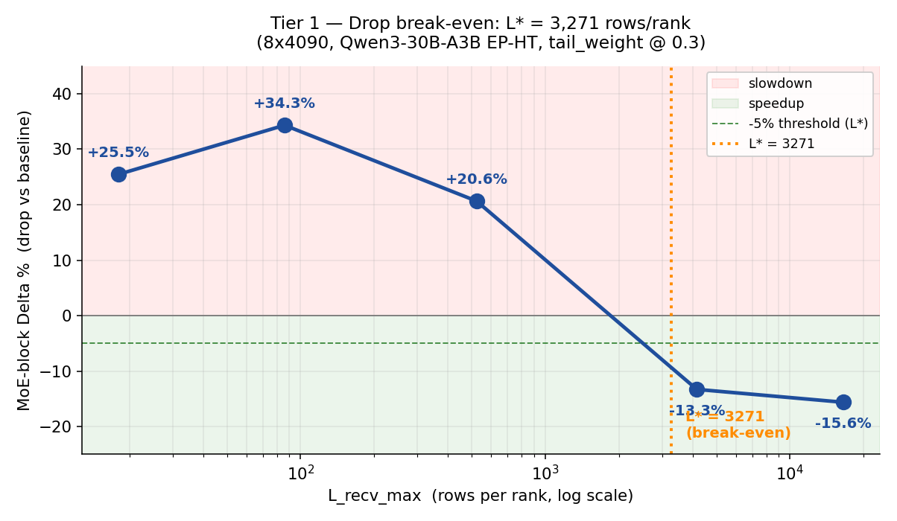
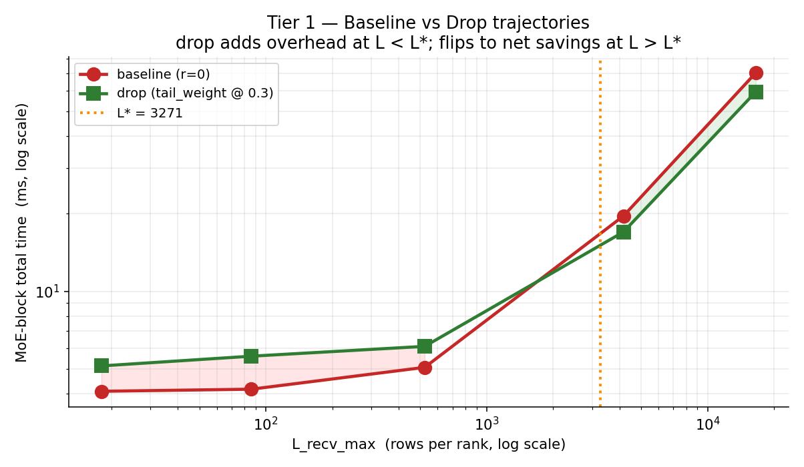
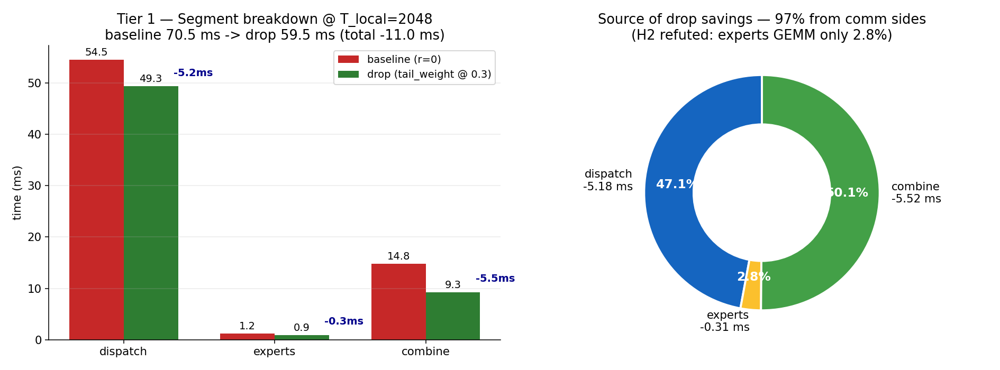
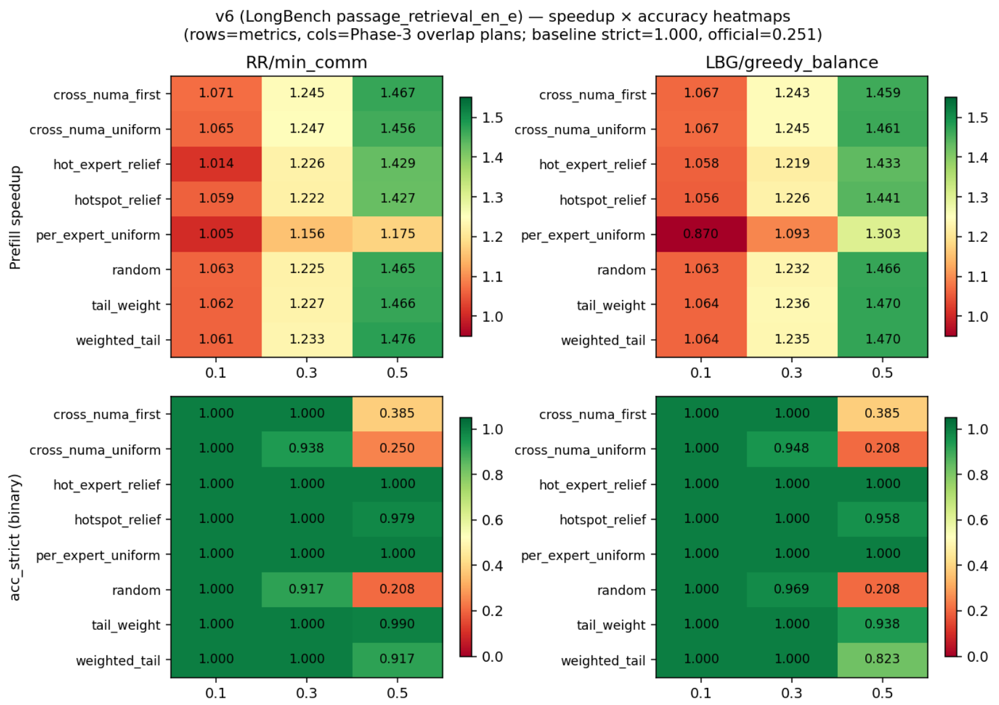
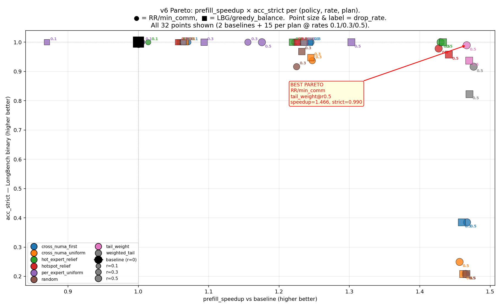

# nanovllm-moe

## placement

增加prompt，方便比对gsm数据集的答案

```
Solve the problem. Keep the reasoning concise, and put the final answer on the last line exactly in the form \boxed{answer}.
```

baseline：先跑一遍模型得到profile，在加prediction之前用profile进行分配

```
model = Qwen3-30B-A3B
comm: ep_ht only
benchmark: GSM8K 256 条
world_size = 4/8
max_tokens = 64
max_num_seqs = 8
max_num_batched_tokens = 256
```

**Placement**

- contiguous：每卡拿连续的 16 个 expert。
- round_robin：每卡按轮转拿 expert，例如 rank0 拿 0,8,16,...。
- random：先按固定随机种子打乱 128 个 expert，再均分到 8 卡。
- load_balanced：先按 expert 总流量从大到小分配，优先补给当前负载最轻的卡；如果并列，再偏向本地 traffic 更高的卡。
- communication_aware：把expert放到最常访问它的 source rank 上，目标是减跨卡通信。

| placement            | e2e_s  | 相对 contiguous | prefill tok/s | decode tok/s | gpu_cv | cross_traffic_ratio |
| :------------------- | :----- | :-------------- | :------------ | :----------- | :----- | :------------------ |
| round_robin          | 100.00 | -0.32%          | 61.95         | 42.20        | 0.0526 | 0.8748              |
| contiguous           | 100.32 | baseline        | 61.02         | 42.22        | 0.0720 | 0.8750              |
| communication_aware  | 103.41 | +3.08%          | 57.35         | 42.62        | 0.1435 | 0.8707              |
| load_balanced        | 104.68 | +4.35%          | 59.43         | 40.60        | 0.0009 | 0.8750              |
| fixed_random_shuffle | 107.86 | +7.52%          | 54.38         | 41.21        | 0.1080 | 0.8747              |

* round robin稍微快一点
* 在这个数据集下，每个请求的routing结果比较相近，不存在一些请求集中访问一些expert，另一些集中访问另一些expert，所以comm_aware作用很小


## Static Replica

```
impl=ep_ht
runtime_mode=owner_local_ep
world_size=8
tp_size=1
data_parallel_size=8
num_problems=256
max_tokens=64
max_num_batched_tokens=512
max_num_seqs=8
base_placements=round_robin, load_balanced
overlap=0.25
```

**Replica Placement Policy**：在开始运行之前先分配好expert，过程中不改变

* consecutive：在原本rank的基础上直接连续扩充副本，baseline，比如expert在rank1，扩充到rank1、2
* numa_first：跨numa覆盖，将expert副本优先放在不同numa上
* traffic_aware：将副本放在对其访问多的rank上
* traffic_balance：先考虑负载balance，再考虑访问量

**Dispatch Policy**

所有 dispatch 策略都已经是 local-first，讨论的是没有local expert时如何选择

* balance：选当前负载最低的rank
* min-comm：优先选已经有别的token要发往的rank，让通信更集中
* numa-aware：先选同numa的，没有的话考虑min-comm
* hybird：兼顾负载均衡和通信集中

取两个base placement，在这个策略的基础上，增加的副本使用Replica Placement Policy放置：

**Round robin**

Baseline：

| overlap | e2e_s  | score   | cross  | local  | xnuma  | gpu_cv |
| :------ | :----- | :------ | :----- | :----- | :----- | :----- |
| 0.00    | 104.40 | 0.01953 | 0.8748 | 0.1252 | 0.5005 | 0.0528 |

0.25：单元格格式为 e2e_s / prefill / decode throughout / xnuma

| Replica \ Dispatch | balance                         | min-comm                            | numa-aware                      | hybird                          |
| :----------------- | :------------------------------ | :---------------------------------- | :------------------------------ | :------------------------------ |
| consecutive        | 72.55 / 185.79 / 36.58 / 0.4299 | 80.70 / 174.77 / 36.15 / 0.4471     | 73.96 / 163.58 / 37.20 / 0.2397 | 100.54 / 82.07 / 32.78 / 0.4319 |
| numa_first         | 71.74 / 178.65 / 37.65 / 0.4188 | **69.88 / 172.38 / 39.49 / 0.3791** | 71.33 / 164.45 / 38.93 / 0.0000 | 97.78 / 88.79 / 32.60 / 0.4006  |
| traffic_aware      | 71.77 / 179.89 / 37.67 / 0.4299 | 75.54 / 174.05 / 35.36 / 0.4471     | 74.12 / 163.65 / 37.02 / 0.2397 | 107.65 / 81.80 / 30.18 / 0.4320 |
| traffic_balance    | 74.60 / 210.72 / 34.23 / 0.4299 | 70.51 / 173.75 / 39.11 / 0.4473     | 75.57 / 161.47 / 37.81 / 0.2397 | 102.86 / 80.68 / 32.35 / 0.4320 |

- 最优：numa_first + min-comm，e2e_s = 69.88，相对 baseline 提速约 1.49x
- replica 中 numa-first 最优


**load balance**

Baseline：

| overlap | e2e_s | score   | cross  | local  | xnuma  | gpu_cv |
| :------ | :---- | :------ | :----- | :----- | :----- | :----- |
| 0.00    | 71.77 | 0.01172 | 0.8750 | 0.1250 | 0.4987 | 0.0011 |

0.25：单元格格式为 e2e_s / prefill / decode throughout / xnuma

| Replica \ Dispatch | balance                             | min-comm                        | numa-aware                      | hybird                          |
| :----------------- | :---------------------------------- | :------------------------------ | :------------------------------ | :------------------------------ |
| consecutive        | 72.56 / 182.99 / 37.77 / 0.4280     | 72.25 / 176.06 / 37.95 / 0.4342 | 78.18 / 180.68 / 33.87 / 0.2032 | 94.78 / 93.10 / 33.26 / 0.4265  |
| numa_first         | **69.91 / 177.88 / 39.11 / 0.4197** | 70.74 / 174.53 / 38.77 / 0.3792 | 72.01 / 164.36 / 38.87 / 0.0000 | 99.60 / 84.73 / 32.89 / 0.4017  |
| traffic_aware      | 72.76 / 180.63 / 37.51 / 0.4280     | 75.00 / 200.72 / 34.28 / 0.4339 | 76.64 / 162.76 / 35.67 / 0.2032 | 104.74 / 83.89 / 30.16 / 0.4264 |
| traffic_balance    | 73.07 / 173.06 / 37.32 / 0.4280     | 71.98 / 191.61 / 42.28 / 0.4342 | 74.40 / 163.46 / 38.21 / 0.2032 | 101.88 / 79.38 / 32.60 / 0.4264 |

- 最优：numa_first + balance，e2e_s = 69.91，相对 baseline 提速约 1.03x
- replica 中 numa-first 最优，dispatch 中 balance 和 min-comm 差不多


## drop

### old（可跳过）

```
impl=ep_ht
runtime_mode=owner_local_ep
world_size=8
tp_size=1
data_parallel_size=8
num_problems=256
max_tokens=192
max_num_batched_tokens=512
max_num_seqs=8
base_placements=round_robin, load_balanced
overlap=0.25
baseline 两条 Phase 3 已验证的优配：round_robin / numa_local_first / min_communication
load_balanced / numa_local_first / greedy_balance
```

drop 策略：

约束：本地的 token 不 drop（不用跨卡通信）；token 在所有 expert 上都被 drop 时，保留 weight 最大的那个

下面策略都是在单卡上考虑的，不涉及卡之间的通信

| **`tail_weight`**          | 全局                 | 把所有可 drop 的 remote replica 按 `router_weight` 升序排，丢最小的 `drop_rate · T·K` 个 |
| -------------------------- | -------------------- | ------------------------------------------------------------ |
| **`random`**               | 全局                 | 在可 drop 的 remote 集合里**均匀采样** `drop_rate · T·K` 个；用作 noise floor |
| **`cross_numa_first`**     | 全局 + 拓扑          | 先把跨 NUMA 的 remote replica 按 `router_weight` 升序全部排序，**先吃跨 NUMA**；额度不够再从同 NUMA remote 里按权重升序补足 |
| **`per_expert_uniform`**   | **按 expert 分组**   | 对每个 global expert e：丢它的可 drop remote 集合的 `drop_rate · R_remote(e)` 比例，**在该 expert 内部按 router_weight 升序挑**。每个 expert 损失同比例，分布最公平 |
| **`hot_expert_relief`**    | **按 expert 分组**   | 计算每个 expert 的 token 命中数 `T(e)`，把全局 drop 配额按 `max(0, T(e) − mean_T)` 加权分给热 expert（冷 expert 拿 0）；配额内部按权重升序挑 remote。**专门给热瓶颈 expert 减压** |
| **`per_expert_tailtoken`** | **按 expert 分组**   | 对每个 expert e：先取它收到的 token 中按 router_weight 升序的**末段 30%** 作为可 drop 池，再在该池内按权重升序挑 `drop_rate · branches(e)` 个。和 `tail_weight` 的区别是「每个 expert 只砍自己的长尾 token」 |
| **`hotspot_relief`**       | **按目标 rank 分组** | 计算每个 dst rank 的入流量，按 `max(0, load_dst − mean_load)` 给热 dst 分配 drop 配额；配额内部按 router_weight 升序挑。和 `hot_expert_relief` 区别：grouping 维度是 rank 而非 expert |

#### Baseline RR (`round_robin / numa_local_first / min_communication`)

**drop=0 (n=3)**: score = **0.9375 ± 0.0000**, e2e = **116.08 ± 1.74s**, prefill = **233**

**.5 tok/s**, decode = **26.01 tok/s**

| policy                 | rate | score (mean ± std) | Δscore     | e2e_s (mean ± std) | Δe2e       | prefill | decode | drop% | wmass% |
| ---------------------- | ---- | ------------------ | ---------- | ------------------ | ---------- | ------- | ------ | ----- | ------ |
| `tail_weight`          | 0.05 | 0.9362 ± 0.013     | −0.001     | 133.63 ± 6.66      | +15.1%     | 205.2   | 22.29  | 4.8%  | 2.3%   |
| `tail_weight`          | 0.10 | 0.9245 ± 0.010     | −0.013     | 129.27 ± 4.17      | +11.4%     | 207.6   | 22.75  | 9.7%  | 5.0%   |
| `tail_weight`          | 0.20 | 0.9232 ± 0.010     | −0.014     | 133.88 ± 4.43      | +15.3%     | 208.3   | 21.95  | 20.2% | 11.9%  |
| `per_expert_uniform`   | 0.05 | 0.9375 ± 0.007     | 0.000      | 130.92 ± 1.95      | +12.8%     | 210.6   | 22.34  | 1.2%  | 0.6%   |
| `per_expert_uniform`   | 0.10 | 0.9232 ± 0.008     | −0.014     | 134.71 ± 8.52      | +16.1%     | 207.6   | 22.14  | 3.3%  | 1.8%   |
| `per_expert_uniform`   | 0.20 | 0.9349 ± 0.013     | −0.003     | 138.17 ± 6.72      | +19.0%     | 200.8   | 21.71  | 10.1% | 6.4%   |
| `per_expert_tailtoken` | 0.05 | 0.9349 ± 0.011     | −0.003     | **128.90** ± 1.58  | **+11.0%** | 217.0   | 22.92  | 1.2%  | 0.6%   |
| `per_expert_tailtoken` | 0.10 | 0.9323 ± 0.009     | −0.005     | 134.19 ± 0.78      | +15.6%     | 208.7   | 21.99  | 3.3%  | 1.8%   |
| `per_expert_tailtoken` | 0.20 | 0.9297 ± 0.008     | −0.008     | 132.36 ± 4.11      | +14.0%     | 208.3   | 22.83  | 10.1% | 6.4%   |
| `hot_expert_relief`    | 0.05 | 0.9284 ± 0.006     | −0.009     | 132.17 ± 9.48      | +13.9%     | 207.6   | 22.31  | 2.5%  | 1.5%   |
| `hot_expert_relief`    | 0.10 | 0.9323 ± 0.014     | −0.005     | 129.27 ± 2.65      | +11.4%     | 217.4   | 23.36  | 6.5%  | 4.3%   |
| `hot_expert_relief`    | 0.20 | 0.9023 ± 0.010     | **−0.035** | 141.29 ± 11.18     | +21.7%     | 223.7   | 22.11  | 14.1% | 10.8%  |
| `hotspot_relief`       | 0.05 | 0.9297 ± 0.018     | −0.008     | 134.07 ± 3.01      | +15.5%     | 212.3   | 21.46  | 3.2%  | 1.6%   |
| `hotspot_relief`       | 0.10 | 0.9440 ± 0.008     | +0.007     | 130.33 ± 3.91      | +12.3%     | 209.6   | 22.82  | 6.5%  | 3.7%   |
| `hotspot_relief`       | 0.20 | 0.9336 ± 0.004     | −0.004     | 134.94 ± 5.35      | +16.2%     | 208.4   | 21.80  | 13.5% | 8.9%   |
| `cross_numa_first`     | 0.05 | 0.9427 ± 0.002     | +0.005     | 131.76 ± 3.32      | +13.5%     | 214.5   | 22.28  | 4.8%  | 2.2%   |
| `cross_numa_first`     | 0.10 | **0.9479** ± 0.010 | **+0.010** | 131.03 ± 1.92      | +12.9%     | 215.1   | 22.51  | 9.7%  | 5.0%   |
| `cross_numa_first`     | 0.20 | 0.9336 ± 0.008     | −0.004     | 136.29 ± 3.52      | +17.4%     | 206.2   | 21.63  | 20.2% | 11.9%  |
| `random`               | 0.05 | 0.9180 ± 0.016     | −0.020     | 126.98 ± 6.64      | +9.4%      | 210.8   | 23.30  | 4.9%  | 4.8%   |
| `random`               | 0.10 | 0.8633 ± 0.014     | **−0.074** | 141.06 ± 7.52      | +21.5%     | 218.6   | 19.69  | 9.7%  | 9.6%   |
| `random`               | 0.20 | **0.7370** ± 0.036 | **−0.201** | 144.65 ± 9.70      | +24.6%     | 211.8   | 19.85  | 20.2% | 19.    |

#### Baseline LB (`load_balanced / numa_local_first / balance`)

**drop=0 (n=3)**: score = **0.9336 ± 0.0103**, e2e = **113.10 ± 1.22s**, prefill = **241.9 tok/s**, decode = **25.74 tok/s**

| policy                 | rate | score (mean ± std) | Δscore     | e2e_s (mean ± std) | Δe2e       | prefill | decode | drop% | wmass% |
| ---------------------- | ---- | ------------------ | ---------- | ------------------ | ---------- | ------- | ------ | ----- | ------ |
| `tail_weight`          | 0.05 | 0.9375 ± 0.018     | +0.004     | 138.94 ± 4.15      | +22.8%     | 215.6   | 21.04  | 4.8%  | 2.2%   |
| `tail_weight`          | 0.10 | 0.9349 ± 0.006     | +0.001     | 134.37 ± 4.44      | +18.8%     | 211.4   | 21.71  | 9.7%  | 5.0%   |
| `tail_weight`          | 0.20 | 0.9349 ± 0.013     | +0.001     | 139.35 ± 7.77      | +23.2%     | 214.5   | 20.85  | 20.2% | 11.9%  |
| `per_expert_uniform`   | 0.05 | 0.9362 ± 0.005     | +0.003     | 130.34 ± 4.24      | +15.2%     | 212.3   | 21.92  | 1.2%  | 0.6%   |
| `per_expert_uniform`   | 0.10 | 0.9362 ± 0.006     | +0.003     | 129.80 ± 1.29      | +14.8%     | 213.9   | 22.28  | 3.3%  | 1.8%   |
| `per_expert_uniform`   | 0.20 | 0.9401 ± 0.012     | +0.007     | 141.28 ± 9.99      | +24.9%     | 215.2   | 21.18  | 10.0% | 6.4%   |
| `per_expert_tailtoken` | 0.05 | **0.9440** ± 0.006 | **+0.010** | **128.90** ± 0.72  | **+14.0%** | 213.9   | 22.45  | 1.2%  | 0.6%   |
| `per_expert_tailtoken` | 0.10 | 0.9349 ± 0.008     | +0.001     | 133.48 ± 5.40      | +18.0%     | 207.2   | 22.17  | 3.3%  | 1.8%   |
| `per_expert_tailtoken` | 0.20 | 0.9375 ± 0.007     | +0.004     | 137.69 ± 1.49      | +21.7%     | 210.7   | 21.99  | 10.0% | 6.4%   |
| `hot_expert_relief`    | 0.05 | 0.9362 ± 0.008     | +0.003     | 138.19 ± 8.99      | +22.2%     | 206.7   | 21.22  | 2.5%  | 1.5%   |
| `hot_expert_relief`    | 0.10 | 0.9336 ± 0.004     | 0.000      | 133.72 ± 7.92      | +18.2%     | 208.1   | 21.76  | 6.5%  | 4.3%   |
| `hot_expert_relief`    | 0.20 | 0.9128 ± 0.014     | **−0.021** | 137.59 ± 3.27      | +21.7%     | 222.3   | 21.21  | 14.1% | 10.8%  |
| `hotspot_relief`       | 0.05 | 0.9297 ± 0.007     | −0.004     | 134.39 ± 5.05      | +18.8%     | 223.0   | 21.20  | 0.5%  | 0.2%   |
| `hotspot_relief`       | 0.10 | 0.9310 ± 0.005     | −0.003     | **128.20** ± 1.24  | **+13.4%** | 211.1   | 22.73  | 1.0%  | 0.6%   |
| `hotspot_relief`       | 0.20 | **0.9453** ± 0.008 | **+0.012** | 131.69 ± 2.49      | +16.4%     | 210.7   | 22.00  | 2.0%  | 1.4%   |
| `cross_numa_first`     | 0.05 | 0.9375 ± 0.010     | +0.004     | 134.85 ± 7.82      | +19.2%     | 206.5   | 21.37  | 4.8%  | 2.4%   |
| `cross_numa_first`     | 0.10 | 0.9310 ± 0.019     | −0.003     | 133.41 ± 0.98      | +18.0%     | 209.8   | 21.84  | 9.7%  | 5.5%   |
| `cross_numa_first`     | 0.20 | 0.9375 ± 0.008     | +0.004     | 134.82 ± 4.41      | +19.2%     | 216.2   | 23.03  | 20.2% | 13.6%  |
| `random`               | 0.05 | 0.9010 ± 0.024     | **−0.033** | 131.87 ± 2.41      | +16.6%     | 211.7   | 21.08  | 4.8%  | 4.8%   |
| `random`               | 0.10 | 0.8216 ± 0.059     | **−0.112** | 135.48 ± 11.16     | +19.8%     | 223.0   | 22.51  | 9.7%  | 9.6%   |
| `random`               | 0.20 | **0.6979** ± 0.074 | **−0.236** | 136.72 ± 5.38      | +20.9%     | 212.6   | 22.33  | 20.2% | 19.9%  |

* 相比于 random，别的 drop 实验中**准确率的下降很小**

* 但 e2e 时间在上升，可能是因为 drop token 的选择在 CPU，增加了耗时，需要修改实验
  * 增加 batch size，drop 增加的时间固定，节省的时间增加
  * 将 drop 计算改到 GPU 上


### batch size 与 speedup 的关系

已经将 drop 改到 GPU 上进行计算

|              | MoE-block sweep                                              | total model                                                  |
| ------------ | ------------------------------------------------------------ | ------------------------------------------------------------ |
| 目的         | 找 drop 中 batch size 与 speedup 的关系                      | 验证是否在全模型上仍然成立                                   |
| 范围         | DispatchEPHT + ExpertsEPHT + CombineEPHT，剔除 attention/sampling/scheduler | Qwen3-30B-A3B 完整 48 层 + flashinfer attention + sampling + scheduler |
| Workload     | 合成 routing：T_local source tokens → K=8 random experts/token | 合成 prompt：T_local 长度的 prompt × 8 ranks 一次性 prefill  |
| T_local 扫描 | {1, 8, 64, 512, 2048}                                        | {512, 2048}                                                  |
| Drop policy  | tail_weight                                                  | tail_weight                                                  |
| Drop rate    | {0.0, 0.3}（baseline vs drop）                               | {0.0, 0.3}                                                   |
| Plan         | LBG / numa_local_first / greedy_balance                      | smoke_plan                                                   |
| 硬件         | 8×RTX 4090 24GB                                              | 同                                                           |
| 模型         | Qwen3-30B-A3B EP-HT owner_local                              | 同                                                           |

#### MoE block sweep

8 ranks × Qwen3-30B-A3B EP-HT × tail_weight @ 0.3 × LB overlap，30 iters/cell：

* T_local：平均每张卡分配的 token 数，batch size / world size
* L_send：平均每张卡要通信的行数，每个 token 通信 topk 次，T_local * K（此模型 topk = 8）
* L_recv_max：所有卡中接收到的行数的最大值，略大于L_send

| T_local |  L_send   | L_recv_max | baseline_us |  drop_us   |   **Δ%**   | eff_drop_recv |
| :-----: | :-------: | :--------: | :---------: | :--------: | :--------: | :-----------: |
|    1    |     8     |     18     |    4,092    |   5,134    | **+25.5%** |     0.25      |
|    8    |    64     |     86     |    4,170    |   5,600    | **+34.3%** |     0.30      |
|   64    |    512    |    524     |    5,069    |   6,115    | **+20.6%** |     0.30      |
| **512** | **4,096** | **4,160**  | **19,606**  | **16,999** | **−13.3%** |     0.30      |
|  2,048  |  16,384   |   16,544   |   70,539    |   59,519   | **−15.6%** |     0.30      |





- **L\* (delta_pct = −5%) ≈ 3,271 rows/rank**（插值，落在 T=64 和 T=512 之间）→ 全 batch ≈ 3.3k prefill tokens 跨 8 ranks
- 小 L 时 drop 开销 > 收益（dispatch/combine 的固定 launch overhead 主导）；大 L 时 a2a payload bytes 主导，drop 转为正收益
- decode 阶段 drop 是负收益，L_recv 太小了


T_local=2048 cell 上的三段时间分解：

|   segment    | baseline_us |  drop_us   |     Δus     | **占 total 收益** |
| :----------: | :---------: | :--------: | :---------: | :---------------: |
| **dispatch** |   54,517    |   49,332   |   −5,185    |     **47.1%**     |
|   experts    |    1,229    |    920     |    −309     |       2.8%        |
| **combine**  |   14,796    |   9,276    |   −5,520    |     **50.1%**     |
|  **total**   | **70,539**  | **59,519** | **−11,019** |       100%        |



- drop 的省时 **97% 来自通信侧**（dispatch a2a payload bytes ↓47% + combine scatter rows ↓50%），而非 expert 计算量减少
- experts gemm段只占 ~1.2ms 量级，占比非常小


#### total model

Qwen3-30B-A3B 完整 48 层 + flashinfer attention + sampling + scheduler，3 reps/cell：

| T_local | total prefill tokens | baseline prefill |  drop prefill   | **prefill speedup** |
| :-----: | :------------------: | :--------------: | :-------------: | :-----------------: |
|   512   |        4,096         | 0.874 s ± 0.026  | 0.797 s ± 0.019 | **+8.8% (1.096×)**  |
|  2,048  |        16,384        | 2.923 s ± 0.020  | 2.791 s ± 0.030 | **+4.5% (1.047×)**  |

* MoE-block 收益是 T=2048 (−15.6%) > T=512 (−13.3%)，但全模型 prefill 反过来，T=512收益更大
  * attention 是 O(N²)，N 越大 attention 占 prefill 总时间越高，把 MoE-block 收益稀释更多


### longbench+only-prefill-drop

将 drop 的计算改到 GPU 进行，并且只有 token > 512 时开启 drop

```
模型                          Qwen3-30B-A3B                                           
Runtime                      owner_local_ep + ep_ht + enforce_eager=True                         
max_num_batched_tokens       6144 (per-rank)                                                               
max_num_seqs / batch_size    64 / 8（1 prompt 1 rank）                                           
max_new_tokens               64
```


#### round_robin / numa_local_first / min_communication

**Baseline**：prefill **4.333s ± 0.272**, e2e **14.876s**, per-rank tok/s **723**, F1 **0.208**

| policy               |    rate | prefill (s) ± std | prefill_sp |    e2e_sp | per-rank tok/s |      F1 ± SEM |   F1 Δ |
| :------------------- | ------: | ----------------: | ---------: | --------: | -------------: | ------------: | -----: |
| cross_numa_first     |     0.1 |     4.099 ± 0.236 |      1.057 |     1.029 |            765 | 0.207 ± 0.016 | −0.001 |
| cross_numa_first     |     0.3 |     3.533 ± 0.214 |      1.226 |     1.063 |            887 | 0.221 ± 0.016 | +0.013 |
| **cross_numa_first** | **0.5** | **3.047 ± 0.176** |  **1.422** | **1.103** |       **1031** | 0.191 ± 0.016 | −0.018 |
| cross_numa_uniform   |     0.1 |     4.088 ± 0.236 |      1.060 |     1.019 |            767 | 0.208 ± 0.016 | −0.001 |
| cross_numa_uniform   |     0.3 |     3.526 ± 0.218 |      1.229 |     1.056 |            890 | 0.211 ± 0.016 | +0.002 |
| cross_numa_uniform   |     0.5 |     3.036 ± 0.181 |      1.427 |     1.087 |           1034 | 0.205 ± 0.016 | −0.003 |
| random               |     0.1 |     4.103 ± 0.231 |      1.056 |     1.012 |            764 | 0.220 ± 0.016 | +0.012 |
| random               |     0.3 |     3.555 ± 0.222 |      1.219 |     1.067 |            883 | 0.212 ± 0.016 | +0.004 |
| random               |     0.5 |     3.410 ± 0.371 |      1.271 |     1.018 |            985 | 0.212 ± 0.016 | +0.004 |
| tail_weight          |     0.1 |     4.114 ± 0.241 |      1.053 |     0.944 |            762 | 0.210 ± 0.016 | +0.002 |
| tail_weight          |     0.3 |     3.555 ± 0.224 |      1.219 |     1.032 |            882 | 0.204 ± 0.016 | −0.005 |
| tail_weight          |     0.5 |     3.036 ± 0.182 |      1.427 |     1.031 |           1035 | 0.213 ± 0.016 | +0.004 |
| weighted_tail        |     0.1 |     4.103 ± 0.231 |      1.056 |     1.012 |            764 | 0.210 ± 0.016 | +0.001 |
| weighted_tail        |     0.3 |     3.553 ± 0.220 |      1.220 |     1.053 |            884 | 0.202 ± 0.016 | −0.007 |
| **weighted_tail**    | **0.5** | **3.033 ± 0.180** |  **1.428** | **1.097** |           1035 | 0.211 ± 0.016 | +0.003 |

#### load_balanced / numa_local_first / balance

**Baseline**：prefill **4.348s ± 0.242**, e2e **14.895s**, per-rank tok/s **720**, F1 **0.208**

| policy               |    rate | prefill (s) ± std | prefill_sp |    e2e_sp | per-rank tok/s |      F1 ± SEM |       F1 Δ |
| :------------------- | ------: | ----------------: | ---------: | --------: | -------------: | ------------: | ---------: |
| cross_numa_first     |     0.1 |     4.109 ± 0.231 |      1.058 |     1.019 |            762 | 0.213 ± 0.016 |     +0.005 |
| cross_numa_first     |     0.3 |     3.499 ± 0.207 |      1.243 |     1.057 |            896 | 0.205 ± 0.016 |     −0.003 |
| **cross_numa_first** | **0.5** | **2.997 ± 0.171** |  **1.451** | **1.104** |       **1046** | 0.194 ± 0.016 |     −0.014 |
| cross_numa_uniform   |     0.1 |     4.094 ± 0.241 |      1.062 |     1.022 |            765 | 0.211 ± 0.016 |     +0.003 |
| cross_numa_uniform   |     0.3 |     3.531 ± 0.213 |      1.232 |     1.048 |            888 | 0.218 ± 0.016 |     +0.010 |
| cross_numa_uniform   |     0.5 |     2.993 ± 0.175 |      1.453 |     1.095 |           1048 | 0.201 ± 0.016 |     −0.007 |
| random               |     0.1 |     4.107 ± 0.239 |      1.059 |     1.015 |            763 | 0.219 ± 0.016 |     +0.010 |
| random               |     0.3 |     3.540 ± 0.213 |      1.228 |     1.055 |            885 | 0.219 ± 0.016 |     +0.011 |
| random               |     0.5 |     3.003 ± 0.180 |      1.448 |     1.092 |           1044 | 0.206 ± 0.016 |     −0.002 |
| tail_weight          |     0.1 |     4.108 ± 0.236 |      1.058 |     1.022 |            762 | 0.208 ± 0.016 |     −0.001 |
| tail_weight          |     0.3 |     3.712 ± 0.298 |      1.172 |     0.984 |            857 | 0.212 ± 0.016 |     +0.004 |
| tail_weight          |     0.5 |     2.997 ± 0.179 |      1.451 |     1.096 |           1047 | 0.230 ± 0.016 | **+0.021** |
| weighted_tail        |     0.1 |     4.114 ± 0.239 |      1.057 |     1.015 |            761 | 0.214 ± 0.016 |     +0.006 |
| weighted_tail        |     0.3 |     3.541 ± 0.215 |      1.228 |     1.056 |            885 | 0.201 ± 0.016 |     −0.007 |
| weighted_tail        |     0.5 |     3.000 ± 0.178 |      1.450 |     1.097 |           1045 | 0.218 ± 0.016 |     +0.009 |

* prefill 阶段有明显 speedup
* 这个数据集下 accuracy 不好评估。Qwen3-30B模型的 CoT 链难以强制跳过，不能做到直接输出 answer 来对比


### new benchmark

**更换一个比较长且方便比对 accuracy 的数据集**

```python
模型                          Qwen3-30B-A3B                                           
Runtime                      owner_local_ep + ep_ht + enforce_eager=True                         
max_num_batched_tokens       6144 (per-rank)                                                               
max_num_seqs / batch_size    96 / 8（1 prompt 1 rank）                                           
max_new_tokens               32
dataset                      passage_retrieval_en_e               // 方便判断accuracy
MOE_DROP_MIN_REPLICAS        512                                  // 跳过decode阶段，decode时不drop
```

drop 策略：

约束：本地的 token 不 drop（不用跨卡通信）；token 在所有 expert 上都被 drop 时，保留 weight 最大的那个

下面策略都是在单卡上考虑的，不涉及卡之间的通信


| Policy                   | 描述                                                         |
| ------------------------ | ------------------------------------------------------------ |
| **`tail_weight`**        | 整个rank上排序，砍 router_weight 最低的 `rate·T·K` 个        |
| **`random`**             | 在可 drop 的 remote replicas 里**均匀随机采样**              |
| **`cross_numa_first`**   | **两层**：cross-NUMA replicas 按 weight 升序排在前；额度不够再吃 same-NUMA tail-weight。 |
| **`weighted_tail`**      | tail_weight + 小幅随机扰动。                                 |
| **`cross_numa_uniform`** | 像 cross_numa_first 但 cross-NUMA 内部用 uniform 随机选。    |
| **`per_expert_uniform`** | 每 expert 公平砍同比例，**分布最公平**。effective drop 在 rate=0.5 上 ≈ 0.44（rounding loss） |
| **`hot_expert_relief`**  | **只砍过载 expert**，冷 expert 不动                          |
| **`hotspot_relief`**     | **只砍过载 dst rank**，专门减压通信热点                      |

**baseline**：

| Plan                         | prefill (s) | prefill tok/s | e2e (s) | acc_strict |
| ---------------------------- | ----------- | ------------- | ------- | ---------- |
| load_balanced_greedy_balance | 6.39        | 747           | 11.72   | 1.000      |
| round_robin_mincomm          | 6.49        | 736           | 11.84   | 1.000      |

**Plan A —  (load_balanced + greedy_balance)**

| policy                | r       | prefill_sp | e2e_sp    | tok/s    | acc_off   | **acc_strict** |
| --------------------- | ------- | ---------- | --------- | -------- | --------- | -------------- |
| tail_weight           | 0.1     | 1.064      | 1.041     | 795      | 0.246     | 1.000          |
| tail_weight           | 0.3     | 1.236      | 1.105     | 924      | 0.384     | 1.000          |
| tail_weight           | 0.5     | **1.470**  | 1.215     | 1099     | 0.679     | 0.938          |
| random                | 0.1     | 1.063      | 1.025     | 794      | 0.334     | 1.000          |
| random                | 0.3     | 1.232      | 1.124     | 921      | 0.730     | 0.969          |
| random                | 0.5     | 1.466      | 1.225     | 1095     | 0.208     | **0.208**      |
| cross_numa_first      | 0.1     | 1.067      | 1.033     | 797      | 0.288     | 1.000          |
| cross_numa_first      | 0.3     | 1.243      | 1.109     | 929      | 0.481     | 1.000          |
| cross_numa_first      | 0.5     | 1.459      | 1.221     | 1091     | 0.327     | 0.385          |
| weighted_tail         | 0.1     | 1.064      | 1.038     | 795      | 0.265     | 1.000          |
| weighted_tail         | 0.3     | 1.235      | 1.116     | 923      | 0.420     | 1.000          |
| weighted_tail         | 0.5     | 1.470      | 1.218     | 1099     | 0.612     | 0.823          |
| cross_numa_uniform    | 0.1     | 1.067      | 1.036     | 798      | 0.398     | 1.000          |
| cross_numa_uniform    | 0.3     | 1.245      | 1.115     | 931      | 0.653     | 0.948          |
| cross_numa_uniform    | 0.5     | 1.461      | 1.223     | 1092     | 0.229     | 0.208          |
| per_expert_uniform    | 0.1     | 0.870      | 0.890     | 658      | 0.241     | 1.000          |
| per_expert_uniform    | 0.3     | 1.093      | 1.001     | 834      | 0.275     | 1.000          |
| per_expert_uniform    | 0.5     | 1.303      | 1.145     | 973      | 0.484     | **1.000**      |
| **hot_expert_relief** | 0.1     | 1.058      | 1.039     | 791      | 0.281     | 1.000          |
| **hot_expert_relief** | 0.3     | 1.219      | 1.100     | 911      | 0.365     | 1.000          |
| **hot_expert_relief** | **0.5** | **1.433**  | **1.205** | **1071** | **0.756** | **1.000**      |
| hotspot_relief        | 0.1     | 1.056      | 1.032     | 789      | 0.247     | 1.000          |
| hotspot_relief        | 0.3     | 1.226      | 1.123     | 916      | 0.317     | 1.000          |
| hotspot_relief        | 0.5     | 1.441      | 1.207     | 1077     | 0.665     | 0.958          |

**Plan B — (round_robin + min_communication)**

| policy                | r       | prefill_sp | e2e_sp    | tok/s    | acc_off   | **acc_strict** |
| --------------------- | ------- | ---------- | --------- | -------- | --------- | -------------- |
| tail_weight           | 0.1     | 1.062      | 1.037     | 782      | 0.256     | 1.000          |
| tail_weight           | 0.3     | 1.227      | 1.095     | 903      | 0.327     | 1.000          |
| tail_weight           | 0.5     | 1.466      | 1.213     | 1079     | 0.653     | 0.990          |
| random                | 0.1     | 1.063      | 1.009     | 782      | 0.351     | 1.000          |
| random                | 0.3     | 1.225      | 1.105     | 902      | 0.612     | 0.917          |
| random                | 0.5     | 1.465      | 1.215     | 1079     | 0.171     | 0.208          |
| cross_numa_first      | 0.1     | 1.071      | 1.034     | 788      | 0.271     | 1.000          |
| cross_numa_first      | 0.3     | 1.245      | 1.109     | 917      | 0.422     | 1.000          |
| cross_numa_first      | 0.5     | 1.467      | 1.218     | 1080     | 0.393     | 0.385          |
| weighted_tail         | 0.1     | 1.061      | 1.031     | 781      | 0.254     | 1.000          |
| weighted_tail         | 0.3     | 1.233      | 1.111     | 907      | 0.416     | 1.000          |
| weighted_tail         | 0.5     | 1.476      | 1.221     | 1087     | 0.712     | 0.917          |
| cross_numa_uniform    | 0.1     | 1.065      | 1.033     | 784      | 0.340     | 1.000          |
| cross_numa_uniform    | 0.3     | 1.247      | 1.109     | 918      | 0.677     | 0.938          |
| cross_numa_uniform    | 0.5     | 1.456      | 1.209     | 1072     | 0.258     | 0.250          |
| per_expert_uniform    | 0.1     | 1.005      | 0.963     | 749      | 0.245     | 1.000          |
| per_expert_uniform    | 0.3     | 1.156      | 1.081     | 851      | 0.275     | 1.000          |
| per_expert_uniform    | 0.5     | 1.175      | 1.045     | 915      | 0.455     | **1.000**      |
| **hot_expert_relief** | 0.1     | 1.014      | 1.008     | 754      | 0.258     | 1.000          |
| **hot_expert_relief** | 0.3     | 1.226      | 1.104     | 903      | 0.427     | 1.000          |
| **hot_expert_relief** | **0.5** | **1.429**  | **1.197** | **1052** | **0.710** | **1.000**      |
| hotspot_relief        | 0.1     | 1.059      | 1.033     | 779      | 0.255     | 1.000          |
| hotspot_relief        | 0.3     | 1.222      | 1.116     | 900      | 0.340     | 1.000          |
| hotspot_relief        | 0.5     | 1.427      | 1.200     | 1050     | 0.655     | 0.979          |



* 两种expert placement策略效果相近
* 效率与 drop 比例强相关，和 drop 策略弱相关。端到端时间中，通信占比高，gemm占比低，减少通信 > load balance
* accuracy 和 drop 策略相关
  * tail_weight 准确率有所下降，speedup 1.466倍
  * hot_expert_relief 准确率不下降，speedup 1.429倍

