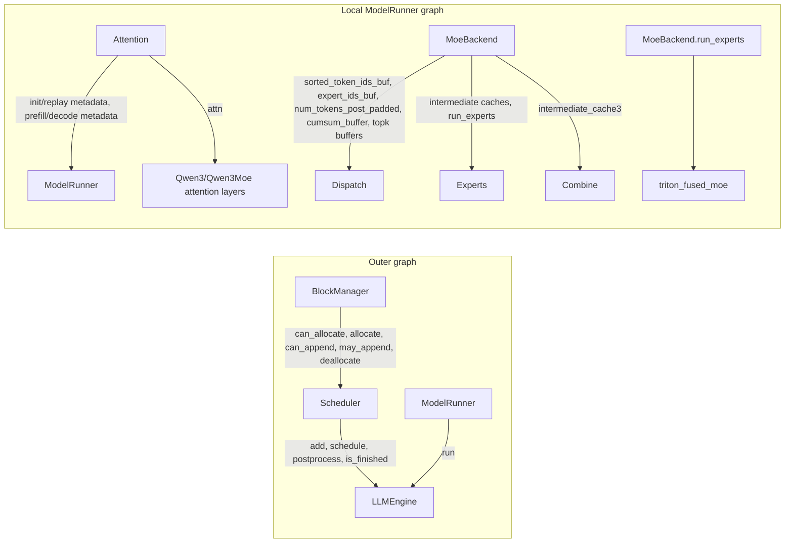
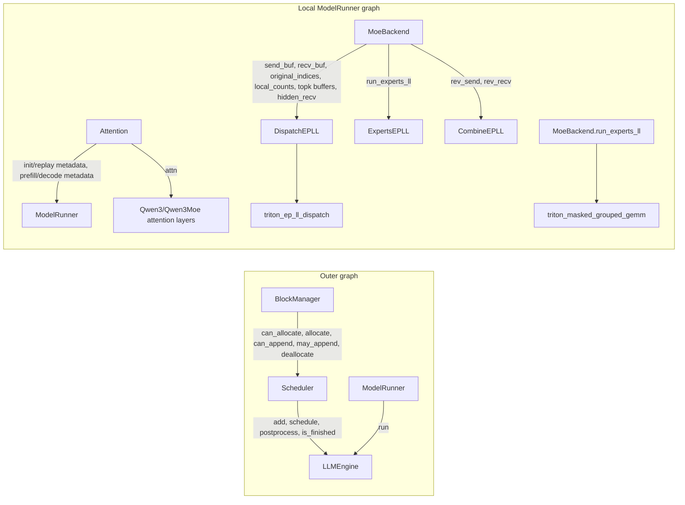
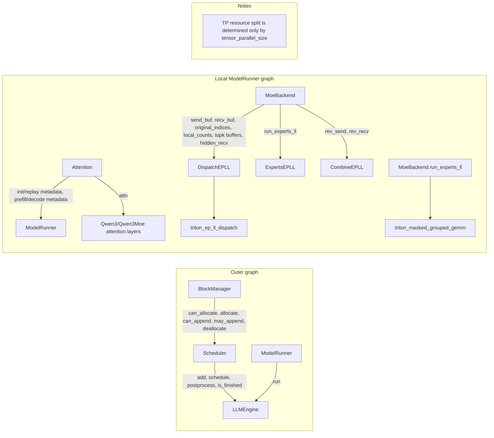
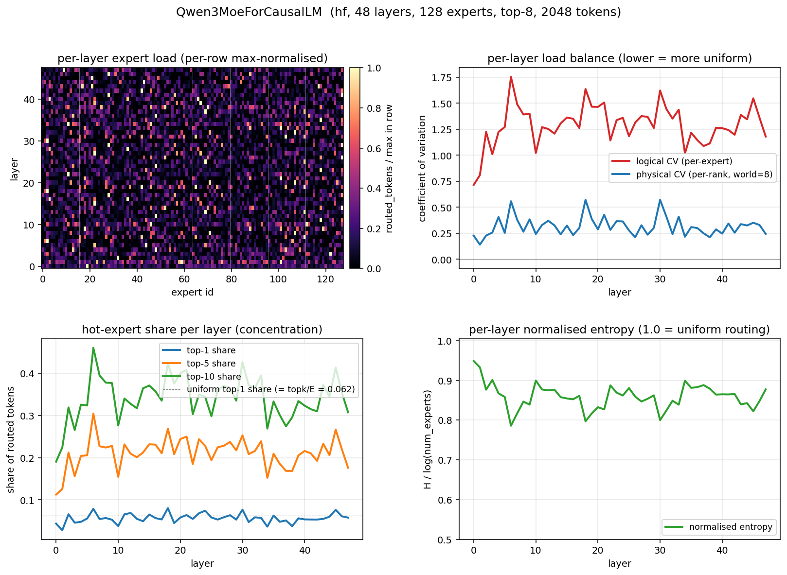
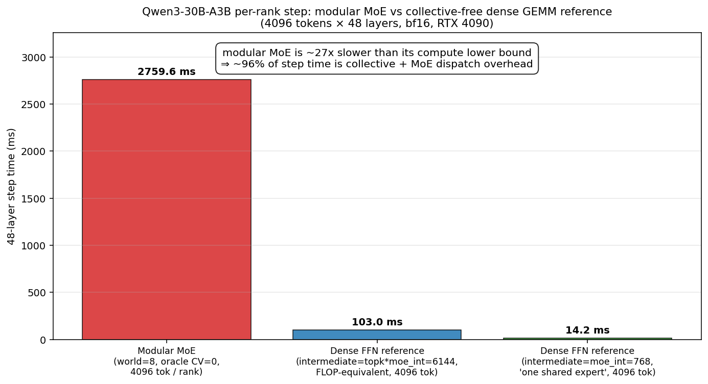
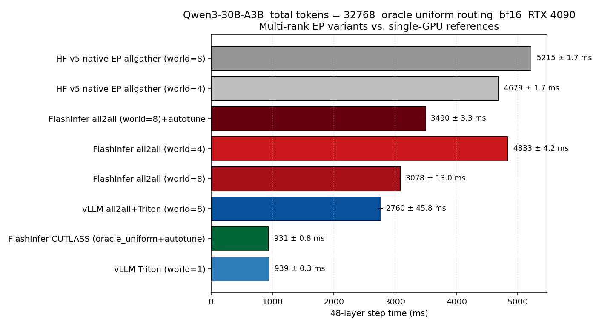

# MoE Weekly Report

> Status: rolling progress tracker. Update this file weekly as research notes, implementation variants, and experiments evolve.

## Categorization Plan

Track MoE progress with the following stable buckets:

1. **Research Inputs**: papers, system notes, implementation references, and design ideas worth carrying forward.
2. **Implementation Progress**: code-level progress across `workshop/`, `bazaar/`, recipes, orchestration boundaries, debugging utilities, and graph/visualization tools.
3. **Experiments**: smoke tests, component checks, recipe graph inspection, profiling, routing analysis, visual reports, and benchmark artifacts.
4. **Risks And Gaps**: unresolved runtime issues, weak assumptions, missing observability, and unverified performance claims.
5. **Next Priorities**: concrete work planned for the next iteration.

## 2026-05-31 Snapshot

### Research Inputs

Current MoE notes under `paper_links/` emphasize practical serving improvements:

- Communication reduction: pre-dispatch activation quantization, compact dispatch layouts, fused communication paths, and one-sided or lower-overhead all-to-all designs.
- Memory reduction: expert-weight quantization, tighter workspace sizing, `M_max` budgeting, KV compression/recompute, expert caching, and CPU/offload paths.
- EP serving comparison: EP-LL exposes dispatch/expert/combine mechanics most directly; EP-HT better represents high-throughput serving where the lower-level routing path is less visible to the user.
- Near-term implementation candidates: EP-LL workspace visibility, overflow telemetry, pre-dispatch activation quantization, and clearer comparisons between EP-LL, EP-HT, and TP x EP.

### Implementation Progress

The project now has two MoE implementation tracks:

- `workshop/nanovllm_moe/`: original selector-driven MoE implementation, kept as the reference baseline.
- `workshop/nanovllm_moe_orch/`: new recipe-first implementation variant.

The recipe-first variant moves implementation selection out of runtime config and into explicit `bazaar/` recipes:

- `LLMEngine` owns tokenizer, request lifecycle, stepping, generation, and reset.
- `ModelRunner` accepts recipe-provided local wiring through `wire_components`.
- MoE backend/kernel choice is encoded by the selected recipe, not by e2e test flags.
- `src/core/` remains unchanged.

Current recipe assets under `bazaar/` include single-rank, EP-LL, EP-HT, and TP x EP variants. Each recipe is intended to expose both orchestration layers:

- Outer graph: `BlockManager -> Scheduler -> LLMEngine`, plus `ModelRunner -> LLMEngine`.
- Local graph: attention, MoE dispatch, experts, combine, and backend kernel selection.

Development and debugging tools have also been added:

- `bazaar/README.md` documents the recipe contract and debugging flow.
- `eval/test_bazaar_moe.py` now uses recipe-first arguments such as `--moe-structure`.
- `eval/visualize_bazaar_moe.py` imports recipes directly, calls `describe_graph()`, and emits Markdown, Mermaid, or text graph views.
- Recipe-local graph definitions make component wiring visible without requiring users to inspect the engine internals first.

### Experiments

Completed checks on the new recipe-first path:

- Static compile/import checks for the new MoE orchestration tree and bazaar recipes.
- Recipe graph summary import for all recipe modules.
- Smoke tests passed for single-rank Triton, single-rank Torch, EP-LL Triton, EP-LL Torch, and EP-HT.

Known experimental gap:

- TP x EP produced rank-0 output but did not terminate cleanly. This is currently the main runtime issue to isolate.

Related visual and benchmark work exists in `workshop/e2e_bench/`:

- Routing trace visualizations for Qwen3 and Qwen3.5.
- Per-layer benchmark plots, scatter plots, heavy-expert comparisons, collective breakdowns, PCIe budget analysis, and EP comparison figures.
- Scripts for trace capture, routing imbalance analysis, heatmap plotting, kernel sweeps, and vLLM/HF comparison.

These e2e assets are not yet fully integrated into the new recipe-first eval flow, but they provide the right style of visually rich analysis for future weekly experiment sections.

#### Visualization Guide

Generate recipe graphs directly from each recipe's `describe_graph()` function:

```bash
# Markdown report with all recipe diagrams.
uv run python -m eval.visualize_bazaar_moe \
  --recipes all \
  --format markdown \
  --output eval_results/moe_recipe_graphs.md

# Mermaid-only output for one recipe, useful for pasting into docs.
uv run python -m eval.visualize_bazaar_moe \
  --recipes ep_ll_triton \
  --format mermaid \
  --direction LR

# Plain text fallback for terminals or logs.
uv run python -m eval.visualize_bazaar_moe \
  --recipes single_triton ep_ht \
  --format text
```

Mermaid diagrams can be pasted into any Markdown file with:

````markdown

````

Use this convention in weekly reports:

- Keep recipe graph diagrams under `Experiments -> Visual analyses`.
- Prefer `LR` direction for recipe wiring, because it reads as data/control flow.
- Use node labels for components and edge labels for interfaces, state cells, or kernel calls.
- Use image links for benchmark figures generated by `workshop/e2e_bench/`.

#### Recipe Graph Examples

Single-rank Triton recipe:



EP-LL Triton recipe:



TP x EP recipe:



#### Existing Visual Analysis Reports

The existing e2e benchmark artifact already contains image-based reports that can be cited from this weekly tracker:







When adding future visual reports, place the figure under an experiment directory, then reference it from this section with a one-line interpretation before the image.

### Risks And Gaps

- TP x EP shutdown behavior needs debugging before it can be marked stable.
- Recipe smoke tests exist, but a repeatable result table is not yet committed.
- Performance claims for the new recipe-first implementation still need benchmark evidence.
- Activation quantization, expert-weight quantization, and workspace aliasing are research-backed candidates but not implemented in the new path yet.
- EP-LL `M_max` sizing is visible, but overflow telemetry and stress testing are still limited.

### Next Priorities

1. Stabilize TP x EP process termination.
2. Add repeatable recipe smoke-test scripts and save their outputs under a consistent experiment directory.
3. Connect recipe graph visualization with the weekly experiment workflow.
4. Add EP-LL workspace and `M_max` telemetry.
5. Prototype pre-dispatch activation quantization, starting with the EP path where communication cost is easiest to observe.
6. Reuse `workshop/e2e_bench/` visual analysis patterns for recipe-first MoE comparisons.

## Weekly Template

```markdown
# MoE Weekly Report - YYYY-MM-DD

## Research Inputs
- Notes reviewed:
- Key methods extracted:
- Methods selected for implementation:

## Implementation Progress
- Workshop changes:
- Bazaar recipe changes:
- Development/debugging tools:
- Core changes, if any:

## Experiments
- Static checks:
- Component tests:
- Smoke/e2e tests:
- Visual analyses:
  - Recipe graph command:
  - Mermaid snippets:
  - Benchmark figures:
- Failed or flaky experiments:

## Risks And Gaps
- Runtime risks:
- Design risks:
- Missing observability:
- Unverified assumptions:

## Next Priorities
- Priority 1:
- Priority 2:
- Priority 3:
```
