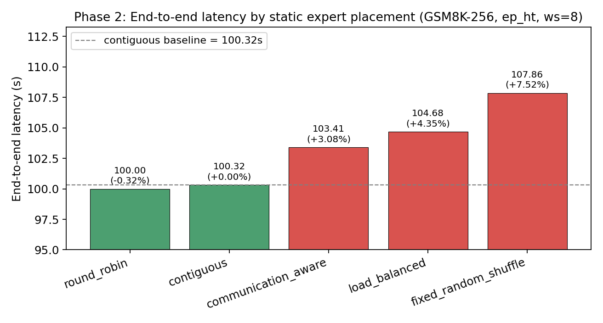
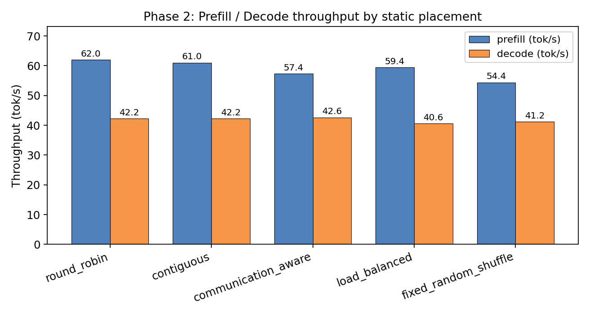
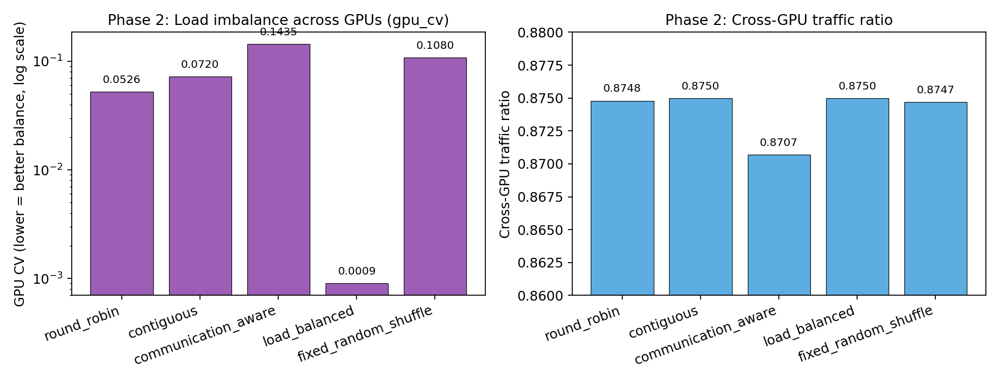
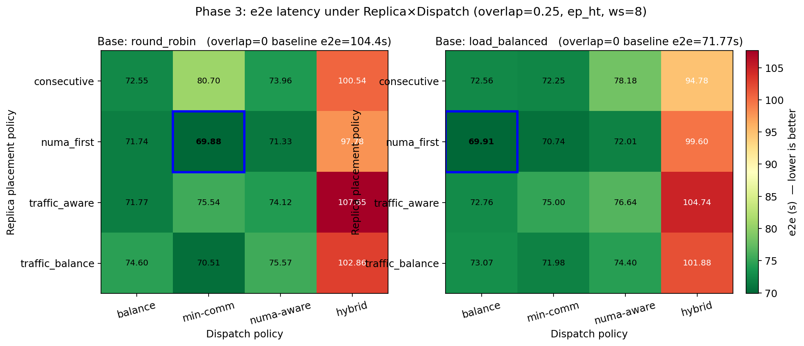
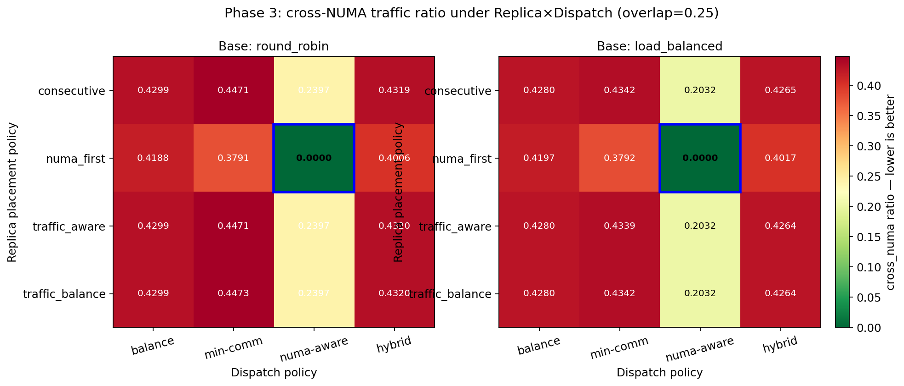
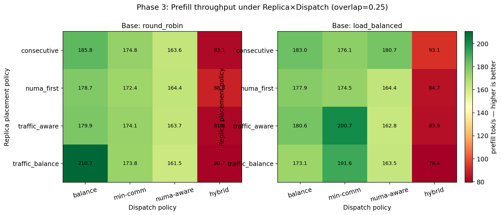
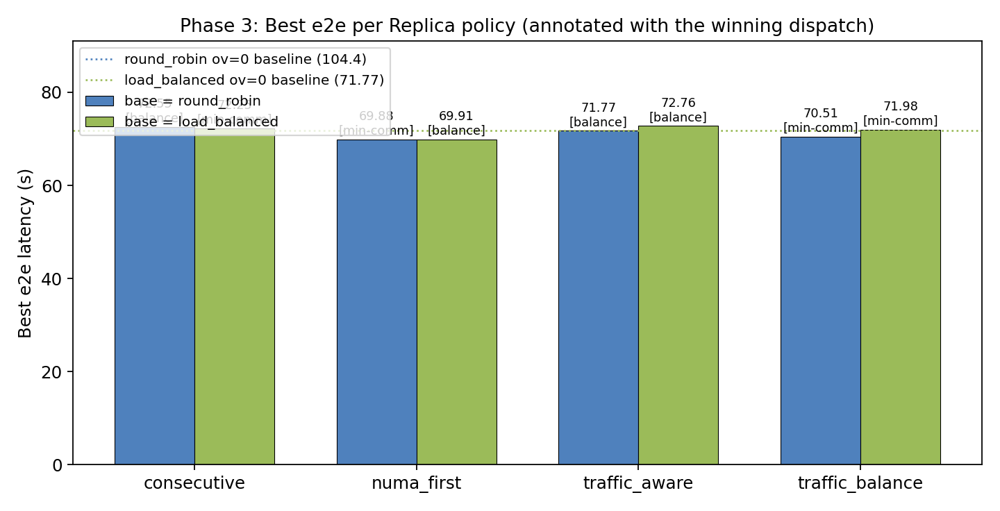
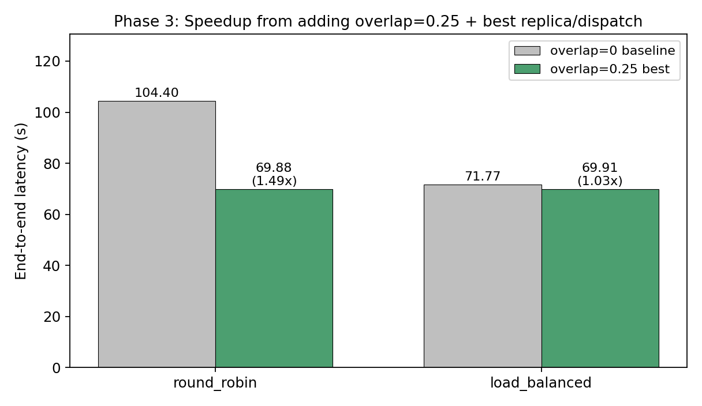
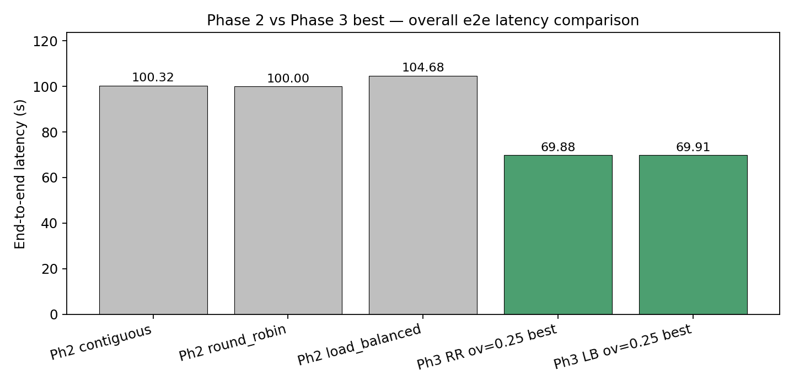

# Phase 2 / Phase 3 实验结果汇报

**实验设置**

- 模型：Qwen3-30B-A3B
- 通信实现：`ep_ht` (owner_local_ep runtime, ep_size = world_size = 8, tp=1, dp=8)
- 数据集：GSM8K，256 条
- 解码参数：`max_tokens=64`、`max_num_seqs=8`、`max_num_batched_tokens=512` (Phase 3) / `=256` (Phase 2)
- Phase 2：在 baseline `contiguous` profile 基础上生成 5 种 placement，重跑 GSM 真实测量
- Phase 3：固定两种 base placement（`round_robin` 与 `load_balanced`），在 `overlap=0.25` 下扫 4×4 的 (Replica × Dispatch) 联合空间

> 所有 e2e / throughput / cross_traffic / cross_numa / gpu_cv 都来自真实 runtime；不是离线 proxy 估计。

---

## 一、Phase 2：Static Expert Placement

### 图 1：End-to-end latency 对比

**含义**：5 种 placement 在 GSM8K-256 上的端到端延迟，灰色虚线是 `contiguous` baseline。柱子上的百分比是相对 `contiguous` 的变化。

**结论**：
- `round_robin` 和 `contiguous` 几乎一致（差距 0.32%，可视为噪声）；
- `fixed_random_shuffle` 最慢，+7.5%，说明纯随机会破坏 traffic locality；
- `load_balanced` 和 `communication_aware` 在 e2e 上反而比 contiguous 慢 3–4%。
- **延迟维度上，几种主流静态 placement 差距都很小**——单看 e2e 几乎选不出明显赢家。

### 图 2：Prefill / Decode 吞吐对比

**含义**：每种 placement 的 prefill 与 decode 吞吐量（tok/s）。

**结论**：
- decode 吞吐高度集中在 40–43 tok/s 这个窄带，placement 影响不大；
- prefill 吞吐差异更明显：`round_robin` ≈ 62，`fixed_random_shuffle` 仅 54。
- 说明 Phase 2 这层的 latency 差异主要来自 prefill 路径上的 dispatch/combine 流量分布。

### 图 3：GPU 负载不均衡 (gpu_cv) 与 cross-GPU traffic ratio

**含义**：左图是各卡 expert 算力分布的变异系数（CV，log 轴，越小越均衡）；右图是跨卡 traffic 比例（越小越好）。

**结论（这张图是 Phase 2 最重要的图）**：
- `load_balanced` 在 gpu_cv 上压到 ~0.0009，**比所有其它策略低一到两个数量级**——但它在 e2e 上反而最慢。说明在 Phase 2 这种"无副本、纯静态"语义下，把 expert 算力压到完全均衡，并不能转化为 e2e 收益（因为 cross-GPU 通信瓶颈没动）。
- 所有 placement 的 cross_traffic_ratio 都堆在 0.87–0.88，几乎贴在一起。**纯静态 placement 不足以撬动跨卡通信**。
- `communication_aware` 拿到最低 cross_traffic（0.8707），但优势仅 0.4%。

**Phase 2 → Phase 3 的设计动机**：单纯换 expert 放置位置对 e2e 几乎没用，必须引入**副本（replica）+ NUMA 感知的 dispatch**，才能真正攻击 traffic 和 latency。这也是 Phase 3 把 base 限制在两种代表性 placement (`round_robin` 偏 latency / `load_balanced` 偏 balance)，把自由度留给 replica + dispatch 的原因。

---

## 二、Phase 3：Replica × Dispatch 联合实验 (overlap = 0.25)

### 图 4：e2e latency 热力图 (Replica × Dispatch)

**含义**：左右两个子图分别对应 `base = round_robin` 和 `base = load_balanced`，每格是该 (Replica, Dispatch) 组合在 overlap=0.25 下的真实 e2e（s）。颜色越绿越快，越红越慢。蓝框标出本图最优格子。子图标题里写了对应的 overlap=0 baseline e2e，便于对比 0.25 副本带来的提升。

**结论**：
- 两个 base 的最优都落在 `numa_first` 行：
  - `round_robin` 最优：`numa_first × min-comm`，e2e = **69.88s**（vs ov=0 baseline 104.40s，**1.49× 加速**）；
  - `load_balanced` 最优：`numa_first × balance`，e2e = **69.91s**（vs ov=0 baseline 71.77s，1.03× 加速）。
- `hybrid` 整列普遍最差（90–110 s），不论 base 与 replica 是哪个组合——说明这套 hybrid 实现在当前 workload 下未能兼顾 balance 与 traffic，需要被排除或重写。
- `numa_first` 整行明显比其它 replica 策略稳定地好，**副本"跨 NUMA 多样性"比"按流量贪心"或"连续扩"更有效**。

### 图 5：Cross-NUMA traffic 热力图

**含义**：每格是该组合的真实 cross-NUMA 流量占比。越绿越好。

**结论**：
- `numa-aware` 这一列（dispatch）在所有 replica 下都能把 cross_numa 压到 0.0–0.24（其中 `numa_first × numa-aware` 直接 = 0），效果是绝对的；
- 但回看图 4，`numa-aware` 这一列的 e2e（71–78 s）并不是最快——说明**砍 NUMA 流量 ≠ 砍 e2e**，因为 dispatch 集中会引入新的算力不均；
- 真正最快的两个格子用的是 `min-comm` 或 `balance`，它们的 cross_numa 在 0.37–0.42，是"还可接受"的水平。
- **可观察的 tradeoff**：在 `numa_first` 副本布置下，把 dispatch 从 numa-aware 放宽到 min-comm/balance，能用 ~0.4 的 cross_numa 换 2–3s 的 e2e 减少。

### 图 6：Prefill 吞吐热力图

**含义**：与图 4 同样布局，每格是 prefill 吞吐（tok/s），颜色越深绿越好。

**结论**：
- 高 prefill 吞吐区域与低 e2e 区域基本重合，但 **`load_balanced × traffic_balance × min-comm` 拿到全场最高 prefill 200.7 tok/s**，e2e 却只是中等（75 s）——说明它 prefill 很快，但 decode 拖了后腿；
- `hybrid` 列普遍 80–93 tok/s，是它整体最慢的根因；
- 对比 Phase 2 ep_ht 的 prefill ≈ 57–62 tok/s：**Phase 3 把 prefill 提到了 3× 左右**，这是 e2e 大幅提速的主要来源。

### 图 7：每种 Replica policy 的最优组合

**含义**：把每种 Replica policy 在所有 dispatch 中的最优 e2e 取出来对比，柱子上注明了"最优 dispatch 是谁"。两条点线是 overlap=0 时各自 base 的 baseline。

**结论**：
- `numa_first` 在两个 base 上同时拿最优；
- `consecutive`（baseline 副本策略）也能跑到 72.25–72.55 s，与 `numa_first` 差距仅约 2.5 s——说明**只要副本数对了，副本怎么放的边际收益比想象的小**，真正的 jump 来自 overlap 本身；
- `traffic_aware` / `traffic_balance` 表现介于中间，没有体现出预期优势：因为在 GSM 这个数据集上 routing 比较平均，traffic 信号弱（与 Phase 2 中 `communication_aware` 也没赢一致）。

### 图 8：overlap=0 baseline vs overlap=0.25 最优 — 加速比

**含义**：每个 base placement 下，"无副本 baseline" 与 "0.25 副本 + 最优 replica/dispatch" 的 e2e 对比。绿柱上的 ×N 是加速比。

**结论**：
- `round_robin` 基线下，引入 25% 副本 + numa_first + min-comm 拿到 **1.49× 加速**；
- `load_balanced` 基线下只拿到 1.03× —— 因为 load_balanced 的 baseline 本身就已经是 71.77s，**它的 baseline 性能已经吃掉了 overlap 能带来的大部分收益**，剩余可优化空间小；
- 两个 base 的 overlap=0.25 最优终点几乎相同（69.88 vs 69.91 s）；
- 这暗示一个**收敛现象**：副本机制把不同 base placement 之间的差异抹平了，**只要副本布置（特别是 numa_first）做对**，最终性能不强依赖于 base placement 的选择。

---

## 三、整体对比

### 图 9：Phase 2 vs Phase 3 — 总体 e2e 对比

**含义**：把 Phase 2 三种典型静态 placement 与 Phase 3 两个 base 下的最优组合放在一起对比 e2e 延迟。灰色 = Phase 2，绿色 = Phase 3 最优。

**结论**：
- Phase 2 内部 5 种 placement 都在 100–108 s 区间，差距很小；
- Phase 3 把 e2e 一举拉到 ~70 s，相对 Phase 2 最好（`round_robin` 100s）提速约 **1.43×**；
- **整个项目最大的性能跳点出现在"引入副本 + numa 感知"这一步，而不是 placement 的微调上**。

---

## 四、给老师汇报时建议的一句话总结

> 静态 placement 上，5 种策略的 e2e 在 100–108s 区间，差距不显著（图 1）；`load_balanced` 能把 gpu_cv 压到接近零（图 3 左），但跨卡通信比例几乎一样（图 3 右），所以单纯换 placement 不能撬动 e2e。引入 25% 副本后（Phase 3），`numa_first` 副本布置 + `min-comm` 或 `balance` 这种"放松 NUMA"的 dispatch 把 e2e 拉到约 70s（图 4、图 8），相对最好的 Phase 2 placement 提速约 1.43×；且两种不同 base placement 的 0.25-副本最优收敛到几乎同一个点（图 7、图 8），说明**真正贡献加速的是副本 + 跨 NUMA 分布**，不是 base placement 本身。

---

## 五、文件清单

- 图片源 Python：[generate_figures.py](generate_figures.py)
- 图片输出目录：[figures/](figures/)
  - `phase2_01_e2e.png`、`phase2_02_throughput.png`、`phase2_03_cv_and_traffic.png`
  - `phase3_01_e2e_heatmap.png`、`phase3_02_xnuma_heatmap.png`、`phase3_03_prefill_heatmap.png`
  - `phase3_04_best_per_replica.png`、`phase3_05_speedup.png`
  - `summary_phase2_vs_phase3.png`

要重生成图片：`python /home/lzy/Artifact-Infer/reports/phase2_phase3_report/generate_figures.py`
