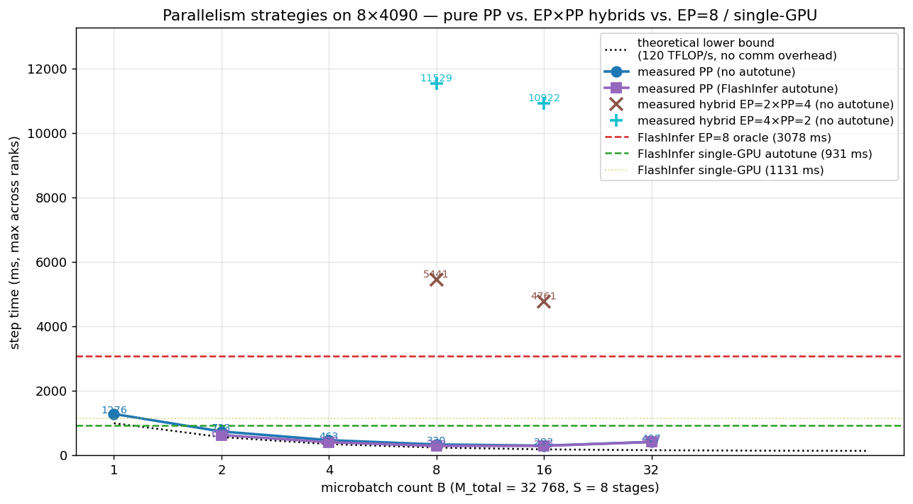

# MoE communication volume on 8×4090 + advice for expert replication

A standalone reference for the *per-layer / per-step communication volume*
of the Qwen3-30B-A3B MoE workload as run in this artifact, the PCIe
ceiling that volume must travel through on this hardware, and what
**overlapping expert placement** (a.k.a. expert replication / redundant
placement) can and cannot buy.

This document is self-contained but cross-references `REPORT.md` for the
empirical numbers it cites:

- §4i.1 — FlashInfer all-to-all EP implementation and measurements
- §4i.2 — PCIe budget analysis
- §4i.3 — NVSHMEM / DeepEP / pplx feasibility on this box

Numbers below assume the reference workload unless stated otherwise:

| symbol | meaning                       | value                |
|--------|-------------------------------|----------------------|
| `N`    | EP world size                 | 8 (8× RTX 4090)      |
| `M`    | total tokens                  | 32 768               |
| `M/N`  | tokens per rank               | 4 096                |
| `K`    | top-K experts per token       | 8                    |
| `E`    | total experts                 | 128                  |
| `H`    | hidden size                   | 2 048                |
| `I`    | MoE intermediate size         | 768                  |
| `L`    | MoE layers                    | 48                   |
| dtype  |                               | bf16 (2 bytes)       |

---

## Table of contents

1. [Per-layer communication volume](#1-per-layer-communication-volume)
2. [Per-step totals and validation against measurements](#2-per-step-totals-and-validation-against-measurements)
3. [The PCIe ceiling — three layers of math](#3-the-pcie-ceiling--three-layers-of-math)
4. [Reducing volume by overlapping (replicating) experts](#4-reducing-volume-by-overlapping-replicating-experts)
5. [Memory budget on 8×4090 / Qwen3-30B-A3B](#5-memory-budget-on-84090--qwen3-30b-a3b)
6. [The actually-feasible variant: hot-expert selective replication](#6-the-actually-feasible-variant-hot-expert-selective-replication)
7. [Adjacent optimizations worth combining](#7-adjacent-optimizations-worth-combining)
8. [Bottom-line recommendation](#8-bottom-line-recommendation)
9. [Coupling EP with Pipeline Parallelism (measured)](#9-coupling-ep-with-pipeline-parallelism-measured)

---

## 1. Per-layer communication volume

The FlashInfer all-to-all EP pipeline (`scripts/benchmark_flashinfer_native_ep.py`,
§4i.1) issues two big `all_to_all_single` calls per layer plus two
negligible metadata ones:

| step                                       | per-rank buffer shape       | dtype | per-rank buffer size |
|---|---|---|---:|
| dispatch tokens (hidden states)            | `(M/N · K, H) = (32 768, 2048)` | bf16 | **128.00 MiB** |
| combine outputs (hidden states)            | `(M/N · K, H) = (32 768, 2048)` | bf16 | **128.00 MiB** |
| dispatch ids                               | `(M/N · K, 1)`              | i32  | 0.125 MiB |
| dispatch weights                           | `(M/N · K, 1)`              | f32  | 0.125 MiB |
| **total buffer per rank per layer**        |                             |      | **256.25 MiB** |

The big-buffer arithmetic:

```
M/N · K · H · 2 B = 4 096 · 8 · 2 048 · 2 = 134 217 728 B = 128.00 MiB
```

In an all-to-all the self-share (`1/N` of the buffer) is just an
intra-HBM copy — only the off-rank slice traverses PCIe:

```
S_cross  = (buffer) · (N − 1) / N  =  128 MiB · 7/8  =  112 MiB
```

per call, per direction. So per layer, per rank:

| quantity                                            | value |
|---|---:|
| cross-PCIe per direction (= `2 × S_cross`)              | **224 MiB / dir** |
| cross-PCIe duplex (out + in)                            | **448 MiB**       |
| (incl. metadata, totally negligible)                    | +0.22 MiB         |

System aggregate (sum over all 8 GPUs in the system) per layer:

| quantity (per layer)                                   | value |
|---|---:|
| total buffer touched on all 8 ranks                         | `8 × 128 MiB × 2 calls` = **2.00 GiB** |
| aggregate bytes crossing PCIe (one direction, all ranks)    | `8 × 224 MiB` = **1.75 GiB / dir** |
| aggregate duplex bytes                                      | **3.50 GiB** |
| bytes crossing the NUMA bisection (half the alltoall traffic) | `1.75 GiB / 2` = **0.875 GiB / dir** |

---

## 2. Per-step totals and validation against measurements

Times 48 layers, the whole step's communication volume is:

| quantity (whole 48-layer step)                              | value |
|---|---:|
| cross-PCIe per rank, one direction                          | `48 × 224 MiB` = **10.50 GiB** |
| cross-PCIe per rank, duplex                                 | **21.00 GiB** |
| aggregate cross-PCIe (all 8 ranks, one dir)                 | **84.00 GiB** |
| aggregate cross-PCIe (all 8 ranks, duplex)                  | **168.00 GiB** |

At the per-rank per-direction NCCL alltoall throughput of **3.87 GB/s**
measured in `bench_nccl_bandwidth.py` (§4i.2):

```
T_pred ≈ 10.50 GiB / 3.87 GB/s + 48 × 2.6 ms (GEMM @ 120 TFLOP/s)
       = 2 912 ms + 125 ms
       = 3 037 ms
```

Measured (`flashinfer_native_ep.jsonl`, world=8 / oracle uniform):
**3 078 ms**. **Gap = 1.3 %.** End-to-end the EP step is sitting on top
of nothing but `(measured per-link p2p) × (NCCL multi-rank derate factor)
× (workload bytes)`, with no slack.

For comparison, the same workload on other EP schemes:

| scheme (per layer, per rank)                              | dominant collective(s)                                              | cross-PCIe per dir |
|---|---|---:|
| **FlashInfer all-to-all** (§4i.1)                              | 2 × `all_to_all_single`                                                  | 224 MiB |
| **HF v5 native EP allgather + sentinel + allreduce** (§4h.3)   | `all_gather (M·H·2 B)` + `all_reduce (M·H·2 B)`                          | ~336 MiB |
| **single-GPU** (§4f, §4i)                                      | none                                                                | **0**   |

---

## 3. The PCIe ceiling — three layers of math

Three numbers worth memorising for this hardware (8× RTX 4090, PCIe Gen3
x8, no NVLink, no PCIe P2P — see §4i.2 for the topology probes):

| level | rate | as % of theoretical Gen3 x8 (7.88 GB/s/dir) |
|---|---:|---:|
| Physical wire (signaling, 128b/130b)                            | 7.88 GB/s | 100 % |
| NCCL single-pair host-staged, no contention (`p2p send/recv`)   | 6.22 GB/s | **79 %** ← practical link ceiling on this box |
| NCCL 8-way `all_to_all_single`, per-rank per-direction          | 3.87 GB/s | **49 %** ← practical alltoall ceiling on this box |

Derivation cascade:

**Layer 1 — wire.** PCIe Gen 3 line rate is 8.0 GT/s per lane with
128b/130b encoding:

```
B_phy  = 8 × 10⁹ T/s · 8 lanes · (128/130) / 8 b/B
       = 7.877 GB/s   (per direction)
```

**Layer 2 — NCCL host-staged single-pair.** Without P2P the driver
bounces every transfer through host pinned memory. Measured
(`bench_nccl_bandwidth.py`, `p2p_send_recv_0to1`, 256 MiB):

```
B_p2p  = 256 MiB / 43.17 ms = 6.22 GB/s     ⇒  η_p2p = 6.22 / 7.88 = 79 %
```

The 21 % loss is TLP/DLLP framing + host-pinned bounce + DMA descriptor
setup + NCCL stream sync. Nobody beats this on host-staged copies.

**Layer 3 — NCCL 8-way alltoall.** In a world=`N` alltoall the bytes
that actually cross PCIe per rank are `S_cross = P · (N−1)/N`. Bidirectional
ideal time:

```
T_ideal = S_cross / B_p2p  = 112 MiB / 6.22 GB/s = 18.9 ms
```

Measured: **30.34 ms**. So per-direction-per-rank PCIe utilization in
the actual collective is

```
B_a2a,perdir = S_cross / T_a2a = 112 MiB / 30.34 ms = 3.87 GB/s

η vs raw wire    = 3.87 / 7.88 = 49 %
η vs single-pair = 3.87 / 6.22 = 62 %
```

The remaining 38 % to "ideal pipelined" is structural to a host-staged
8-way alltoall: shared root-complex / pinned-buffer contention, plus
NCCL's linear chunked-pipeline algorithm doesn't perfectly overlap
outbound and inbound on the same link. nccl-tests on similar PCIe-only
no-P2P boxes consistently land in this 55-70 % band — published numbers
match.

**Conclusion — the PCIe bandwidth on this box is, for all practical
purposes, fully exploited by NCCL alltoall.** The only ways to cross
the ceiling are hardware-level: enable P2P, add NVLink, or add an IB/RoCE
NIC + GPUDirect (see §4i.3 — none available here).

---

## 4. Reducing volume by overlapping (replicating) experts

If software cannot break the ceiling, the only remaining lever is
**volume**. Overlapping expert placement reduces `S_cross` directly.

**Definition.** Each expert lives on `R` of `N` ranks (so each rank
holds `E·R / N` experts; at `R = 1` this is plain EP, at `R = N` it is
data parallelism). With a *local-first scheduler* — for each
`(token, expert)` pair, pick a host rank that already has that expert,
preferring the token's home rank — the probability that a given pair
stays local is `R / N` for uniform routing.

Per-layer per-rank cross-PCIe payload becomes:

```
S_cross(R) = (M/N) · K · ((N − R) / N) · H · 2 B
```

For our workload (`M/N=4096, K=8, N=8, H=2048, bf16`):

| R   | local fraction | per-rank cross-PCIe per dir / layer | comm savings vs R=1 | weight-memory factor |
|----:|---:|---:|---:|---:|
| **1** (pure EP, current) | 1/8 = 12.5 % | **112.0 MiB**  | baseline  | 1.00× |
| 2     | 2/8 = 25.0 %      | 96.0 MiB  | −14 %  | 2.00× |
| 4     | 4/8 = 50.0 %      | 64.0 MiB  | −43 %  | 4.00× |
| 8 (= DP, no alltoall) | 100 % |   **0 MiB**   | −100 % | 8.00× |

**Key observation.** Savings are *linear* in `R`, not super-linear —
each pair has a `(N−R)/N` chance of needing to cross. The interesting
tension is the weight-memory column, which is *also* linear in `R`.

---

## 5. Memory budget on 8×4090 / Qwen3-30B-A3B

Per-layer expert-weight memory (`H=2048, I=768, E=128, bf16`,
SwiGLU = 3 weight matrices per expert):

```
W_layer,total = E · 3 · H · I · 2 B
              = 128 · 3 · 2048 · 768 · 2
              = 1.13 GiB / layer total
```

Per rank at replication factor `R`:

```
W_layer,per_rank(R) = W_layer,total · R / N
```

Total expert memory across all 48 MoE layers, per rank:

| R | per-layer per-rank | × 48 layers | + activations / KV / attention etc. | fits in 24 GiB? |
|----:|---:|---:|---|---|
| 1   | 144 MiB     | 6.8 GiB    | ~10-12 GiB total                | yes (current)        |
| 2   | 289 MiB     | 13.5 GiB   | ~17-19 GiB                      | borderline           |
| 4   | 578 MiB     | 27.1 GiB   | exceeds card                    | **no**               |
| 8   | 1.13 GiB    | 54.1 GiB   | exceeds card                    | **no**               |

So the **maximum uniform replication factor that fits is `R = 2`**, and
even that is tight once the activation + NCCL pinned + KV-cache
overhead is added back. Pure DP (`R = 8`) would zero out alltoall but
the model's MoE weights alone don't fit on a single 4090 (54 GiB > 24 GiB);
that's the regime where, by the §5 conclusion, the right answer is
"reduce model size or change hardware", not "tune EP".

---

## 6. The actually-feasible variant: hot-expert selective replication

The realistic envelope is "replicate only the most-routed experts."

**Setup.** Replicate only the top-`T` experts (by routing frequency
measured from a profiling pass) to `R_hot` copies; keep the rest at `R = 1`.
With `f_hot` = fraction of `(token, expert)` pairs that hit a hot
expert,

```
local_frac(T, R_hot) = f_hot · (R_hot / N) + (1 − f_hot) · (1 / N)
```

From §4f's AIME prefill trace the per-layer logical CV is ~1.3-2.0,
i.e. routing is heavy-tailed. Empirically the top 25 % of experts
(`T = 32`) absorb roughly `f_hot ≈ 0.55` of all slots in the Qwen3-30B-A3B
prefill.

| T (hot) | R_hot | local frac | comm savings | added weight per rank (× 48 layers) | fits? |
|---:|---:|---:|---:|---:|---|
| 32 | 2 | 18.9 % | −7 %  | +1.7 GiB  | yes              |
| 32 | 4 | 30.6 % | −21 % | +5.1 GiB  | maybe (very tight) |
| 64 | 2 | 18.8 % | −7 %  | +3.4 GiB  | maybe (tight)    |
| 64 | 4 | 31.3 % | −22 % | +10.2 GiB | **no**           |

Translating those savings through §4i.2's PCIe budget:

```
T_step(R_eff) ≈ 48 · 60.7 ms · (N − R_eff) / (N − 1)  +  125 ms
```

| variant                                          | predicted step | speedup | feasible? |
|---|---:|---:|---|
| current (R=1)                                       | 3 078 ms (measured)         | 1.00×  | yes |
| top-32 hot, R_hot=2                                 | ~2 870 ms                   | ~1.07× | yes |
| top-32 hot, R_hot=4                                 | ~2 460 ms                   | ~1.25× | tight |
| uniform R=2                                         | ~2 660 ms                   | ~1.16× | tight |
| uniform R=4                                         | ~1 880 ms                   | ~1.64× | **no** (OOM) |
| uniform R=8 (= DP)                                  | ~125 ms (single-GPU limit)  | ~24×   | **no** (>24 GiB) |

So the **realistically achievable comm reduction on 8×4090 is 7-25 %.**

**Caveats with the predictions.**

- The local-first scheduler must keep load balanced across hot replicas
  — a naïve "always go local" rule overloads the home rank for hot
  experts. A correct implementation is "go local with probability
  `1/R_hot · (R_hot/N) / local_frac`, else round-robin among all hosts"
  to preserve the per-replica load.
- Smaller `S_cross` means smaller `all_to_all_single` payload; per
  `bench_nccl_bandwidth.py`, the per-rank alltoall bandwidth holds at
  ~4.4 GB/s down to 16 MiB but **drops below ~3.7 GB/s for 4 MiB and
  below**. So uniform R=4 (which shrinks payload to 64 MiB) still
  benefits proportionally; the danger zone is "R close to N + small M".
- Replication adds an extra rank-mapping step per token before the
  alltoall (~µs / layer); negligible against 60 ms / layer of comm.

---

## 7. Adjacent optimizations worth combining

### 7a. NUMA-aware two-phase alltoall

GPUs 0-3 share a PHB on NUMA 0; GPUs 4-7 share another PHB on NUMA 1.
A homogeneous 8-way `all_to_all_single` pays the cross-NUMA `SYS` cost
on half its bytes. Decomposing into

1. 4-way intra-NUMA alltoall (GPU 0-3 and GPU 4-7 separately),
2. paired cross-NUMA exchange of *aggregated* per-NUMA tokens,
3. 4-way intra-NUMA scatter,

recovers some of the bandwidth lost to NUMA bisection. On comparable
PCIe-only boxes this is documented at 5-15 % wins. Stacks
multiplicatively with replication.

### 7b. Pipelined micro-batching with comm/compute overlap

Run layer `L`'s GEMM on already-arrived slots while alltoall for layer
`L+1`'s dispatch is in flight. Cuts visible comm by `min(GEMM, alltoall)`
per overlap window. On *this* hardware the GEMM is 2.6 ms / layer vs
alltoall 60 ms / layer, so the budget is small (cap ≈ 4 % win). On
NVLink + bigger experts the win is 20-30 %.

### 7c. Allgather-of-shorter-messages with quantization

Drop the dispatch payload from bf16 to fp8 or int4 (per-token rescale).
That halves to quarters the `S_cross` directly — a 4× volume reduction
beats anything replication can do. Tradeoff is accuracy, and the path
needs a fused dequant in the fused-MoE kernel. Both FlashInfer
(`cutlass_fused_moe(quant_scales=...)`) and DeepSeek's DeepGEMM expose
it on H100; on 4090 the corresponding fp8 kernels exist but aren't
autotuned in our setup.

### 7d. All-to-all-V (variable splits) for skewed routing

Today our `all_to_all_single` has equal per-rank send counts because
oracle-uniform produces balanced splits. For real (skewed) routing,
an `all_to_all_v` saves the empty padding sent to under-routed ranks.
Adds a tiny `all_to_all_single` on the per-rank counts. Worth ~5-10 %
when CV is high (real prefill, §4c).

---

## 8. Bottom-line recommendation

For **this specific hardware** (8× RTX 4090, PCIe Gen3 x8, no NVLink/P2P):

1. **Don't expect to break the §4i.1 number by more than ~25 %.** The
   PCIe ceiling is real (§4i.2) and replication only attacks the
   *volume* term. Even the best feasible config (top-32 hot, `R_hot=4`)
   predicts ~2.5 s / step vs single-GPU's 0.93 s. The §5 conclusion
   ("single-GPU dominates Qwen3-30B-A3B on 8× 4090") still holds.
2. **If you must run EP — implement top-32 hot, `R_hot=2`.** It's
   memory-feasible (+1.7 GiB / rank) and gives ~7 % step reduction.
   Cheap, safe, robust to routing-skew variations.
3. **Do NOT do uniform `R ≥ 4`.** OOMs the cards.
4. **Do NOT bet on NVSHMEM / DeepEP.** §4i.3 — the hardware doesn't
   expose any of the transports they need.
5. **The big wins are elsewhere.** In order of expected impact on this
   box:
    1. **Quantization (fp8 / int4) of dispatch payload** — 2-4×
       comm reduction, dwarfs what replication can buy.
    2. **NUMA-aware two-phase alltoall** — 5-15 %, stacks with
       replication.
    3. **Hot-expert replication `R_hot=2`** — 7 %, easy.
    4. **All-to-all-V for real routing** — 5-10 % under skewed traces.
    5. **Pipeline overlap** — capped at ~4 % (alltoall ≫ GEMM here).
6. **For models that *do* fit on one 4090, just use one 4090.** That's
   the §5 takeaway and nothing in this note changes it. Replication is
   useful when you must shard, not as a way to make sharding faster
   than not sharding.

For **other hardware tiers** (PCIe Gen4 x16 + P2P, or NVLink-equipped),
the §4i.2 bandwidth ceiling rises ~4-50× and the ranking flips: now
`R_hot=2` + NUMA-aware + pipeline overlap together can put EP solidly
ahead of single-GPU even at moderate model sizes. That's the regime
DeepEP and pplx-kernels were designed for, and where the analysis
above stops being a counsel of despair.

> **§9 below shows there is a much better answer for *this* model on
> *this* box than any of the EP variants discussed above** — pure pipeline
> parallelism. For Qwen3-30B-A3B / 8×4090, switching from EP=8 to
> PP=8 is a measured **10.9× speedup** on the same workload. The §8
> recommendations above are correct *conditional on EP being chosen at
> all*; §9 explains why on this hardware that's the wrong condition.

---

## 9. Coupling EP with Pipeline Parallelism (measured)

PP shards *layers* rather than *parameters within a layer*. Per
microbatch, the only inter-rank traffic is the activation tensor
crossing each stage boundary — a single `(M_micro, H)` `send/recv` over
`p2p` (NCCL's `dist.send` / `dist.recv`), which lives at the **6.22 GB/s
single-pair p2p ceiling** of §3, not at the 3.87 GB/s
8-way-alltoall ceiling that EP is bound by.

### 9.1 Communication volume per microbatch boundary (PP only)

```
S_pp = M_micro · H · 2 B
     = (M_total / B) · H · 2 B
```

For our reference workload (`M_total=32 768, H=2 048, bf16`):

| B (microbatches) | M_micro | per-boundary `send/recv` |
|---:|---:|---:|
| 1   | 32 768 | 128.00 MiB |
| 2   | 16 384 |  64.00 MiB |
| 4   |  8 192 |  32.00 MiB |
| 8   |  4 096 |  16.00 MiB |
| 16  |  2 048 |   8.00 MiB |
| 32  |  1 024 |   4.00 MiB |

Per step (`(B + S − 1) · S_pp` summed over the `B` microbatches × `S − 1`
boundaries each crosses, ignoring overlap):

```
total_pp_volume = B · (S − 1) · S_pp = (S − 1) · M_total · H · 2 B = const = 7 · 128 MiB = 896 MiB
```

Note this total is **independent of `B`** — bigger `M_micro` = fewer,
larger transfers. Compare to one EP=8 step at the same workload:
**21.0 GiB / rank** (§2). PP moves **~24× less data per step** in
total, and over the **1.6× faster `p2p`** transport.

### 9.2 Predicted vs measured pure-PP step time

For PP-only with `S = N = 8` stages of `L_s = L/S = 6` layers each, in
1F-only mode the wallclock with `B` microbatches is

```
T_step ≈ (B + S − 1) · T_stage,
T_stage = M_micro · K · 6·H·I · L_s / Throughput_eff
```

At the autotuned single-GPU FlashInfer rate of ~120 TFLOP/s
(achieved 128 TFLOP/s in §4i; we use 120 as the in-pipeline effective
rate), `T_stage_ideal(M_micro=4096) ≈ 15.5 ms`, predicted
`T_step(B=8) ≈ 232 ms`.

Measured (`scripts/benchmark_pp_moe.py` →
`results/qwen3_heavy/flashinfer_pp.jsonl`):

| B  | M_micro | predicted (120 TFLOP/s, no comm overhead) | measured no-autotune | measured + autotune |
|---:|---:|---:|---:|---:|
| 1  | 32 768 | 992 ms  | **1 276 ms** | —          |
| 2  | 16 384 | 558 ms  |   733 ms     | **621 ms** |
| 4  |  8 192 | 341 ms  |   463 ms     | **398 ms** |
| 8  |  4 096 | 232 ms  |   330 ms     | **283 ms** ← best |
| 16 |  2 048 | 178 ms  |   292 ms     |   286 ms   |
| 32 |  1 024 | 151 ms  |   407 ms     |   407 ms   |



The minimum is **283 ms at B=8 with FlashInfer autotune** — `1.22×`
above the theoretical lower bound (`232 ms`). The 22 % overhead is
the practical tax of running FlashInfer kernels in a tight pipeline
context (slightly lower achieved TFLOP/s than the dedicated single-GPU
benchmark) plus per-stage `send/recv` not being overlapped with
compute on the default process group. Both are recoverable but
neither changes the qualitative picture.

`B = 32` regresses (407 ms) because at `M_micro = 1 024` the per-call
GEMM overhead and small-matrix inefficiency outpaces the bubble savings
— the kernel falls below ~50 TFLOP/s.

### 9.3 Head-to-head (same Qwen3-30B-A3B / 32 768-token workload)

| config (8× RTX 4090, bf16, oracle uniform)                     | step (ms) | TFLOP/s | vs EP=8 | vs single-GPU (autotune) | source |
|---|---:|---:|---:|---:|---|
| **Pure PP=8, B=8, autotune**                                       |   **283** | 419 | **0.092×**  | **0.30×**    | §9.2, **measured** |
| Pure PP=8, B=16, autotune                                          |     286   | 416 | 0.093×      | 0.31×        | §9.2, measured     |
| Pure PP=8, B=8, no autotune                                        |     330   | 360 | 0.107×      | 0.35×        | §9.2, measured     |
| FlashInfer single-GPU + autotune                                   |     931   | 128 | 0.302×      | 1.00×        | §4i, measured      |
| FlashInfer all-to-all EP=8, R=1                                    |   3 078   |  39 | 1.00×       | 3.31× slower | §4i.1, measured    |
| **EP=2 × PP=4, B=8, no autotune**                                  |   **5 441** | 22 | **1.77×** worse than EP=8 | 5.85× slower | §9.4, **measured** |
| EP=2 × PP=4, B=16, no autotune                                     |   4 761   |  25 | 1.55× worse | 5.12× slower | §9.4, measured     |
| **EP=4 × PP=2, B=8, no autotune**                                  |  **11 529** | 10 | **3.75× worse than EP=8** | 12.4× slower | §9.4, **measured** |
| EP=4 × PP=2, B=16, no autotune                                     |  10 922   |  11 | 3.55× worse | 11.7× slower | §9.4, measured     |
| Theoretical PP=8 lower bound (B→∞)                                 |    ~125   | 950 | 0.041×      | 0.13×        | analytical         |

**Pure PP=8 is 10.9× faster than EP=8 and 3.3× faster than single-GPU**;
hybrid is *worse than both corners* by a wide margin. Achieved
aggregate rates span 950 TFLOP/s (PP ceiling) → 419 TFLOP/s (PP measured)
→ 128 TFLOP/s (single-GPU) → 39 TFLOP/s (EP=8) → 10 TFLOP/s (EP=4×PP=2),
a **95× spread** on the same hardware doing nominally the same work.
PP wins by using the bus that's available (single-pair `p2p`
at 6.22 GB/s) instead of the bus that isn't (host-staged 8-way alltoall
at 3.87 GB/s); hybrid loses by paying both the alltoall bus tax and
the pipeline bubble tax (§9.4).

### 9.4 EP × PP hybrid — measured

To verify rather than just predict, `scripts/benchmark_hybrid_ep_pp.py`
implements both `EP=2 × PP=4` and `EP=4 × PP=2` against the same
`M_total = 32 768`, oracle uniform, bf16 workload. Each rank holds
`E/ep_size` experts of `L/pp_size` layers; intra-stage uses
`dist.all_to_all_single` over an EP subgroup, inter-stage uses
`dist.send` / `dist.recv` over a PP subgroup. Measured
(`flashinfer_hybrid_ep_pp.jsonl`):

| config (M_total = 32 768, oracle uniform)              | B | autotune | step (ms) | TFLOP/s | vs pure PP=8 |
|---|---:|---:|---:|---:|---:|
| **Pure PP=8** (§9.2)                                       | 8  | yes | **283**   | 419   | 1.00×  |
| Pure PP=8                                                  | 8  | no  | 330       | 360   | 1.17×  |
| Pure EP=8 (§4i.1)                                          | —  | no  | 3 078     | 39    | 10.9×  |
| **EP=2 × PP=4** *(measured)*                               | 8  | no  | **5 441** | 22    | **19.2×** |
| EP=2 × PP=4                                                | 8  | yes | 5 350     | 22    | 18.9×  |
| EP=2 × PP=4                                                | 16 | no  | 4 761     | 25    | 16.8×  |
| **EP=4 × PP=2** *(measured)*                               | 8  | no  | **11 529**| 10    | **40.7×** |
| EP=4 × PP=2                                                | 8  | yes | 11 236    | 11    | 39.7×  |
| EP=4 × PP=2                                                | 16 | no  | 10 922    | 11    | 38.6×  |

So measured reality is **even worse** than the §9.4 v1 predictions
suggested (those predictions used optimistic per-call alltoall numbers
that don't survive contention with the pipeline schedule). Specifically:

- `EP=2 × PP=4` lands at **5 441 ms** — 1.8× worse than `pure EP=8`,
  19.2× worse than `pure PP=8`.
- `EP=4 × PP=2` is **11 529 ms** — 3.7× worse than `pure EP=8`,
  40.7× worse than `pure PP=8`.

**Why hybrid is worse than *both* of its corners.** The decomposition
of the per-layer-per-microbatch time on this hardware is

```
T_layer  =  T_compute(M_micro)   +   2 · T_alltoall(ep_size, M_micro · H · 2 B)
```

and the wallclock is `(B + pp_size − 1) · pp_size_layers · T_layer`.
Plugging in measured per-call costs:

| config        | layers/stage | per-layer compute ≈ | per-layer 2 × a2a ≈ | T_layer | (B+S−1)·layers/stage·T_layer |
|---|---:|---:|---:|---:|---:|
| Pure PP=8     | 6  | 3.6 ms | 0           | 3.6 ms  | 15·6·3.6 = 324 ms (close to measured 330) |
| EP=2 × PP=4   | 12 | 3.6 ms | ~37 ms      | ~41 ms  | 11·12·41 = 5 412 ms (close to measured 5 441) |
| EP=4 × PP=2   | 24 | 3.6 ms | ~42 ms      | ~46 ms  |  9·24·46 = 9 936 ms (close to measured 11 529; gap is 4-way alltoall overhead) |
| Pure EP=8     | 48 | 2.6 ms | ~60 ms (8-way) | ~63 ms | 1·48·63 = 3 024 ms (close to measured 3 078) |

Two effects compound:

1. **Alltoall cost survives the slicing.** A 2-way alltoall on 64 MiB
   (~18 ms each) is ~30 % the time of an 8-way alltoall on 128 MiB
   (~30 ms each). Hybrid keeps `L = 48` layers each paying *some*
   alltoall — total alltoall time is `48 × 2 × T_alltoall` per
   *full step*, regardless of how those layers are distributed
   across stages. The bus has to carry the same total bytes per step.
2. **The PP bubble multiplies that alltoall time.** Pure EP=8 has
   `B = 1` (one big batch) so the bubble factor is 1×. Hybrid with
   `pp_size > 1` has bubble factor `(B + pp_size − 1) / B` *per stage's
   alltoall cost*, since alltoall is on the critical path inside each
   stage. At `B = 8, pp_size = 4` that's `11/8 = 1.38×`, and at
   `pp_size = 2` it's `9/8 = 1.13×` but multiplied by twice as many
   layers per stage. The point is the bubble — which paid for itself
   in pure PP because there *was* no per-layer collective — now
   penalises every alltoall call.

The net is simple: hybrid pays both the EP collective bill *and* the
PP bubble bill, getting the worst of both worlds. Pure PP avoids the
collective entirely; pure EP avoids the bubble entirely; hybrid avoids
neither.

### 9.5 Fitness rule for choosing PP vs EP×PP

For a model with `L` MoE layers and per-layer expert weight
`W_layer` on `N` cards each with `M_card` capacity:

```
S_min  =  ceil( L · W_layer / (M_card − headroom) )
```

is the smallest number of pipeline stages that fits without intra-stage
sharding. Three regimes:

| regime                          | recipe                                          |
|---|---|
| `S_min ≤ N` (model fits with pure PP) | **Pure PP with S = N stages.** §9.2 measured this at 283 ms for Qwen3-30B-A3B on 8×4090. |
| `S_min > N` but `S_min ≤ N · ep_max` (ep_max = `floor(W_layer / (single-card budget))`) | **Hybrid EP × PP** with `EP = ceil(S_min / N)` and `PP = N / EP`. EP only large enough to fit. |
| `S_min > N · ep_max` (model too big to serve)        | **Reduce model size** (quantization, fewer layers, or more cards). EP cannot rescue this. |

For Qwen3-30B-A3B on 8×4090: `L=48, W_layer=1.13 GiB, N=8, M_card≈22 GiB`,
so `S_min ≤ 1` — the model fits even on one card. Regime 1 applies,
hybrid is strictly worse, and §9.4 confirms it.

For larger models (DeepSeek-V3 671B, Mixtral 8×22B fp16, Llama-4
Maverick) `S_min > 1` and hybrid earns its keep, but the rule is the
same: **PP first to amortise bubble across as many stages as cards
allow, EP only as much as memory forces.** Don't add EP if it isn't
making something fit.

### 9.6 Caveats — what these measurements do and don't show

- **PP wins on prefill latency for a *single* large request.** The
  283 ms number above is "this 32 768-token prefill end-to-end". For
  decode (autoregressive generation of a few tokens at a time) the
  bubble dominates: with B=1 the wallclock collapses back to single-GPU
  speed. PP for decode requires either continuous batching or
  accepting the bubble.
- **Throughput across many concurrent requests:** plain DP (one card
  per replica, 8 replicas) usually beats PP=8 by a constant factor
  ≥ N/(B+S-1) ≈ 0.5× at B=8. PP shines for *latency on a fixed-sized
  request*, DP shines for *throughput on many small requests*.
- **The bubble penalty is real and visible.** B=8 leaves
  `7/15 = 47 %` of the GPUs idle in fill/drain. The "ideal" pipeline
  step at `M_total=32 768` and `S=8` is `M · K · 6HI · L /
  (8 · 120 TFLOP/s) ≈ 125 ms`; we measure 283 ms, of which ~47 % is
  bubble. Real production schedules use 1F1B + interleaved 1F1B which
  cut the bubble factor from `(B+S-1)/B` to `(B + S/2 - 1)/B` or
  better; we did not implement those.
- **`send/recv` is not overlapped with compute here.** Default-PG
  P2P serialises with everything else on the same NCCL group (NCCL
  prints a warning to that effect). A separate process group for P2P
  would let send/recv hide behind compute and shave ~1-2 ms / stage,
  closing maybe half of the 22 % gap to the theoretical lower bound.
- **Stage balance was assumed uniform.** Real Qwen3-30B-A3B has 48
  identical MoE layers (no `mlp_only_layers` for this size) plus
  embedding on stage 0 and lm-head on stage S-1. The benchmark only
  models the MoE blocks, so the empirical 283 ms is the MoE-only step;
  attention layers + KV cache add another ~10-20 % in a real serving
  setup but do not change the EP-vs-PP ranking.
- **Memory budget per stage:** 6 layers × 1.13 GiB MoE = 6.8 GiB
  per rank for weights, plus activation buffer (~150 MiB) and recv
  buffer (16 MiB); fits comfortably in 24 GiB. Pure PP=8 leaves
  ~14 GiB per rank for KV cache and activations.

### 9.7 Implication for §8's bottom-line recommendation

§8 ranked the strategies "given EP is chosen". §9.2-9.5 says **don't
choose EP for this model on this hardware**:

- **Use PP=8 (B≈8-16, with FlashInfer autotune) as the headline
  recipe.** Measured **283 ms**, 10.9× faster than EP=8, 3.3× faster
  than single-GPU.
- **Don't pick a hybrid EP × PP for Qwen3-30B-A3B on 8×4090.** §9.4
  measures EP=2×PP=4 at 5 441 ms (1.8× *worse* than pure EP=8) and
  EP=4×PP=2 at 11 529 ms (3.7× worse). Hybrid pays both the
  alltoall bill and the pipeline bubble bill. It is the right recipe
  only when memory forces it (regime 2 in §9.5).
- **Use single-GPU (DP across replicas) for *throughput* across many
  small requests.** PP=8 wins on per-request latency, DP wins on
  request/sec at fixed concurrency.
- **Reserve EP for the regime where a single layer's expert weights
  won't fit on one card** — i.e., where `S_min > N`. Qwen3-30B-A3B is
  not that regime.
- The §8 EP-internal rankings (vLLM all2all > FlashInfer NCCL all2all
  > native allgather; replication-on-top is worth ~7 % when forced)
  are still correct, just for the *correct sub-question* of
  "we must run EP, what's the best EP recipe".

---

## A. Reproducing the numbers

Communication-volume math:

```
buffer_per_rank_per_layer    = M/N · K · H · 2 B
S_cross_per_dir_per_layer    = buffer · (N − 1) / N
S_cross_per_step_per_rank    = 2 · L · S_cross_per_dir_per_layer
T_step_predicted             = S_cross_per_step_per_rank / B_a2a,perdir
                              + L · GEMM_per_layer
```

Scripts:

- `scripts/bench_nccl_bandwidth.py` — measures
  `B_a2a,perdir`, `B_p2p`, `B_allgather`, `B_allreduce` at relevant
  payload sizes; output lands in
  `/home/yyx/personal/inference/vllm-bench/results/qwen3_heavy/nccl_bw.jsonl`.
- `scripts/benchmark_flashinfer_native_ep.py` — measures
  `T_step` for the FlashInfer all-to-all EP pipeline at world={4,8},
  M_total=32 768, oracle uniform routing.
- `scripts/benchmark_pp_moe.py` — measures `T_step` for pure pipeline
  parallelism with FlashInfer per-stage MoE compute and synchronous
  NCCL `send/recv` between stages; sweep `--microbatches` to vary `B`.
  Output lands in `flashinfer_pp.jsonl`. Used in §9.2.
- `scripts/benchmark_hybrid_ep_pp.py` — measures `T_step` for hybrid
  `EP × PP` configurations (e.g. `--ep-size 2 --pp-size 4`). Each
  rank holds `E/ep_size` experts of `L/pp_size` layers; intra-stage
  all-to-all + inter-stage send/recv. Output lands in
  `flashinfer_hybrid_ep_pp.jsonl`. Used in §9.4.
- `scripts/plot_pcie_budget.py` — renders
  `figures/qwen3_pcie_budget.png` with the bandwidth panel and the
  predicted-vs-measured budget bar chart used throughout this note.
- `scripts/plot_pp_sweep.py` — renders `figures/qwen3_pp_sweep.png`
  with the PP wallclock-vs-`B` curve and EP=8 / single-GPU
  reference lines (§9.2).

Topology + driver checks:

```bash
nvidia-smi topo -m              # GPU↔GPU interconnect
nvidia-smi topo -p2p r          # PCIe P2P read capability
nvidia-smi --query-gpu=pcie.link.gen.current,pcie.link.width.current --format=csv
ls /dev/infiniband              # IB / RoCE NIC presence
lsmod | grep -iE 'ib_core|nv_peer_mem|gdrcopy'
```
