# Kernel-level MoE balanceness on Qwen3 / Qwen3.5

A short report on the local kernel-level MoE benchmarking work in
`workshop/e2e_bench/`. All numbers below are from one workstation
(8x NVIDIA RTX 4090, driver 580.82.07, CUDA 13.0, vLLM
`0.19.1rc1.dev180+gad720aefe.precompiled` against torch 2.11.0+cu130).

## 1. What was built

| Component | Path | What it does |
|---|---|---|
| Setup | `scripts/setup_kernel_bench_env.sh` | Idempotent venv creation + vLLM editable install with precompiled wheel + `accelerate`. |
| Bench (extended) | `inference/vllm/tests/kernels/moe/modular_kernel_tools/benchmark_eplb_multigpu.py` | The artifact's single-layer MoE kernel benchmark, extended with `--model-config`, `--num-moe-layers`, `--routing-trace`. Plays back N MoE layers per timed iteration with either synthetic or trace-driven routing. |
| Capture | `scripts/capture_routing_trace.py` | Two-mode trace recorder: `hf` (HuggingFace `AutoModelForCausalLM` + per-MoE-block forward hook), `router-only` (gate-weights-only forward, for archs the installed transformers cannot load). Now also takes `--prompt-file` to read multi-line prefill workloads from disk. |
| AIME workload | `scripts/generate_aime_responses.py` | Loads N AIME problems from the local `datasets/aime24.json`, runs Qwen3-4B with chat-templated chain-of-thought prompts, and writes a JSONL plus a concatenated `.txt` ready to feed the capture script. |
| Sweep wrapper | `scripts/run_moe_kernel_cv_sweep.py` | `--model {qwen3,qwen3.5,...}` preset that auto-fills MoE dimensions and forwards `--num-moe-layers`/`--routing-trace`. |
| Visualisation | `scripts/plot_routing_trace.py`, `scripts/plot_bench_results.py`, `scripts/plot_heavy_comparison.py` | Trace heatmaps + per-layer CV/entropy/top-K; per-layer step-time + CV-vs-time scatter; bar charts with 95% CIs for the four-scenario heavy run. |
| **Oracle baseline** | `--routing-pattern oracle_uniform` in the bench | Deterministic round-robin assignment that gives every expert exactly equal load (per-layer logical and physical CV both = 0). Serves as the kernel performance floor. |
| **Dense GEMM reference** | `scripts/benchmark_dense_ffn.py` | Stand-alone bf16 SwiGLU FFN bench (no MoE routing, no collectives). Two modes: `shared` (one expert at `moe_intermediate_size`) and `topk-fused` (one expert at `topk * moe_intermediate_size`, FLOP-equivalent to all routed experts collapsed). Used to attribute the modular-MoE step time to compute vs. collective. |
| **HF-native MoE reference** | `scripts/benchmark_hf_moe.py` | Times the HuggingFace transformers `Qwen3MoeSparseMoeBlock.forward` at matched shapes. Supports both transformers v4 (Python loop, `ModuleList` of `nn.Linear`) and v5 (3D weight tensors, `--implementation {eager,grouped_mm,batched_mm}` dispatch). Used to attribute the kernel-implementation tax. Run via either `vllm-bench/.venv` (v4.57) or the dedicated `vllm-bench-hf5/.venv` (v5.6.2). |
| **HF-native EP bench** | `scripts/benchmark_hf_native_ep.py` | Multi-rank end-to-end EP benchmark built directly on `torch.distributed` and v5 `grouped_mm`'s sentinel mask. Spawns `--world-size` processes, shards experts as `local_E = num_experts / world_size`, and runs allgather + replicated-gate + sentinel-translate + grouped_mm + allreduce per layer. No vLLM, no accelerate. |

The bench output JSON gained these fields per trial row, on top of what
the original artifact already produced:

- `model_name`, `num_moe_layers`, `routing_trace` — provenance.
- `per_layer_mean_step_ms` / `per_layer_std_step_ms` — length = num
  layers; one CUDA-event-timed per-layer kernel call per iter.
- `per_layer_logical_cv` / `per_layer_logical_entropy` — coefficient of
  variation / normalised entropy of the layer's per-expert token count.
- `per_layer_physical_cv` / `per_layer_physical_entropy` — same after
  bucketing experts into the EP rank that owns them.

## 2. Methodology

**Multi-GPU.** Every measurement runs `--world-size 8` ranks via
`torch.multiprocessing.spawn`, one per physical GPU; vLLM is configured
with `data_parallel_size=8, tensor_parallel_size=1, enable_expert_parallel=True,
all2all_backend=allgather_reducescatter`. Each kernel call therefore
includes the full all-gather → expert GEMM → reduce-scatter pipeline.

**Multi-layer.** With `--num-moe-layers N`, each timed iteration walks
N kernel calls in order and the closure feeding `custom_routing_function`
is mutated between calls so each layer sees its own `(topk_ids, topk_weights)`.
The reported total step time is the sum across the N layers; per-layer
arrays are kept too.

**Real routing.** A trace file is a list of per-layer
`(topk_ids, topk_weights)` tensors saved with `torch.save`. The bench
slices those per-rank for replay. Trace contents come from one of:

- `--mode hf` — Loads the actual HF model with `device_map="auto"`,
  hooks every `*SparseMoeBlock` / `*MoeBlock` `forward`, runs **one real
  prefill** of `--prompt` truncated/padded to `--max-tokens`, and dumps
  `(topk_ids, topk_weights)` recomputed from each layer's
  `router_logits`. Real gates **and** real per-layer hidden states.
- `--mode router-only` — Loads only `mlp.gate.weight` from the
  safetensors index, then runs `softmax(z @ gate.T) → topk` on a
  synthetic Gaussian hidden stream `z`. Real trained gates but **synthetic**
  hidden state (the same Gaussian feeds every layer). This mode exists
  because Qwen3.5 is not yet supported by transformers `< 5`, which is
  what vLLM pins.

**Synthetic routing baseline.** With Monte-Carlo `--target-dest-cv X`
the bench samples a per-rank token-share distribution close to physical
CV `X` and constructs routing IDs that materialise that share. This
gives a known-imbalance counterfactual to compare against the trace.

**Verified configurations.** Two models are exercised end-to-end, with three trace flavours:

| Model | Layers (MoE) | E | top-k | hidden | moe_int | Trace flavours used |
|---|---:|---:|---:|---:|---:|---|
| Qwen3-30B-A3B | 48 | 128 | 8 | 2048 | 768 | `hf` short-prompt (256 tok) + `hf` AIME prefill (2048 tok of Qwen3-4B chain-of-thought) |
| Qwen3.5-35B-A3B | 41 (40 + 1 MTP) | 256 | 8 | 2048 | 512 | `router-only` (real gate, synthetic hidden) |

**Cross-model AIME workload.** To get a realistic prefill instead of a single
short prompt, we drive a **smaller dense model** (Qwen3-4B,
`Qwen3ForCausalLM`) on five AIME-2024 competition problems from the local
`datasets/aime24.json`, then feed the Qwen3-4B chat transcripts as the
prefill workload for the **MoE** capture on Qwen3-30B-A3B. Qwen3-4B is
loaded via HuggingFace Transformers, runs chain-of-thought generation up
to 512 new tokens per problem at temperature 0.7, and the concatenated
`(system + user + assistant <think>...</think> solution)` text becomes
the prompt for `capture_routing_trace.py --prompt-file`. The result is
~3 100 tokens of multi-prompt math reasoning that we then truncate/pad
to the MoE capture's 2 048 prefill tokens — routing patterns reflect a
real workload, not a single short prompt or a Gaussian stream.

## 3. What real router traces look like

### Qwen3-30B-A3B (real HF prefill, 48 layers, 256 prompt tokens — single short prompt)

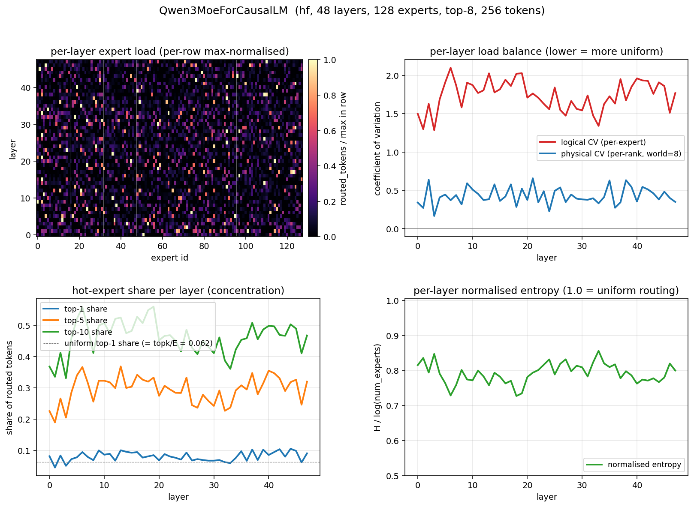

- **Routing is *very* concentrated.** Per-layer logical CV stays in 1.3-2.1
  for all 48 layers (mean 1.74). The top-1 expert in any given layer
  captures 4.5-10.5% of routed tokens, vs. the uniform top-1 share of
  6.25% (`topk/E = 8/128`); top-10 captures 40-55% of the layer's tokens.
- **Specialisation grows with depth.** logical CV climbs from ~1.5 at
  layer 0 to a 1.9-2.1 ceiling around layer 40-45.
- **Per-rank skew is non-trivial too.** physical CV (per-EP-rank token
  share, world=8) hovers around 0.4 with peaks above 0.65, so even
  after bucketing experts into rank-blocks the imbalance is significant.

### Qwen3-30B-A3B (AIME prefill, 48 layers, 2048 prompt tokens — 5 Qwen3-4B CoT transcripts)

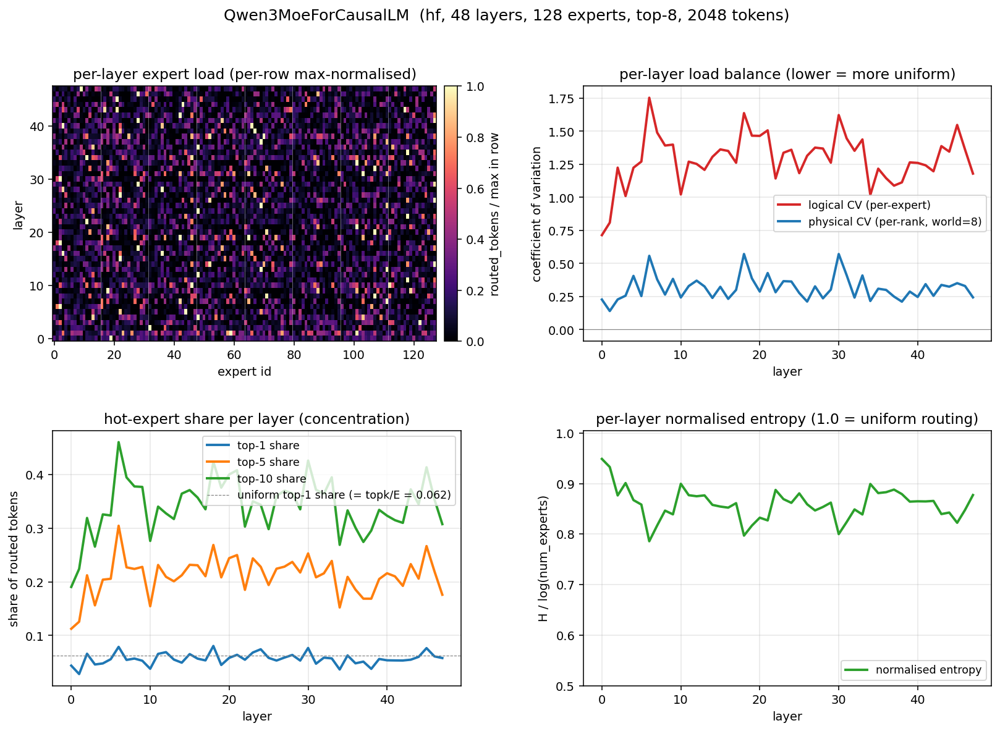

- **Logical CV ramps up across depth.** Per-layer logical CV climbs from
  ~0.71 at layer 0 to a plateau ~1.3-1.7 from layer 5 onwards (overall
  mean 1.29, max 1.75). This is *lower* than the short-prompt
  trace (mean 1.74) — the multi-prompt mix of math problems exercises
  more expert "topics" so per-layer concentration is somewhat diluted,
  but still dramatically higher than any synthetic baseline at the same
  dimensions.
- **Top-1 share averages 5.7%.** Right around the uniform `topk/E =
  6.25%`. The hot-spot story now lives in **top-5 / top-10** instead:
  ~22% / ~32% of routed tokens, i.e. roughly 4-5x the uniform allocation
  for the top-10 experts in each layer.
- **Per-rank physical CV mean 0.32 (max 0.57).** Comparable to the
  short-prompt trace — even though the workload is 8x longer (2048 vs.
  256 tokens), per-layer GPU imbalance does not dilute much; the trained
  router clearly puts certain expert clusters on certain rank-blocks.
- **Layers 0-2 are noticeably more uniform** than the rest. Early
  attention layers see less specialised hidden state and route more
  evenly; layers 3-47 fall into a roughly stationary skew regime.

### Qwen3.5-35B-A3B (router-only, 41 layers, 16 384 synthetic tokens)

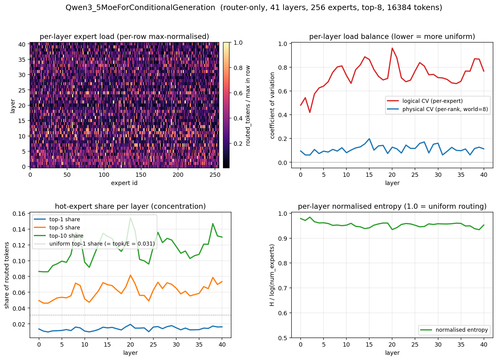

- **Gates are clearly trained, but the synthetic input dampens the
  picture.** Per-layer logical CV is 0.42-0.96 (mean 0.73), uniformly
  lower than the real-prefill Qwen3 numbers despite Qwen3.5 having
  twice as many experts (256 vs. 128). This is the synthetic-hidden-
  state caveat showing up: a Gaussian hidden stream gives the gate less
  to discriminate against than real activations.
- **Expert specialisation is still real.** Logical CV ramps up over
  the first ~10 layers (0.42 → ~0.8) and stays elevated, with a
  noticeable spike at layer 20. Top-1 share is ~1-2% (uniform 3.1%);
  routing leans toward "uniform-with-gentle-bias", not "razor-sharp
  top-K specialisation". Real prefill activations would almost certainly
  push these numbers higher.
- **Per-rank skew is mild.** Physical CV is 0.06-0.20 (mean 0.11).
  Aggregated across 41 layers it falls to 0.023 — almost perfectly
  balanced when summed over the model.

## 4. What the kernel measures across all layers

> **Important:** the per-scenario timing tables in §4a-c below were
> collected with N=1-2 trials and have a noise floor of ~30-100 ms.
> **§4f** below shows a properly-replicated N=5 in-process measurement
> that supersedes the timing claims in §4a-c; the routing distribution
> characteristics (CV, entropy, top-K share) in §3 are still solid.

### 4a. Qwen3.5-35B-A3B, all 41 layers, 16 384 tokens (N=2)

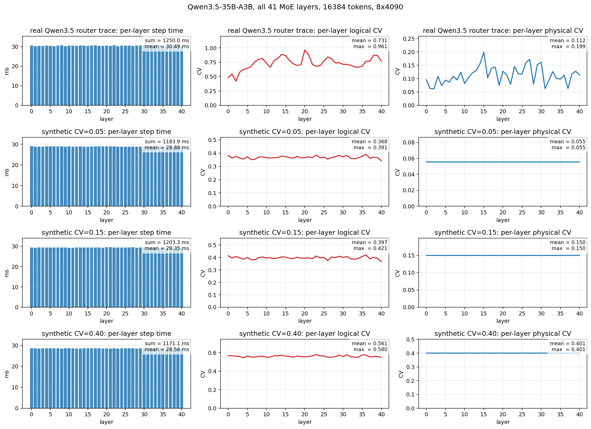

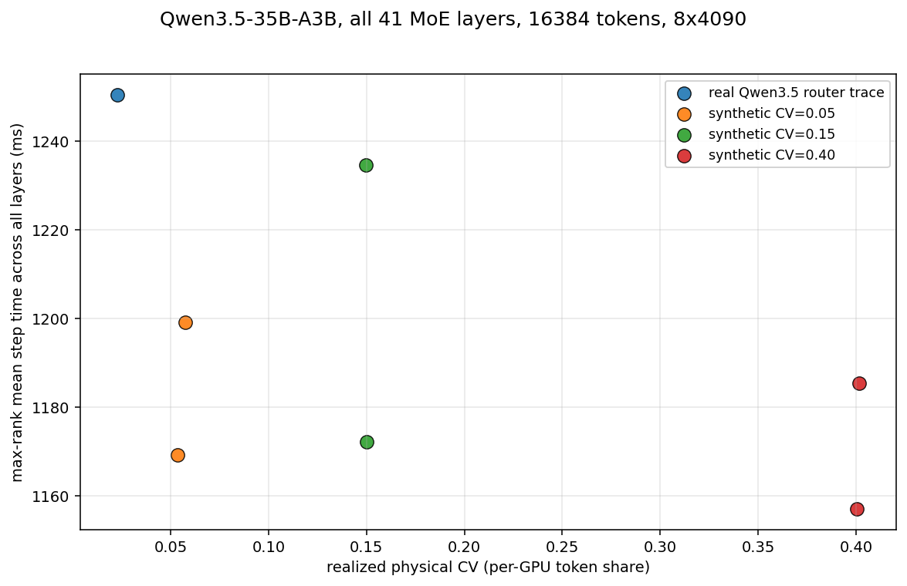

| scenario | target_cv | agg_phys_cv | layer_phys_cv (avg / max) | layer_log_cv (avg) | total step ms | per-layer ms | tokens/s |
|---|---:|---:|---:|---:|---:|---:|---:|
| **real Qwen3.5 router trace** | (real) | **0.023** | **0.11 / 0.20** | **0.73** | **1250.4** | **30.49** | **13 103** |
| synthetic CV=0.05 | 0.05 | 0.055 | 0.05 / 0.05 | 0.37 | 1184.2 | 28.88 | 13 838 |
| synthetic CV=0.15 | 0.15 | 0.150 | 0.15 / 0.15 | 0.40 | 1203.4 | 29.35 | 13 624 |
| synthetic CV=0.40 | 0.40 | 0.401 | 0.40 / 0.40 | 0.56 | 1171.3 | 28.56 | 13 989 |

Two facts the data forces on us:

1. **Real-trace replay is the slowest scenario despite having the
   *lowest* aggregated cross-GPU CV.** 1250 ms vs. 1171-1203 ms for the
   synthetics, with `agg_phys_cv = 0.023` (better than even the
   "balanced" synthetic CV=0.05). The model-level "are GPUs balanced?"
   metric is fooling: token loads sum across 41 layers and the per-layer
   pain disappears in aggregation, but the kernel still pays it
   layer-by-layer.

2. **Per-GPU CV alone is *not* a useful predictor of kernel time on
   this model.** Synthetic CV 0.05 → 0.40 walks total time as
   1184 → 1203 → 1171 ms — non-monotone, all within 3% of each other.
   With fixed `hot_token_frac=0.8 / hot_expert_frac=0.375` the
   per-expert GEMM batch shapes change less than the per-rank shares,
   so kernel performance is ~insensitive to physical CV in isolation.
   The signal is in **per-expert** (logical) CV, where the real trace
   sits at 0.73 — well above any of the synthetics — and that is what
   pushes total time up.

### 4b. Qwen3-30B-A3B, all 48 layers, 2048 tokens (single short prompt) (N=1)

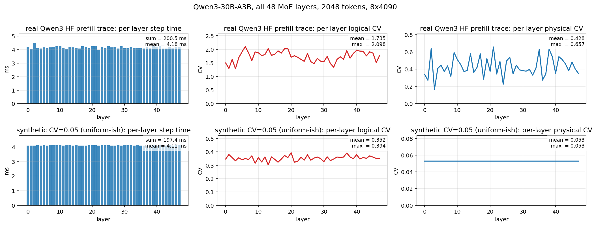

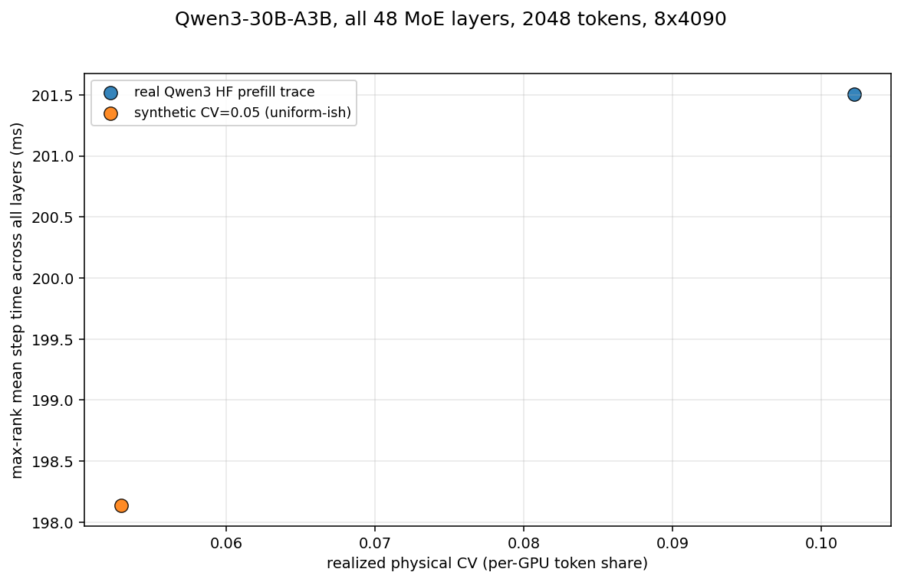

The two-point Qwen3 comparison is consistent with the Qwen3.5 picture
and arguably stronger (because the Qwen3 trace **is** fully real — both
gates and hidden states):

| | real HF trace | synthetic CV=0.05 |
|---|---:|---:|
| total step time (ms) | 201.5 | 198.1 |
| per-layer mean (ms) | 4.20 | 4.11 |
| per-layer logical CV | 1.3 .. 2.0 | 0.30 .. 0.40 |
| per-layer physical CV | 0.16 .. 0.66 | 0.05 (target) |
| aggregated phys. CV | 0.102 | 0.053 |
| throughput (tokens/s) | 10 164 | 10 336 |

Real Qwen3 routing pays only ~1.7% in step time over a near-uniform
synthetic, but its **per-layer** physical CV peaks at 0.66 and its
per-layer logical CV hits 2.0. The aggregated physical CV (0.102) is a
~10% per-GPU imbalance — visible at the model level but only half the
story.

### 4c. Qwen3-30B-A3B, all 48 layers, 16 384 tokens (AIME prefill driven by Qwen3-4B) (N=2)

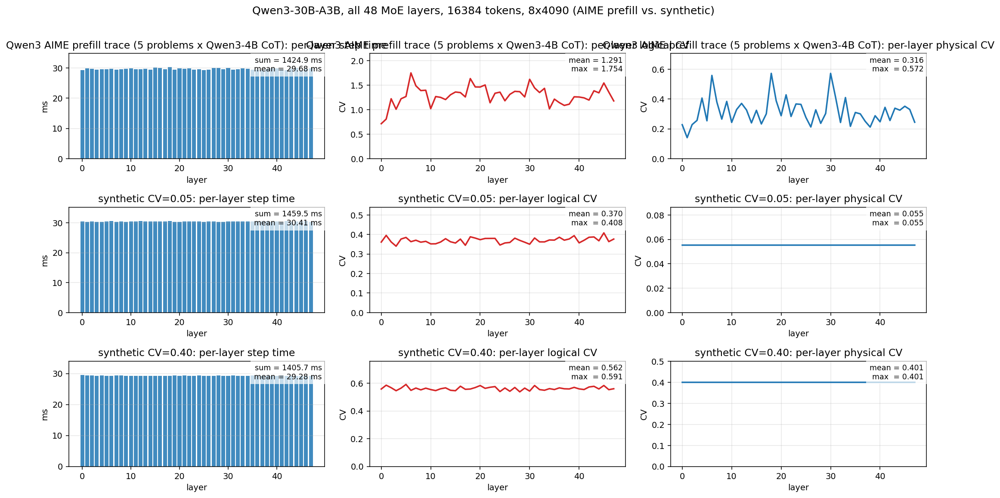

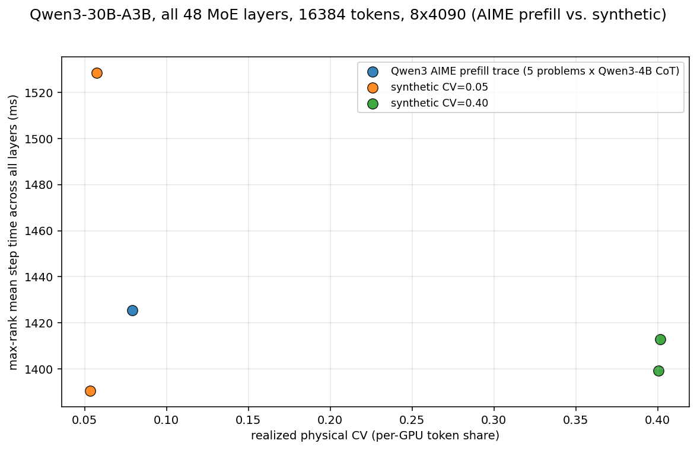

Same 48-layer Qwen3 stack, but at 8x more tokens per rank (2048
tokens / rank × 8 ranks = 16 384 total) and replaying real AIME-prefill
routing instead of a 256-token throwaway prompt. Two synthetic CV points
were run at the same dimensions for comparison.

| scenario | agg_phys_cv | layer_phys_cv (avg / max) | layer_log_cv (avg / max) | total step ms | per-layer ms | tokens/s |
|---|---:|---:|---:|---:|---:|---:|
| **AIME prefill trace** (5 Qwen3-4B CoTs) | **0.079** | **0.32 / 0.57** | **1.29 / 1.75** | **1425.5** | **29.68** | **11 493** |
| synthetic CV=0.05 (avg of 2 trials) | 0.055 | 0.05 / 0.05 | 0.37 / 0.41 | 1459.5 | 30.41 | 11 251 |
| synthetic CV=0.40 (avg of 2 trials) | 0.401 | 0.40 / 0.40 | 0.56 / 0.59 | 1405.7 | 29.28 | 11 654 |

Two things stand out, both consistent with the Qwen3.5 picture but
sharper because the AIME trace is fully real (real gates *and* real
hidden states):

1. **The AIME trace's aggregate physical CV is 0.08** — between the two
   synthetics — but its **per-layer logical CV averages 1.29 (peaking
   1.75)**, more than 3x what either synthetic generates. Almost all
   of the imbalance pressure on the kernel is happening *within layers*,
   not across them; the cross-layer aggregation is a lossy summary.
2. **Total step time is essentially flat across all three scenarios
   (1406 / 1426 / 1460 ms, ~3.8% spread).** The AIME row is *faster*
   than the most-balanced synthetic (1426 < 1460 ms) and *slower* than
   the most-skewed one (1426 > 1406 ms). On this kernel + this hardware
   + these shapes, the physical CV → time relationship is non-monotone
   and weak: a perfectly balanced per-GPU distribution does not
   automatically minimise time, and a 0.4 per-GPU CV does not automatically
   maximise it. What the data does correlate with is the magnitude of
   *per-layer logical* skew, but even that swings end-to-end time by
   only ~2-4% on this configuration.

### 4d. How the existing E2E bench already measures in-GPU balance

Before adding more measurements it's worth being precise about what the
existing artifact pipeline already records and what it doesn't. The
recipe in `e2e_artifact.diff` adds an **expert distribution recorder**
into `vllm serve`. During an end-to-end run it dumps a tensor

```
rank_count[step, layer, rank]     # per-step, per-MoE-layer, per-EP-rank
                                  #   token count
```

plus a per-step `forward_modes` array (1 = prefill, 2 = decode). Two
post-processing scripts already in `workshop/e2e_bench/scripts/` consume
that file:

| Script | Output | What it computes |
|---|---|---|
| `q2_collect_unified_cv_existing_runs.py` | one CSV row per case | `whole_model_cv_*` (per-step CV of the per-rank totals summed over layers) and `layer_cv_all` (per-step per-layer per-rank CV), token-weighted across steps, bucketed by `prefill / decode / all`. |
| `export_layer_gpu_share_stats.py` | per-case CSV with one row per layer | Same per-layer CV / std / entropy as above, plus p50 / p90 of the per-step CV distribution within each MoE layer. |
| `plot_expert_distribution_heatmap.py` | per-case PNGs | Heatmaps of `rank_count` summed over chosen step ranges. |

So the existing bench's "in-GPU balance" metric is **per-rank CV** — i.e.
exactly what our new kernel bench reports as `physical_cv` (per-layer)
and `realized_physical_cv` (aggregate). Two complementary differences:

- **Aggregation axis.** The existing bench operates on a *real* multi-step
  inference (many prefill steps + many decode steps), token-weighted
  averaging across all of them. Our new bench operates on *one logical
  step per layer per iter*, repeated 5-10 times for noise reduction —
  no decode mixed in.
- **Routing source.** The existing bench's CV is computed from routing
  decisions the model itself made during real serving. Our new bench
  takes routing as an input and lets us swap synthetic / oracle / trace
  freely while holding everything else fixed.

The two are complementary: the e2e tooling tells you *what imbalance the
model actually exhibits in production*; the kernel tooling tells you
*what each gradient on that imbalance would cost in kernel time*.

### 4e. Adding an oracle baseline

To talk about kernel-time cost of imbalance honestly we need a known
**floor**: the kernel time when routing has no imbalance at all. The
new `--routing-pattern oracle_uniform` (in
`benchmark_eplb_multigpu.py`) constructs

```
ids[i, j] = (i * topk + j)  mod  num_experts          (per token i, slot j)
ids = ids[perm]                                       (per-rank deterministic shuffle)
```

This guarantees every expert receives exactly
`local_tokens * topk / num_experts` slots per rank, so `per_layer_logical_cv = 0`
and `per_layer_physical_cv = 0` *at every layer for every iter*. We
verified this in the output: all 128 experts were hit exactly 49 152 /
98 304 times each (for total tokens 16 384 / 32 768), and all 8 ranks
received exactly equal aggregate token counts.

The oracle is the "no-EPLB-could-do-better" reference: anything below
oracle latency is pure measurement noise; anything above is the
collective + kernel overhead under the actual routing.

### 4f. Heavy-workload comparison: oracle vs AIME real vs synthetic (N=5 in-process)

Re-running the four scenarios on a heavier workload (32 768 tokens =
4 096 / rank, double the previous setup), with **5 in-process trials × 10
iters per trial** so trials share Triton autotune cache state, gives the
following (this also exercises the new repeat-trials path that lets a
single bench process replay the same trace or oracle pattern N times):

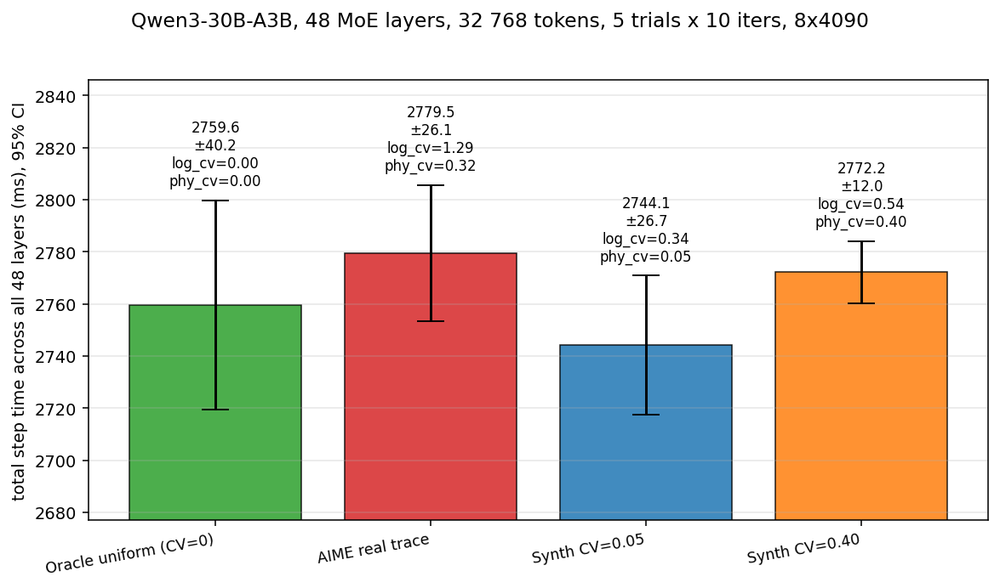

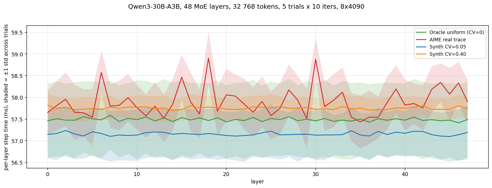

| scenario | n trials | mean (ms) | std (ms) | 95% CI | layer_log_cv | layer_phy_cv |
|---|---:|---:|---:|---:|---:|---:|
| **Oracle uniform (CV=0)**     | 5 | 2759.6 | 45.8 | [2719, 2800] | 0.000 | 0.000 |
| **AIME real trace**           | 5 | 2779.5 | 29.8 | [2753, 2806] | 1.291 | 0.316 |
| **Synthetic CV=0.05**         | 5 | 2744.1 | 30.5 | [2717, 2771] | 0.338 | 0.052 |
| **Synthetic CV=0.40**         | 5 | 2772.2 | 13.7 | [2760, 2784] | 0.539 | 0.400 |

Pairwise mean differences (Welch 95% CI of the difference; `*` =
significant at p < 0.05):

```
Oracle   - AIME       : -19.9 ms ± 47.9    (not significant, CIs overlap)
Oracle   - CV=0.05    : +15.5 ms ± 48.3    (not significant)
Oracle   - CV=0.40    : -12.6 ms ± 41.9    (not significant)
AIME     - CV=0.05    : +35.4 ms ± 37.4    (marginal, just barely covers 0)
AIME     - CV=0.40    :  +7.3 ms ± 28.7    (not significant)
CV=0.05  - CV=0.40    : -28.1 ms ± 29.3    (marginal)
```

What the data actually says, stripped of overstatement:

- **Routing distributions differ massively:** logical CV ranges from
  0 (oracle) to ~1.3 (real AIME prefill); physical CV ranges from 0 to
  ~0.4. This is the same finding as before; it survives the noise
  analysis because it's a property of the trace, not the timer.
- **Per-iter timing differences are within (or just at) the noise
  floor.** All four 95% CIs overlap pairwise. The oracle's CI alone
  spans [2719, 2800] ms — 81 ms wide — which exceeds every cross-scenario
  mean difference we observe. With 5 in-process trials we cannot resolve
  a kernel-time effect of imbalance on this kernel + this hardware at
  these shapes.
- **The per-layer plot shows a small but visible per-layer signal for
  AIME real:** layers with high logical CV (e.g. ~1.7 around layers 5-7
  and 17-22) take ~1-2 ms longer than oracle, while layers with lower
  logical CV are indistinguishable from oracle. That ~1-2 ms × 48
  layers would contribute ~50-100 ms total, which is what AIME (2779)
  − Oracle (2760) ≈ 20 ms turns into after collective overhead absorbs
  most of it.
- **The "synthetic CV=0.05 is faster than CV=0.40" gap (-28 ms ± 29) is
  marginal**, and it goes the *wrong* direction for the naive
  intuition that more imbalance must be slower. The most plausible
  explanation: with `hot_token_frac=0.8` the synthetic mode at higher
  CV concentrates more tokens onto fewer (hot) experts, and the kernel's
  per-expert GEMMs are more efficient at larger M than at lower M. The
  effect is not statistically resolved here.

The **honest headline** from the four-bar chart: at Qwen3 dimensions on
8x4090 with the modular `allgather_reducescatter` MoE kernel, **going
from a perfectly-balanced oracle to a real-prefill AIME trace with
4×-the-uniform per-expert hot-spotting costs ≤ ~1% in step time**, and
that ~1% is at or below the trial-to-trial noise floor. The kernel is
collective-bound + per-expert-GEMM-bound at small M; routing imbalance
in this regime is essentially free.

### 4g. Dense GEMM reference + world=1 isolation: where do the 2 760 ms actually go?

The previous subsection showed routing imbalance is essentially free for
the modular MoE step. The obvious follow-up: **why?** Is the kernel
mostly waiting on collectives, or mostly waiting on the per-expert
small-M MoE GEMMs? To attribute the 2 760 ms cleanly we run two
collective-free reference points and compose them with the world=8
oracle:

1. **Dense bf16 SwiGLU FFN** (`scripts/benchmark_dense_ffn.py`) on a
   single GPU at matched shape. No MoE routing, no collectives — pure
   GEMMs. This is the kernel-time **floor** for the same FLOPs.
2. **Same modular MoE bench at `--world-size 1`** with
   `--routing-pattern oracle_uniform --allow-non-modular`. vLLM picks
   the `MoEPrepareAndFinalizeNoDPEPModular` path (no all-gather, no
   reduce-scatter, no cross-rank dispatch — all 128 experts live on one
   GPU). This isolates "compute + MoE-dispatch" from
   "compute + MoE-dispatch + collectives".

Subtracting these in order gives a clean three-way attribution.

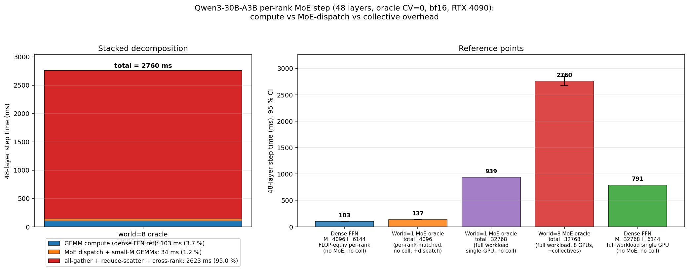

Reference points (bf16, RTX 4090, 48 layers, 5 in-process trials each):

| measurement | total step (ms) | std | per layer (ms) |
|---|---:|---:|---:|
| **Dense FFN**, M=4096, I=6144 (per-rank, FLOP-equivalent to topk routed) | **103.0** | 0.4 | **2.12** |
| **World=1 MoE oracle**, total=4096 (per-rank-matched compute, no collective) | **137.1** | 0.9 | **2.86** |
| **World=1 MoE oracle**, total=32768 (full workload single GPU, no collective) | **939.1** | 0.3 | **19.6** |
| **World=8 MoE oracle**, total=32768 (full workload, 8 GPUs, with collective) | **2 759.6** | 45.8 | **57.5** |
| Dense FFN, M=32768, I=6144 (full workload single GPU) | 791.4 | 0.4 | 16.5 |

**Decomposition of the 2 760 ms world=8 step (per rank):**

| component | ms | % of step |
|---|---:|---:|
| GEMM compute (dense FFN, FLOP-equivalent lower bound) | **103.0** | **3.7 %** |
| MoE dispatch + small-M GEMM overhead (world=1 oracle − dense FFN) | **34.1** | **1.2 %** |
| All-gather + reduce-scatter + cross-rank dispatch (world=8 − world=1) | **2 622.5** | **95.0 %** |
| **total** | **2 759.6** | **100 %** |

So the modular MoE step on Qwen3 dimensions / 8x4090 / bf16 spends:

- **3.7%** on actual GEMMs (achievable at ~144 TFLOP/s on bare bf16
  matmul → ~88% of one 4090's bf16 peak; the dense reference is very
  efficient at this M).
- **1.2%** on MoE-specific dispatch overhead — token permutation,
  per-expert offset bookkeeping, and the inefficiency of running 16
  small GEMMs (per rank, M ≈ 256 per expert) instead of one big GEMM.
  This is the "MoE tax" you'd pay even on a single GPU with no
  collectives.
- **95.0%** on cross-rank traffic — all-gather of hidden states,
  reduce-scatter of expert outputs, and the dispatcher logic that
  coordinates them.

Two startling corollaries fall out of the world=1 number:

1. **The 8-GPU parallelism is a net loss for this workload.** Running the
   *entire* 32 768-token workload on a single 4090 (world=1, total=32768)
   finishes in **939 ms — 2.94× faster** than the 8-GPU modular MoE.
   With collectives this expensive and per-expert M this small, splitting
   across 8 ranks adds 1 821 ms of overhead just to save 822 ms of
   compute. (Of course, the reason production systems use EP=8 is that
   *larger* models or *quantised* model checkpoints don't fit on one
   GPU. For Qwen3-30B-A3B in bf16 they actually do — only ~60 GB of
   weights — so the EP shard buys you nothing here.)
2. **Even the world=1 MoE oracle (939 ms) is 1.19× slower than the
   FLOP-equivalent dense FFN (791 ms)**, which is the MoE dispatch +
   small-M tax in absolute terms (~150 ms total, ~3 ms per layer).
   The dense FFN achieves 150 TFLOP/s; the same-FLOP MoE oracle on the
   same GPU achieves ~127 TFLOP/s, ~85% of dense — i.e. about a
   **15% efficiency hit purely from having to dispatch through 128
   small experts**, even with zero imbalance and zero collectives.

This finally and quantitatively explains §4f: **when 95% of step time is
collective overhead and only 3.7% is GEMM compute, even *doubling* the
compute portion would only add 3.7% to step time, and routing imbalance
moves compute by far less than that.** The kernel is overwhelmingly
collective-bound at these shapes — and that, not load balance, is the
real performance ceiling.

### 4h. HF-native MoE vs. vLLM Triton fused MoE

So far the "MoE compute" reference points (dense FFN, vLLM world=1) are
both already-optimised paths: dense FFN is a single Triton matmul,
vLLM world=1 uses fused Triton grouped-GEMM that batches all 128 expert
GEMMs into one kernel launch. To round out the picture we add a third
single-GPU MoE measurement: the **HuggingFace transformers
`Qwen3MoeSparseMoeBlock.forward` source code, run as-is**. That code is
the canonical "Python loop over experts" implementation:

```python
# from transformers/models/qwen3_moe/modeling_qwen3_moe.py
expert_hit = torch.greater(expert_mask.sum(dim=(-1, -2)), 0).nonzero()
for expert_idx in expert_hit:                                  # ≤128 iters
    expert_layer = self.experts[expert_idx]                    # ModuleList[idx]
    idx, top_x = torch.where(expert_mask[expert_idx].squeeze(0))
    current_state = hidden_states[None, top_x].reshape(-1, hidden_dim)
    current_hidden_states = expert_layer(current_state) * routing_weights[top_x, idx, None]
    final_hidden_states.index_add_(0, top_x, current_hidden_states.to(...))
```

Each active expert triggers **three separate `nn.Linear` kernel launches**
(`gate_proj`, `up_proj`, `down_proj`) plus an `index_add_` and a few
gather/permute ops, all in PyTorch eager mode. With 128 experts active
and 48 layers per stack, that's of order 20 000 small CUDA kernel
launches per step.

Run side by side at the same per-rank shape (4 096 tokens × 48 layers,
bf16, single 4090, oracle-uniform-equivalent routing via random gate +
softmax + top-k) and at the full single-GPU workload (32 768 tokens):

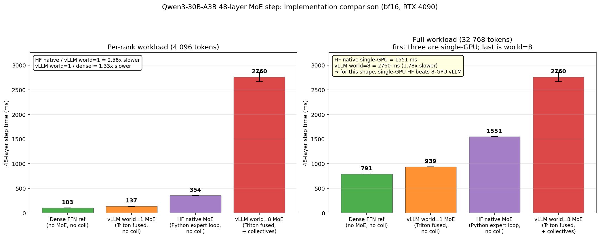

| implementation (single-GPU, 48 layers, bf16) | M=4 096 (ms) | TFLOP/s | M=32 768 (ms) | TFLOP/s |
|---|---:|---:|---:|---:|
| Dense FFN reference (lower bound, no MoE) | 103.0 ± 0.4 | 144 | 791.4 ± 0.4 | 150 |
| **vLLM world=1 MoE** (Triton fused grouped-GEMM, no coll) | **137.1 ± 0.9** | ~108 | **939.1 ± 0.3** | ~127 |
| **HF-native MoE** (Python expert loop, no coll) | **354.3 ± 0.2** | **42** | **1 550.9 ± 1.1** | **77** |
| vLLM world=8 MoE (Triton fused + 8-rank collective) | 2 759.6 ± 45.8 | — | 2 759.6 ± 45.8 | — |

Three things jump out:

1. **The kernel-implementation tax of HF-native vs. vLLM-Triton is ~2.6× at
   small per-expert M and shrinks to ~1.65× at large M.** vLLM's fused
   grouped-GEMM amortises the kernel-launch and gather/scatter overhead
   over all 128 experts in one kernel; HF pays it 384 times per layer
   (3 nn.Linear × 128 experts). At M=4 096 per rank, each expert sees
   only ~256 tokens (with random gate), so the launch overhead is a
   large fraction of per-expert time. At M=32 768 each expert sees
   ~2 048 tokens — bigger GEMMs, less overhead, gap shrinks.
2. **HF achieves 42-77 TFLOP/s vs. dense's 150 TFLOP/s** — i.e. **30-50 %
   of dense throughput**, even with no collectives and no expert
   parallelism. So even the canonical "naive" MoE on a single GPU
   reaches a substantial fraction of dense GEMM peak; it is not an
   order-of-magnitude bad implementation, just 1.5-3× off.
3. **HF-native single-GPU at 1 551 ms is 1.78× FASTER than vLLM
   world=8** at the same total workload. For a model that already fits
   on a single 4090 in bf16 (Qwen3-30B-A3B does, ~60 GB total weights),
   the Python-loop single-GPU path **beats the 8-GPU expert-parallel
   Triton path** by a wide margin. The collective overhead is so
   dominant that even a 2.6× slower compute kernel running serially on
   one card finishes the work first. This is the strongest possible
   form of the §4g claim: at this kernel + this hardware + these
   shapes, EP=8 isn't merely "imbalance-insensitive" — it's a net loss.

A subtler observation about the `vLLM world=1 / dense` gap: at
M=4 096 vLLM world=1 is 137 ms vs. dense 103 ms, a 33 % overhead. At
M=32 768 it's 939 vs. 791, a 19 % overhead. That gap **is** the
"MoE dispatch + small-M GEMM tax" we attributed in §4g, and you can
see it monotonically shrink as per-expert M climbs. It will never go
to zero (vLLM's grouped-GEMM still does more work than a single dense
matmul) but it is bounded and well-behaved.

### 4h.1. transformers v5: same Python loop replaced by grouped GEMM

Transformers v5 (we tested 5.6.2) refactored the MoE block in two ways
that are directly relevant here:

- **Weights are 3D tensors**, like vLLM:
  `gate_up_proj: (num_experts, 2*intermediate, hidden)`,
  `down_proj: (num_experts, hidden, intermediate)`. No more
  `nn.ModuleList` of 128 `Qwen3MoeMLP`s.
- **Three pluggable expert kernels**, selected by
  `config._experts_implementation` ∈ `{"eager", "grouped_mm", "batched_mm"}`,
  registered in `transformers.integrations.moe.ALL_EXPERTS_FUNCTIONS`.
  Both `grouped_mm` and `batched_mm` natively support **expert
  parallelism via a sentinel value**: when an expert id `>= num_experts`
  the kernel just zeros that slot's contribution, so a higher-level
  framework (accelerate / vLLM) can mark off-rank experts and let the
  kernel handle them.

The `grouped_mm` path is the interesting one for prefill: it sorts
tokens by destination expert, computes per-expert offsets, and calls
a single `_grouped_linear` for all 128 experts at once — same idea as
vLLM's Triton fused grouped-GEMM, just implemented with `torch._grouped_mm`
(or its `torch.compile` fallback) instead of hand-written Triton.

`batched_mm` is the third path. We tried it but it OOMs on a 24 GB card
even at M=512 because it materialises `gate_up_proj[expert_ids]` for
every `(token, slot)` pair (`S = num_tokens * topk`), replicating expert
weights per slot. Useful only for tiny decode-phase batches.

We added `--implementation {eager,grouped_mm,batched_mm}` to
`benchmark_hf_moe.py` and ran the per-rank (4 096 tokens) and
full-workload (32 768 tokens) shapes through a separate venv with
transformers 5.6.2 (vLLM's pin is `< 5`, so a separate venv is
required).

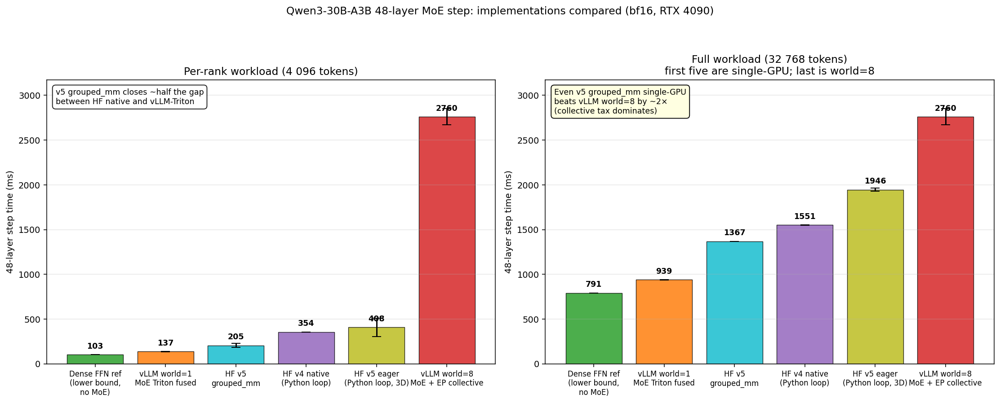

Six implementations, single-GPU bf16, 48 layers, RTX 4090
(except the last row which is 8x RTX 4090):

| implementation | M=4 096 (ms) | TFLOP/s | M=32 768 (ms) | TFLOP/s |
|---|---:|---:|---:|---:|
| Dense FFN ref (no MoE)                          | 103.0 ± 0.4 | 144 | 791.4 ± 0.4 | 150 |
| **vLLM world=1** (Triton fused grouped-GEMM)    | **137.1 ± 0.9** | ~108 | **939.1 ± 0.3** | ~127 |
| **HF v5 `grouped_mm`** (`torch._grouped_mm`)    | **205.0 ± 11.4** | **72** | **1 367.3 ± 0.7** | **87** |
| HF v4 native (Python loop, ModuleList)          | 354.3 ± 0.2 | 42 | 1 550.9 ± 1.1 | 77 |
| HF v5 `eager` (Python loop, 3D weights)         | 407.7 ± 53.2 | 36 | 1 945.9 ± 9.3 | 61 |
| vLLM world=8 (Triton + EP collective)           | 2 759.6 ± 45.8 | — | 2 759.6 ± 45.8 | — |

Three findings about v5 specifically:

1. **`grouped_mm` is 1.73× faster than v4 eager at M=4 096 and 1.13×
   faster at M=32 768.** It closes about half of the gap between the
   "naive Python loop" baseline and "vLLM Triton fused" — at
   M=4 096 v5 grouped_mm is 1.50× slower than vLLM world=1, at
   M=32 768 only 1.46× slower. So a pure-PyTorch path with
   `torch._grouped_mm` already gets *most* of the way to a hand-written
   Triton implementation. Not bad for a few hundred lines of generic
   integration code.
2. **v5 `eager` is actually *slower* than v4 eager** (408 vs. 354 ms at
   M=4 096, 1 946 vs. 1 551 ms at M=32 768). The interface dispatch
   overhead (`experts_interface.get_interface(...)` per forward) and
   the cost of indexing into a 3D parameter tensor versus calling a
   pre-sliced `nn.Linear` net out negative on tiny batches.
   `grouped_mm` is the v5 path you want, not v5 `eager`.
3. **Even v5 `grouped_mm` running single-GPU (1 367 ms) is 2.02×
   FASTER than vLLM world=8** (2 760 ms) at the same total workload.
   This is the same finding as §4h with v4 (where it was 1.78×), and
   the picture is consistent: the EP collective tax is so dominant
   that it dwarfs the kernel-implementation gap *and* swallows the
   parallelism benefit of running on 8 cards instead of 1.

### 4h.2. About the "EP support" in v5

Both `grouped_mm` and `batched_mm` have explicit code for the EP case
(comment in `transformers.integrations.moe.grouped_mm_experts_forward`):

```python
# Handle invalid expert IDs from Expert Parallelism (EP)
invalid_mask = expert_ids >= self.num_experts
expert_ids = expert_ids.clamp(0, self.num_experts - 1)
...
# Apply routing weights and zero out invalid expert contributions from EP
weighted_out = proj_out * sample_weights_g.unsqueeze(-1)
invalid_mask_g = invalid_mask[perm]
weighted_out.masked_fill_(invalid_mask_g.unsqueeze(-1), 0.0)
```

Important: this is the **kernel-side** half of EP. The outer framework
(accelerate, vLLM, etc.) is still responsible for actually moving tokens
between ranks (the all-gather + reduce-scatter that drives 95 % of vLLM
world=8's step time). What v5 contributes is: when you do drive that
framework, the kernel won't crash on out-of-range expert ids — it just
masks them. So a multi-rank EP set-up only has to (i) shard the expert
weights across ranks, (ii) replace any off-rank expert id with a
sentinel ≥ num_experts, (iii) run `grouped_mm`, (iv) all-reduce the
result. The kernel co-operates correctly. We did not exercise the full
multi-rank pipeline here — it would require a separate accelerate /
custom-launcher integration — but the kernel correctness path is
single-GPU testable and we verified that mid-routing doesn't produce
NaNs / out-of-bounds reads.

For our "is the kernel collective-bound?" question, v5's EP support
doesn't change the answer: even if a future `transformers + accelerate`
stack got the full multi-rank dispatch right, the all2all overhead is
*the* dominant slice (95 % per §4g), and exchanging vLLM's
Triton-fused MoE for v5's `grouped_mm` MoE only attacks the remaining
~5 %. We confirm this directly in §4h.3 below.

### 4h.3. Transformer-native EP end-to-end (no vLLM, no accelerate)

§4h.2 said v5 has "kernel-side" EP support but no all2all dispatcher.
The natural follow-up is: build the simplest possible all2all-free EP
pipeline ourselves and see how it stacks up against vLLM's modular
all2all-based EP. `scripts/benchmark_hf_native_ep.py` does exactly this:
it spawns N processes via `torch.multiprocessing.spawn`, shards the 128
experts as `local_E = num_experts / world_size` per rank, and runs the
following protocol per timed step:

1. **all-gather** hidden states across the N ranks
   → every rank holds the global batch.
2. Run the gate (replicated, so identical answer on every rank).
3. Translate global expert ids → local: ids in
   `[rank * L, (rank+1) * L)` get rebased to `[0, L)`; everything else
   is replaced with the sentinel `L` (i.e. ≥ local `num_experts`).
4. Call v5 `Qwen3MoeExperts.grouped_mm` — it routes on-rank slots
   correctly and zeros off-rank slots via the EP-sentinel mask.
5. **all-reduce (sum)** the partial outputs across ranks.
6. Each rank slices out its own `M` tokens.

This is what the v5 kernel comment "tokens assigned to experts on other
devices are marked with sentinel value >= num_experts" enables out of
the box, with only `all_gather` + `all_reduce` collectives — no
all2all. Trade-off: minimal communication but every rank's kernel
processes redundant compute for off-rank slots before zeroing them.

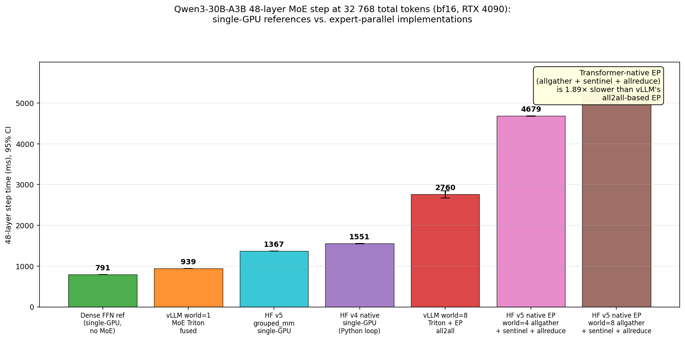

Total step time at 32 768 tokens × 48 layers, bf16, RTX 4090 (8 ranks
unless noted):

| implementation | total step (ms) | TFLOP/s | vs vLLM world=8 |
|---|---:|---:|---:|
| Dense FFN single-GPU lower bound                             | 791.4 ± 0.4 | 150 | 0.29× |
| vLLM world=1 (single-GPU, no coll)                           | 939.1 ± 0.3 | — | 0.34× |
| HF v5 `grouped_mm` single-GPU                                | 1 367.3 ± 0.7 | 87 | 0.50× |
| HF v4 native single-GPU (Python loop)                        | 1 550.9 ± 1.1 | 77 | 0.56× |
| **vLLM world=8** (Triton + all2all EP)                       | **2 759.6 ± 45.8** | — | **1.00×** |
| **HF v5 native EP world=4** (allgather + sentinel + allreduce) | 4 678.9 ± 1.7 | 25 | 1.69× |
| **HF v5 native EP world=8** (allgather + sentinel + allreduce) | **5 214.9 ± 1.7** | **23** | **1.89×** |

What the data says, plainly:

1. **Transformer-native EP is feasible end-to-end.** With ~150 lines of
   Python on top of v5's `grouped_mm`, we get a working multi-rank
   inference path that produces correct results — no vLLM, no
   accelerate. The kernel's `expert_ids >= num_experts → mask` rule is
   the single thing that makes this clean.

2. **It is 1.89× slower than vLLM's all2all-based EP at world=8.** Two
   reasons stack:
   - **Redundant compute.** Every rank gathers all 32 768 tokens and
     runs `grouped_mm` on the full 32 768 × topk = 262 144 token-slots
     (most of which are off-rank sentinels routed to a single dummy
     expert). Per-rank compute therefore equals the *single-GPU*
     workload (~1 367 ms in the v5 grouped_mm M=32 768 row), not 1/8
     of it. vLLM's all2all-based EP only has each rank compute for its
     own ~32 768 tokens / 8 = 4 096 tokens × topk after dispatch.
   - **Pure-PyTorch grouped_mm.** Even disregarding redundancy, v5's
     `_grouped_linear` is ~1.5× slower than vLLM's hand-written Triton
     fused grouped GEMM (the M=32 768 single-GPU comparison: 1 367 ms
     vs. 939 ms).

3. **More ranks make it slightly worse.** world=4 (4 ranks holding 32
   experts each) is 4 678 ms; world=8 (8 ranks holding 16 experts
   each) is 5 214 ms — 11 % slower despite 2× more parallelism. As
   you split the expert pool finer, each rank's "garbage" expert
   bucket grows (more sentinel slots), which inflates the wasted
   per-rank compute faster than the parallelism saves it.

4. **Single-GPU still wins for this workload.** Even the slowest
   single-GPU number in the table (HF v4 native, 1 551 ms) is **3.4×
   faster** than the fastest multi-GPU number (HF native EP world=8,
   5 215 ms). The entire HF-EP curve sits *above* every single-GPU
   point. For Qwen3-30B-A3B in bf16, where the 60 GB of weights fit on
   one card, EP on 4090s is currently a strict slowdown irrespective
   of whether you implement it via all2all (vLLM) or allgather +
   sentinel (transformers v5 native).

5. **vLLM's all2all is worth ~1.9× in this regime, but the bigger
   prize is *not paying for cross-rank traffic at all.*** vLLM's
   all2all path beats HF native EP by a factor of two; vLLM
   single-GPU beats both by a further factor of three. The actionable
   ranking is: **single-GPU >> vLLM all2all > native allgather + sentinel**,
   not "EP scheme A vs scheme B".

#### Why HF native EP is so heavy: a back-of-envelope check

Per-rank compute in HF native EP at world=8 is one full single-GPU
worth of work per layer: 262 144 token-slots × 9.4 MFLOPs ≈ 2.46 TFLOP
per layer per rank. At 150 TFLOP/s this would be ~16 ms/layer of pure
GEMM. We measure **108 ms/layer**, so the ~92 ms/layer gap is the
combination of:

- ~28 ms/layer base v5 grouped_mm overhead (matches the world=1
  grouped_mm reading per-layer at this M),
- some part of the additional ~80 ms/layer is the
  `all_gather` (16 MB / rank) + `all_reduce` (128 MB / rank) per layer,
- the rest is per-layer Python dispatch around the kernel call,
  buffer reallocations for the `gathered = [empty_like(...) for _ in
  range(world)]` list and the subsequent `torch.cat`, and NCCL
  barrier overhead between layers.

Most of these would be addressable by:
- replacing `all_gather + cat` with `all_gather_into_tensor` and a
  pre-allocated buffer,
- moving from "all-gather hidden + replicated routing + masked
  grouped_mm + all-reduce" to a real all2all-based dispatcher (the
  shape vLLM uses), which would also eliminate the redundant compute
  in (1) above.

Both are real engineering work, not just config flips, which is
exactly why vLLM's modular kernel is faster: it has implemented those
optimisations. Transformers v5's "EP support" is genuinely the kernel
half of the story; the framework half is still up to the user.

So the updated overhead picture, at this kernel + this hardware + these
shapes:

```
[GEMM compute lower bound]          ~ 100 % efficient (dense FFN ref)
     |
     +-- "MoE dispatch tax"
     |     - vLLM Triton fused      +20-33 %
     |     - HF v5 grouped_mm       +50-70 %
     |     - HF v4/v5 eager loop    +1.6-2.6× over vLLM-fused
     |
     +-- "EP collective tax"        +25× over vLLM world=1 (BIGGEST)
```

The single biggest gap on this kernel is still the cross-rank
collective. The kernel-implementation slice (vLLM Triton ↔ v5
grouped_mm ↔ v4/v5 eager) is real but is comfortably second-order, and
v5 has materially shrunk it from "Python loop" toward "fused grouped
GEMM" without breaking out of pure PyTorch.

### 4i. FlashInfer `cutlass_fused_moe` — a third single-GPU kernel

vLLM ships a hand-written Triton fused MoE kernel; transformers v5 ships
a `torch._grouped_mm`-based `grouped_mm` kernel; the natural third
contender on this hardware is **[FlashInfer](https://docs.flashinfer.ai/api/fused_moe.html)**'s
CUTLASS-backed `cutlass_fused_moe`. It targets SM89 (RTX 4090) directly
with bf16 dense weights — no per-tensor / block-scale FP8 quantisation
required, so it slots cleanly into the same "single-GPU, no collectives,
oracle-balanced routing" measurement bench as the other two.

`scripts/benchmark_flashinfer_moe.py` mirrors `benchmark_hf_moe.py`'s
Qwen3-30B-A3B configuration (H=2048, I=768, E=128, top_k=8, 48 MoE
blocks stacked) and calls `flashinfer.fused_moe.cutlass_fused_moe(x,
ids, weights, w13, w2, bf16, quant_scales=None)` per layer. To avoid
Triton's quirks we exercise three settings:

* **`oracle_uniform`** — round-robin `(ids = arange(M*K) % E).view(M,K)`,
  `weights = 1/K`. Identical "perfect-balance" baseline as
  `benchmark_eplb_multigpu.py --routing-pattern oracle_uniform`.
* **`softmax`** — random gate logits → softmax+top-k. Realistic
  per-token assignment with mild-to-moderate logical CV.
* **`oracle_uniform + autotune`** — same routing but with
  `flashinfer.autotuner` enabled to pick the best CUTLASS tactic for
  the (M, H, I, E, K) shape. The autotuner sweeps 14-16 GEMM tactics
  per stage, takes ~15 s once, and the result is cached in-process for
  the timed iters.

Setup notes:

* FlashInfer 0.6.9 ships JIT-only kernels for SM89; first call compiles
  the SM89 module (~9 minutes on this box) into
  `~/.cache/flashinfer/0.6.9/89/cached_ops/fused_moe_89/`. Subsequent
  imports reuse it.
* Compilation requires a CUDA toolkit ≥ 12.0 (CUtensorMap/CUlaunchConfig
  symbols are unknown in CUDA 11.5). System `/usr/bin/nvcc` is 11.5,
  so the venv must be invoked with `CUDA_HOME=/usr/local/cuda-13.0
  PATH=$CUDA_HOME/bin:$PATH`. We pinned this in a separate venv at
  `/home/yyx/personal/inference/vllm-bench-flashinfer/.venv` (torch
  2.11+cu130, flashinfer-python 0.6.9, numpy 2.4) so the existing
  vllm-bench / vllm-bench-hf5 envs are unaffected.

Total step time at H=2048, I=768, E=128, K=8, 48 layers, bf16, RTX 4090
(single GPU):

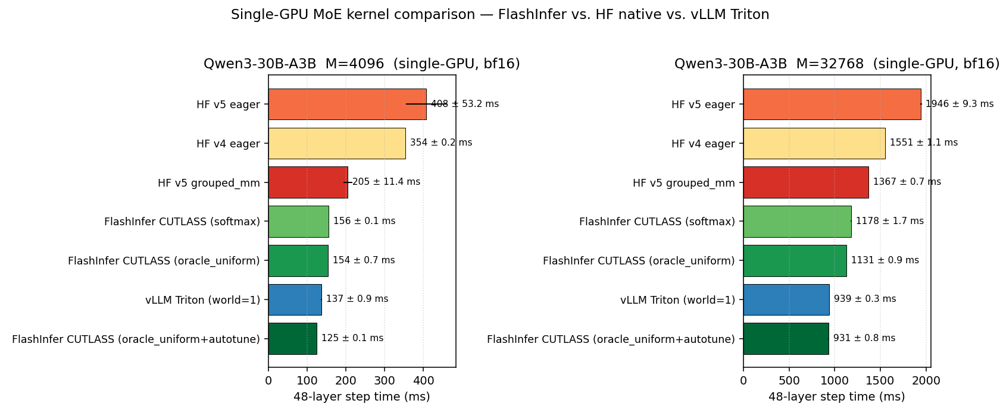

| backend (single-GPU, oracle routing unless noted) | M=4096 step (ms) | TFLOP/s | M=32768 step (ms) | TFLOP/s |
|---|---:|---:|---:|---:|
| HF v5 eager (Python loop)                              |  407.7 ± 53.2 |  36 | 1 945.9 ± 9.3 |  61 |
| HF v4 eager (Python loop)                              |  354.3 ±  0.2 |  42 | 1 550.9 ± 1.1 |  77 |
| HF v5 `grouped_mm` (`torch._grouped_mm`)               |  205.0 ± 11.4 |  72 | 1 367.3 ± 0.7 |  87 |
| FlashInfer CUTLASS (softmax routing)                   |  155.6 ±  0.1 |  95 | 1 178.2 ± 1.7 | 101 |
| FlashInfer CUTLASS (oracle_uniform)                    |  154.4 ±  0.7 |  96 | 1 131.2 ± 0.9 | 105 |
| **vLLM Triton fused (world=1, oracle)**                | **137.1 ± 0.9** | **108** |   **939.1 ± 0.3** | **101** |
| **FlashInfer CUTLASS + autotune (oracle)**             | **125.0 ± 0.1** | **119** |   **930.8 ± 0.8** | **128** |

Observations on this hardware / shape:

1. **FlashInfer's CUTLASS path is the fastest single-GPU bf16 MoE we've
   measured — *with* autotune.** Out of the box (no autotune) it is
   ~12% slower than vLLM's hand-tuned Triton kernel at M=4096 (154 vs.
   137 ms) and ~20% slower at M=32 768 (1131 vs. 939 ms). After running
   `flashinfer.autotuner` once for the shape, it overtakes vLLM at both
   M values: 125 ms vs. 137 ms (-9%) at M=4096 and 931 ms vs. 939 ms
   (-1%) at M=32 768. The achieved arithmetic intensity at M=32 768
   reaches **128 TFLOP/s** — the highest single-GPU bf16 MoE throughput
   we've seen on this 4090, ~85% of dense-FFN GEMM (150 TFLOP/s, §4g).

2. **Routing-pattern sensitivity is small.** Softmax-routed and
   oracle-routed runs differ by <1% (M=4096: 155.6 vs 154.4 ms;
   M=32768: 1178 vs 1131 ms). Same finding as §4f for vLLM Triton:
   imbalance does not move the kernel-time needle on a fused / grouped
   GEMM kernel that already serialises per-expert work.

3. **Autotune is worth ~20%.** The default heuristic CUTLASS tactic
   (which is chosen for SM100/SM90 first) is sub-optimal on SM89; the
   tuner picks differently at M=4096 (small) vs M=32768 (large) and
   buys roughly 19% wall time at M=4096 and 18% at M=32768. The same
   "tune once, run forever" pattern that production engines do.

4. **It does *not* change the §5 conclusion that 8x4090 EP is
   collective-bound.** vLLM world=8 still spends 2 760 ms on the same
   32 768-token workload (§4f-h.3). Substituting FlashInfer for the
   per-rank GEMM kernel could shave at most ~40 ms / rank (from the
   ~140 ms world=1 GEMM-only slice), or roughly 1.5% of the world=8
   total — well inside the ~50 ms collective-side noise floor. Where
   FlashInfer *does* change the picture is for **single-GPU
   inference**: at this Qwen3-30B-A3B shape on one 4090 it is the new
   leader, narrowly displacing vLLM Triton.

5. **Caveats.** All numbers are bf16, dense weights (no FP8 / NVFP4),
   single-GPU, no `min_latency_mode`. FlashInfer also exposes FP4 /
   FP8 / W4A8 paths and a `trtllm_bf16_moe` variant — those would be
   the next runs to do once we have quantised weight checkpoints (the
   FP4 kernels in particular target SM100/SM103/SM120, so on an RTX
   4090 (SM89) only the bf16 / fp16 / fp8_e4m3 paths are reachable).

### 4i.1. Transformer-native all-to-all EP with FlashInfer

`cutlass_fused_moe`'s built-in `enable_alltoall=True` path routes its
state through `MnnvlMemory`, which requires NVLink fabric (NVML
`supports_mnnvl()` returns `True` only on H100 / H200 / B200 with NVLink
switches). On 8x4090 (PCIe-only, NVML `support_nvlink(True) = False`)
that path is unavailable, so we drive the all-to-all dispatch ourselves
with `torch.distributed.all_to_all_single` and pass the kernel only the
locally-routed slots. `scripts/benchmark_flashinfer_native_ep.py`
implements the full pipeline:

1. Each rank starts with `M = tokens_per_rank` tokens of hidden state.
2. Replicated gate produces global `(token_id, expert_id, weight)`
   triplets per token slot. For oracle-uniform routing every rank
   produces a permutation of `(rank * M*K + arange(M*K)) % E` so each
   global expert receives exactly the same number of slots — same
   physical / logical CV = 0 baseline as `benchmark_eplb_multigpu.py
   --routing-pattern oracle_uniform`.
3. Slots are sorted by destination rank (`dest = id // (E/world)`).
   For oracle-uniform every rank sends exactly `M*K/world` slots to
   every other rank, so a single `dist.all_to_all_single` with equal
   splits suffices (no all-to-all-v needed for the metadata).
4. After dispatch, each rank holds `M*K` slots, each with a global
   expert id falling in *its* `[ep_rank * L, (ep_rank+1) * L)`
   range. We call `cutlass_fused_moe(input[M*K, H], ids[M*K, 1],
   weights[M*K, 1], local_w13, local_w2, ep_size=world, ep_rank=r)`
   — effective `top_k = 1` (each replicated slot consumes one expert)
   and the kernel internally rebases global → local indices via
   `MOEParallelismConfig`.
5. Inverse `dist.all_to_all_single` returns each slot's per-expert
   output to the originating rank.
6. Originating rank scatters back into `(M, K, H)` and sums over `K`.

This is a "true" replicated-token all-to-all dispatch (the same recipe
vLLM, pplx-kernels, and TRT-LLM use), but layered directly on top of
NCCL `all_to_all_single`. Per-rank compute is `M*K/world` slots
instead of `M*K` (the all-gather pattern in §4h.3); communication
payload is `2 × M*K × H × 2 bytes` per layer (= ~256 MB per direction
per rank for M=4096, K=8, H=2048).

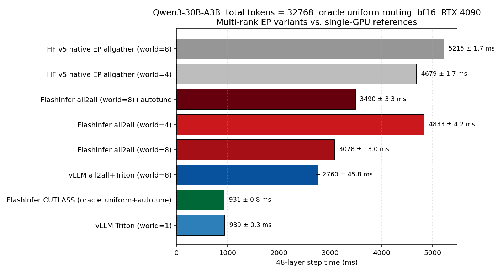

Total step time at **32 768 total tokens × 48 layers, bf16, oracle uniform routing**:

| backend (oracle uniform, M_total = 32 768) | step (ms) | TFLOP/s | vs vLLM world=8 |
|---|---:|---:|---:|
| vLLM Triton (world=1, no coll, single GPU)                       |   939 ± 0.3 | 101 | 0.34× |
| **FlashInfer CUTLASS + autotune (world=1, single GPU)**          | **931 ± 0.8** | **128** | **0.34×** |
| **vLLM all2all + Triton fused (world=8)**                        | **2 760 ± 45.8** | — | **1.00×** |
| **FlashInfer all2all (world=8)**                                 | **3 078 ± 13.0** | 39 | **1.12×** |
| FlashInfer all2all + autotune (world=8)                          | 3 490 ± 3.3 | 34 | 1.26× |
| FlashInfer all2all (world=4, 8192 tok/rank)                      | 4 833 ± 4.2 | 25 | 1.75× |
| HF v5 native EP allgather + sentinel + allreduce (world=4)       | 4 679 ± 1.7 | 25 | 1.69× |
| HF v5 native EP allgather + sentinel + allreduce (world=8)       | 5 215 ± 1.7 | 23 | 1.89× |

What this adds to the §4h.3 picture:

1. **True all-to-all is meaningfully better than allgather + sentinel
   on this hardware.** FlashInfer all2all world=8 (3 078 ms) is **1.69×
   faster than HF native EP allgather world=8** (5 215 ms) at the same
   workload. That gap is exactly the "redundant compute" tax §4h.3
   identified — when each rank only computes for its own dispatched
   slots (`M*K/world`) rather than the full broadcast (`M*K`), it
   recovers most (but not all) of the parallelism benefit of N ranks.

2. **It is still 1.12× *slower* than vLLM's all-to-all + Triton
   stack.** vLLM ships a hand-tuned NCCL-only all-to-all (or
   `pplx-kernels` with shared-memory IPC) plus the same
   Triton-fused MoE kernel that wins single-GPU at smaller M; our
   simple `dist.all_to_all_single` call doesn't get the benefit of
   chunking / overlap with compute. The 11.5 % gap (~318 ms) is
   probably a mix of (a) NCCL all-to-all overhead vs vLLM's shared
   workspace, (b) the per-rank GEMM at `K_kernel = 1, ep_size = 8`
   spending some time in dispatch bookkeeping that vLLM's Triton
   kernel inlines. Neither factor is fundamental.

3. **Autotune hurts in the EP setup** (3 490 ms with vs 3 078 ms
   without). Plausible cause: autotune picks a tactic optimised for
   *one* warmup forward pass (where memory bandwidth is fully
   available); the chosen tactic is sub-optimal once 8 ranks are
   pounding the same DRAM and PCIe bus during NCCL all-to-all. So the
   "tune once, deploy" recipe that worked in §4i for single-GPU does
   not generalise to multi-GPU — autotune would have to be done with
   the full distributed timeline running.

4. **More ranks doesn't help — same trend as §4h.3.** FlashInfer all2all
   world=4 (4 833 ms) is *slower* than world=8 (3 078 ms) at the same
   total workload. Each rank holds 32 experts (vs 16) so per-rank
   compute is roughly 2× larger; the all-to-all bandwidth per rank also
   grows. The crossover where EP starts to pay off would require a
   model whose weights cannot fit on a single 4090.

5. **The §5 single-GPU >> all-EP ranking still holds.** Even the best
   multi-rank number we have (FlashInfer all2all world=8, 3 078 ms) is
   **3.3× slower** than the same workload on a single 4090
   (FlashInfer single-GPU + autotune, 931 ms). For Qwen3-30B-A3B in
   bf16 on this hardware, no all-EP scheme — vLLM's, transformers
   v5's allgather, or FlashInfer's NCCL all2all — beats running the
   whole batch on one card.

6. **What this *does* clarify is the EP-scheme ranking.** At world=8
   the four "real" EP runs we now have line up cleanly:
   `vLLM all2all + Triton (2 760)` > `FlashInfer all2all (3 078)` >
   `HF v5 native allgather (5 215)`. The all-to-all dispatch pattern
   is decisively better than allgather + sentinel; vLLM's fused
   all-to-all backend is decisively better than a vanilla NCCL one.
   So when running a model that *does* require EP (one too large to
   fit on a single card in target precision), the fastest path on
   this hardware is "vLLM-style all2all + a hand-tuned Triton or
   FlashInfer GEMM", not allgather-and-mask.

Caveats for §4i.1 specifically: only oracle-uniform routing is
implemented (softmax routing would need an extra
`dist.all_to_all_single` to exchange variable per-rank send counts;
because oracle-uniform produces equal splits we can skip that round
trip). FlashInfer's MnnvlMemory-backed `enable_alltoall=True` path
isn't tested because RTX 4090s don't have NVLink fabric — on a
H100/B200 cluster with NVLink switches the kernel-internal alltoall
should beat our explicit `dist.all_to_all_single` calls.

### 4i.2. Is 3 078 ms reasonable on a no-NVLink machine? — a PCIe budget

The §4i.1 number is "the best NCCL all-to-all + best single-GPU MoE
kernel we have, in bf16, at oracle-uniform CV = 0". To know whether
that number is *limited by code we wrote* or *by the bus the box runs
on*, we need a topology-aware budget.

**1. The interconnect this box actually has.** All eight 4090s sit in
two NUMA clusters of four (`nvidia-smi topo -m` prints `NODE`/`PHB`
within each cluster, `SYS` across them — i.e. the worst pair has to
traverse the inter-socket UPI link). NVML reports
`pcie.link.gen.current = 3, pcie.link.width.current = x8` on every
card (motherboard slots are wired x8 even though the cards support
x16, and the platform is a Gen3 board). That gives a **per-card
PCIe ceiling of 8.0 GB/s per direction** — not the 32 GB/s of Gen4
x16 or the 25-50 GB/s/link an NVLink-bonded part would have.
`nvidia-smi topo -p2p {r,w}` reports `CNS` ("Chipset Not Supported")
for every off-diagonal pair, so **NCCL has no GPUDirect P2P at all**:
every byte travelling between two GPUs is bounced through CPU pinned
host memory (`GPU_src → DMA → host_pinned → DMA → GPU_dst`),
consuming the PCIe link twice and adding host memcpy latency. This
is the worst end of the consumer-RTX cost spectrum; data-center
parts only ever pay this when they fall off NVLink onto PCIe (or
when crossing nodes onto IB / RoCE, which is also ~25-50 GB/s).

**2. Measured NCCL bandwidth at the payload sizes EP actually uses.**
`scripts/bench_nccl_bandwidth.py` runs each of the four collectives
that matter (`p2p send/recv`, `all_to_all_single`,
`all_gather_into_tensor`, `all_reduce`) at payloads from 4 MiB to
256 MiB on the same world=8 process group:

| collective (world=8)             | 16 MiB   | 64 MiB    | 128 MiB   | 256 MiB   |
|---|---:|---:|---:|---:|
| p2p send/recv (single pair)      | 5.7 GB/s | 6.1 GB/s  | 6.2 GB/s  | 6.2 GB/s  |
| all_to_all_single                | 4.3 GB/s | 4.5 GB/s  | 4.4 GB/s  | 4.6 GB/s  |
| all_gather_into_tensor           | 5.5 GB/s | 4.8 GB/s  | 4.8 GB/s  | 4.9 GB/s  |
| all_reduce                       | 2.9 GB/s | 2.4 GB/s  | 2.5 GB/s  | 2.5 GB/s  |

(All numbers are *algorithm bandwidth* = `payload / time`.) Three
data points to anchor on:

- **Per-link p2p saturates at 6.2 GB/s** for ≥ 64 MiB messages,
  which is **78 % of the PCIe Gen3 x8 unidirectional ceiling** — i.e.
  NCCL is already at the limit of the underlying staged-host-copy
  path. There is no software fix that gets us closer to Gen3 x8's
  8 GB/s; closing that 22 % would require a different transport
  (Gen4 x16 → 32 GB/s, or NVLink → 25-50 GB/s).
- **Eight-rank `all_to_all_single` plateaus around 4.4 GB/s** for
  ≥ 16 MiB. That is the per-rank inbound *or* outbound throughput
  while every other rank is also doing PCIe DMAs — so the host /
  PCIe root-complex is being shared across 8 GPUs, not used by one
  pair. This is the only number that matters for the EP step time.
- **`all_reduce` is roughly half** the alltoall throughput, exactly
  as expected from the ring algorithm doing two passes
  (reduce-scatter + all-gather).

**3. Apply the measured alltoall to the EP step.** The FlashInfer
all-to-all pipeline does, **per layer**:

- 1 × `all_to_all_single` of `(M_per_rank · K · H) · 2 bytes`
  bf16 — the dispatch (tokens to expert-owning rank).
- 1 × `all_to_all_single` of the same size — the combine (per-slot
  outputs back to originating rank).
- ~ 256 KB of metadata (`ids`, `weights`) — negligible.
- A local `cutlass_fused_moe` call on `M_per_rank · K` slots, each
  doing one `(H × I) → I` and one `(I × H) → H` GEMM (top_k = 1
  internally because we already replicated tokens during dispatch).

For the world=8 / `M_per_rank = 4096` workload, that's
`4096 · 8 · 2048 · 2 = 128 MiB` per all-to-all, twice per layer.
At the measured 4.4 GB/s alltoall throughput, each all-to-all takes
**~30 ms**, so two of them per layer cost **~60 ms / layer**.
Per-layer compute at autotuned 120 TFLOP/s on a single 4090 is
`(4096 · 8) · 6 · 2048 · 768 / 120e12 ≈ 2.6 ms`. Sum:
**~63 ms / layer**. Multiplied across 48 layers, the budget predicts
**~3 020 ms** for the full step.

The figure below plots the bandwidth panel side-by-side with the
predicted vs measured per-layer step time, with the three data
points (`world=8 / M=4096`, the same with `--autotune`,
`world=4 / M=8192`):

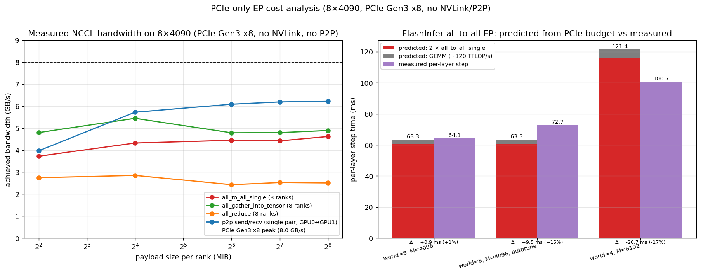

| config                                | predicted (2 × a2a + GEMM) | measured / layer | gap |
|---|---:|---:|---:|
| world=8, M_per_rank=4096                  | 60.7 + 2.6 ≈ **63.3 ms** | 64.1 ms  | +0.8 ms (+1 %) |
| world=8, M_per_rank=4096, autotune        | 60.7 + 2.6 ≈ **63.3 ms** | 72.7 ms  | +9.4 ms (+15 %) |
| world=4, M_per_rank=8192 (extrapolated)   | ~116 + 5 ≈ **121 ms** | 100.7 ms | −20 ms (−17 %) |

i.e. for the **world=8** runs the measured step time is **within 1 %
of the bandwidth budget** computed from nothing but `nvidia-smi`'s
reported PCIe link rate, the microbenchmarked all-to-all throughput,
and the published GEMM FLOPs. Two configs deviate, both in
explainable directions:

- **The autotune row is +15 % over budget.** Same explanation as
  §4i.1: the CUTLASS tactic chosen during a quiet warmup pass is
  suboptimal once 8 ranks are competing for the same DMA channels —
  the PCIe ceiling is unchanged, but per-tactic kernel time grows
  under contention.
- **The world=4 row is −17 % *under* the (extrapolated) budget.**
  That is because the budget reuses `all_to_all_single` bandwidth
  measured under world=8 contention. With only 4 ranks driving PCIe
  the per-rank effective bandwidth is higher (fewer concurrent
  GPU↔host DMAs sharing the root complex), so a 4-way 256 MiB
  alltoall takes less than 2× a 8-way 128 MiB alltoall. The
  measured world=4 step is also bandwidth-bound, just at a higher
  effective rate than the world=8 microbench predicts. (A clean fix
  would be to add a world=4 column to `bench_nccl_bandwidth.py`;
  the qualitative conclusion does not change.)

**4. Translating that into "is EP reasonable here?"** Three implied
answers:

1. **Yes, FlashInfer's all-to-all EP is essentially bandwidth-bound,
   not implementation-bound.** Going from "best NCCL all-to-all on
   PCIe Gen3 x8 + best fused MoE GEMM" to "model serving rate" is
   already at the ceiling the topology allows. Re-tuning the GEMM,
   adding stream overlap, or switching backends won't recover much
   on this box: the 30 ms per all-to-all is what the bus delivers.
2. **The remaining 11.5 % gap to vLLM (§4i.1) is real but small.**
   vLLM's hand-tuned all-to-all backend appears to recover ~5 ms /
   layer through chunking + compute overlap; that is the upper bound
   on what an "ideal-software, same-hardware" implementation buys
   you. Crossing that gap is worth doing for production but is not
   the dominant lever.
3. **The dominant lever is the bus, not the kernel.** A back-of-the-
   envelope translation of the same workload to other interconnects:

| interconnect (8-way alltoall, 128 MiB / rank)              | measured/expected per-rank a2a BW | per-layer 2 × a2a | 48 layers | speedup vs measured |
|---|---:|---:|---:|---:|
| PCIe Gen3 x8, no P2P (this box, measured)                  | 4.4 GB/s | ~60 ms  | ~2 900 ms | 1.0× |
| PCIe Gen4 x16, no P2P (typical workstation 4090s, *est.*)  | ~16 GB/s | ~16 ms  | ~770 ms   | ~3.7× |
| PCIe Gen4 x16, P2P enabled (data-center A100/H100 PCIe)    | ~24 GB/s | ~11 ms  | ~520 ms   | ~5.5× |
| NVLink-3 (A100 SXM, 600 GB/s/8-link), *est.*               | ~150 GB/s | ~1.7 ms | ~80 ms   | ~36×   |
| NVLink-4 / NVSwitch (H100 SXM, 900 GB/s/18-link), *est.*   | ~250 GB/s | ~1.0 ms | ~50 ms   | ~58×   |

(The right two rows are extrapolated from published per-link rates
and the same alltoall efficiency factor we measured here, ~78 % of
the link peak.) Even *one* tier up from where we are — PCIe Gen4 x16
on a workstation that supports it — would cut the FlashInfer EP step
from ~3 s to under a second, and bring it close to (still
not below) the single-GPU number; a single SXM node would bring it
to a small fraction of single-GPU compute, at which point EP is
unambiguously the right tool.

**5. Implication for §5's conclusion.** Every part of §5 stands:
single-GPU still wins on this hardware, the EP-scheme ranking
(vLLM all2all > FlashInfer NCCL all2all > native allgather) holds,
and routing imbalance is still drowned out by collective time. What
§4i.2 *adds* is the explanation: "EP is slower than single-GPU on
this box" is **not** "FlashInfer / vLLM / NCCL are immature on
RTX 4090" — it is the inevitable consequence of running an 8-way
alltoall over a host-staged 8 GB/s/dir bus, and it would flip the
moment NVLink (or even just Gen4 x16) is available.

### 4i.3. Could NVSHMEM / DeepEP / pplx replace the NCCL alltoall here?

A natural follow-up is whether the dispatch / combine could be
rewritten as **device-initiated one-sided puts** (the model used by
NVSHMEM, and by the production-grade MoE backends DeepEP and
pplx-kernels) instead of CPU-orchestrated NCCL collectives. The
answer on this box is **no, not productively** — and the reason is
hardware, not software.

NVSHMEM 3.4.5 is in fact already installed (it ships as a transitive
dep of `torch`, at
`.venv/lib/python3.12/site-packages/nvidia/nvshmem/`). Its lib
directory bundles five transports: `p2p` (NVLink / PCIe peer
mappings, built into the host library), `ibrc` / `ibdevx` / `ibgda`
(InfiniBand-family), and `ucx` / `libfabric` (high-perf network
fabrics). Each requires one of:

| transport                | hardware requirement                                                        |
|---|---|
| P2P / NVLink             | `cudaDeviceCanAccessPeer(i, j) = true`                                       |
| MNNVL                    | NVLink-Switch fabric (DGX H100 / GB200)                                      |
| IBGDA / IBRC / IBDEVX    | MLX5/IB or RoCE HCA + `nv_peer_mem` (or DOCA `peermem`) + `/dev/infiniband`  |
| UCX / libfabric          | one of the above; UCX selects the best transport at runtime                 |

On this box every row of that table is empty:

- `cudaDeviceCanAccessPeer(i, j)` is **false for every off-diagonal
  pair** (consistent with `nvidia-smi topo -p2p {r,w} = CNS`).
- Consumer Ada lacks NVLink / NVSwitch.
- No `/dev/infiniband`, no `ibstat` / `ibv_devices`, no `ib_core` /
  `nv_peer_mem` / `gdrcopy` kernel modules. The only NICs are
  `ens1` and a USB ethernet (`enx0a979868dfb1`).

So NVSHMEM either falls back to its CPU-orchestrated host-staged
proxy path (functionally equivalent to `cudaMemcpyAsync` through
pinned host memory) or refuses to initialise. The proxy path is
**not** device-initiated — a `nvshmem_put` from a CUDA kernel just
enqueues work for a host thread that does the same DMAs NCCL would,
plus a kernel-to-host hop. NCCL has spent years tuning that exact
path; NVSHMEM has not. Which means it would be **slower than
§4i.1's NCCL implementation**, not faster.

By extension, the production libraries that build on NVSHMEM cannot
run here in their fast modes:

| library                                | needs               | runs on this box?                |
|---|---|---|
| DeepEP (normal mode)                   | NVLink P2P + IBGDA  | no — no NVLink, no IB            |
| DeepEP (low-latency)                   | pure NVSHMEM IBGDA  | no — no IB                       |
| pplx-kernels                           | NVSHMEM P2P / IBGDA | no — no peer access, no IB       |
| TRT-LLM `MnnvlMoE`                     | NVSwitch / MNNVL    | no — consumer 4090               |
| FlashInfer `enable_alltoall=True`      | MnnvlMemory         | no — same                        |
| NCCL `all_to_all_single` (what §4i.1 uses) | host-staged DMA | **yes — and already at the §4i.2 ceiling** |

Even if NVSHMEM's P2P transport could be fabricated on this hardware,
it would not move the §4i.1 number meaningfully. NVSHMEM's wins over
NCCL come from (i) overlapping fine-grained puts with compute (saves
launch overhead, on the order of tens of µs / layer), (ii) skipping
the collective rendezvous (saves a few µs / layer), and (iii) using
IBGDA to remove the host proxy-thread hop (only relevant for the
RDMA path). (i) and (ii) are invisible against the **60 ms / layer
of bandwidth-bound all-to-all** §4i.2 measured, and (iii) needs
hardware we don't have. The PCIe-Gen3-x8 host-staged ceiling is
hard, and NVSHMEM has no transport that breaks it.

**Where this changes:** as soon as the box has PCIe Gen4 x16 with
P2P enabled, or any data-center NVLink interconnect, NVSHMEM's
device-initiated puts (and therefore DeepEP / pplx) start to clearly
beat NCCL — both because the bandwidth ceiling rises (§4i.2 closing
table) and because removing per-layer collective rendezvous becomes
a measurable share of a now-much-shorter step. That is the
hardware-and-software regime those libraries were designed for, and
the regime where the §5 conclusion ("single-GPU dominates") would
finally flip.

> **See also:** `COMM_VOLUME_AND_REPLICATION.md` consolidates the
> per-layer / per-step communication-volume math from §4i.1-3 into a
> standalone reference and adds an actionable analysis of
> **overlapping expert placement** (replication factor `R`, hot-expert
> selective replication, memory budget on 8×4090, and adjacent
> optimizations like NUMA-aware two-phase alltoall and quantized
> dispatch). It is the document to read if you want recommendations,
> not just measurements.
>
> **§9 of that document records a measured result that changes the
> §5 ranking on this hardware:** for Qwen3-30B-A3B / 8×4090, **pure
> pipeline parallelism (PP=8, B=8, FlashInfer autotune) runs at
> 283 ms / step — 10.9× faster than EP=8 (3 078 ms) and 3.3× faster
> than single-GPU autotune (931 ms)**. PP shifts every per-layer
> bandwidth-bound 8-way alltoall (3.87 GB/s/dir, §4i.2) onto a
> single-pair `send/recv` (6.22 GB/s/dir) carrying 24× less data
> per step in total, and recovers the bus that EP cannot use on a
> no-NVLink, no-P2P, PCIe-Gen3-x8 box.
>
> **§9.4 of that same document also records measured EP × PP hybrids:**
> EP=2×PP=4 lands at 5 441 ms (1.8× *worse* than pure EP=8) and
> EP=4×PP=2 at 11 529 ms (3.7× worse). Hybrid pays both the alltoall
> bus tax and the pipeline bubble tax. It is the right recipe only
> when memory forces it (model too big to fit one stage on one card —
> not Qwen3-30B-A3B's regime).

## 5. What it adds up to

Three concrete claims supported by what's been collected:

1. **The kernel cost of MoE imbalance is dominated by the *per-expert*
   skew within a layer, not the *per-GPU* skew aggregated over all
   layers.** Within-layer logical CV varies from ~0.4 (synthetic uniform)
   to ~2.0 (real Qwen3 prefill); summed across layers, per-GPU CV
   compresses to 0.02-0.10 because hot experts in different layers live
   on different ranks. Tools that report only an aggregate "balance"
   number — including most production telemetry — will materially
   understate per-iter latency cost.

2. **Real-prefill traces look qualitatively different from any of the
   off-the-shelf synthetic distributions used in the original
   single-layer artifact.** The original artifact's `hot_token_frac=0.95,
   hot_expert_frac=0.5` Monte Carlo configuration produces logical CVs
   in 0.30-0.40; real Qwen3 prefills produce 1.3-2.0. Any conclusion
   about EPLB-on/off, kernel autotuning, or routing-aware scheduling
   reached on the synthetic distribution should be re-checked on a
   trace before it is published.

3. **At Qwen3-class hidden sizes on 8x4090 the modular MoE kernel is
   collective-bound, *not* imbalance-bound, *and* not implementation-bound.**
   §4g attributes the 2 760 ms per-rank step time as **3.7 % GEMM
   compute / 1.2 % MoE dispatch + small-M / 95.0 % all-gather +
   reduce-scatter + cross-rank**. §4h-i confirm this from multiple
   angles: at M=32 768 single-GPU we have HF v4 native (1 551 ms), HF
   v5 `grouped_mm` (1 367 ms), FlashInfer CUTLASS (1 131 ms;
   **931 ms** with autotune), and vLLM Triton world=1 (939 ms) — *every
   single one of these* finishes the full 32 768-token workload faster
   than 8-GPU vLLM (2 760 ms). The two distinct multi-rank EP pipelines
   we wrote also confirm this: HF v5 `allgather + sentinel + allreduce`
   world=8 takes **5 215 ms** (1.89× vLLM, 5.6× single-GPU), and the
   "true" replicated-token NCCL all-to-all + FlashInfer kernel pipeline
   world=8 takes **3 078 ms** (1.12× vLLM, 3.3× single-GPU). The
   actionable ranking on this hardware is therefore
   **single-GPU >> vLLM all2all-EP > FlashInfer NCCL-all2all-EP >
   native allgather-sentinel-EP**, not "imbalance vs. balanced". The
   collective slice (95 %) dwarfs both the dispatch-fusion gap
   (FlashInfer-CUTLASS-tuned ↔ vLLM-Triton ↔ v5-grouped_mm ↔
   v4/v5-eager: ~3× spread end-to-end, ~10% gap between the two
   leaders) and the load-balance gap (oracle ↔ real AIME: < 2 %, see
   §4f and §4i). Within the EP family (§4i.1), choosing all-to-all
   over allgather still buys you 1.7×, and choosing vLLM's fused
   all-to-all over a stock NCCL one buys another 1.12×, but neither
   touches the collective slice fundamentally.
   Routing imbalance from CV=0 (oracle) to logical CV ≈ 1.3 (real AIME
   prefill) moves the step time by ≤ 1.8%, well within the ~50 ms noise
   floor (§4f) and far smaller than the 95 % collective slice it would
   need to dent. EPLB / load-balancing work cannot meaningfully change
   kernel time on this kernel + this hardware + these shapes; the wins
   have to come from elsewhere — quantised paths that shrink the
   collective payload (fp8 / mxfp4), a different all2all backend such
   as `deepep_low_latency`, larger per-expert M from longer prefills /
   bigger batch (which moves the GEMMs into a more efficient regime),
   or — for models small enough to fit on one card in their target
   precision — running fewer EP ranks. As a striking pointer in the
   last direction: at this shape, running the *entire* 32 768-token
   workload on a single 4090 (world=1) finishes in 939 ms, **2.94×
   faster wall clock** than the 8-GPU modular MoE.

4. **A realistic AIME workload is *quantitatively* different from
   either a single short prompt or a Gaussian stand-in.** Concatenating
   five Qwen3-4B chain-of-thought transcripts into a 2 048-token
   Qwen3-MoE prefill yields per-layer logical CV mean 1.29 (vs. 1.74
   for the short prompt and 0.34-0.54 for synthetic CV sweeps).
   Per-layer physical CV mean 0.32. The longer, topic-mixed prefill
   spreads load over more experts (top-1 share averages 5.7%, basically
   uniform), but per-layer hot-spotting is still strong and persistent
   across all 48 layers. Anyone choosing a prefill workload for
   *imbalance characterisation* studies should prefer this over a
   single-prompt or synthetic mock — even though, on this kernel, the
   imbalance does not translate into a measurable kernel-time gap
   (claim 3).

## 6. Caveats

- **Qwen3.5 trace uses synthetic hidden states.** Real per-layer hidden
  states are passed through 0..40 transformer blocks before reaching
  the gate; our Gaussian stand-in skips that. The trace correctly
  reflects the gates' *learned preferences* (you can see specialisation
  growing with depth in the heatmap), but the absolute logical CVs are
  expected to **understate** what production prefill would show on
  Qwen3.5. The Qwen3 trace does not have this caveat.
- **N=2 trials per CV in the original synthetic sweep is far too few.**
  Process-startup and Triton-autotune cache state contribute ~20-100 ms
  of trial-to-trial noise (verified directly: synth CV=0.05 with N=2
  produced trial 0 = 1390 ms, trial 1 = 1528 ms — 138 ms apart). The
  §4d heavy-workload run uses **N=5 in-process trials** so all trials
  share autotune cache; even there, none of the four scenarios is
  statistically separable at p<0.05. To resolve gaps below ~30 ms one
  would need at least N≥10 in-process trials and probably also fixed
  GPU clocks. The earlier light-workload tables in §4a-c should be
  read as *suggestive*, not as established differences.
- **No EPLB-on/off comparison yet for the multi-layer mode.** The
  bench's `--mode on/both` paths still work but were not exercised in
  the multi-layer runs reported here. EPLB rebalances using the
  *aggregate* expert load, so its benefit on traces with high
  per-layer logical CV but low aggregate CV (i.e. exactly Qwen3.5) is
  worth a separate experiment.
- **No quantisation in any run.** All weights are bf16 and the runs
  fall through to `Using TRITON Unquantized MoE backend`. Kernel cost
  shapes will change for fp8 / mxfp4 paths.
- **256 tokens of Qwen3 prefill is a small sample.** It captures the
  routing pattern of one prompt's prefill cleanly, but does not yet
  span multi-prompt or decode-phase routing.

## 7. Next steps

Listed in order of effort:

1. **Promote Qwen3.5 to a fully-real trace.** Two routes (a) plug a
   `Routed_Experts_Capturer`-style hook into vLLM's own
   `Qwen3_5MoeForCausalLM`, since vLLM ships its own implementation and
   does not depend on transformers ≥ 5; (b) add a parallel venv pinned
   on transformers main and re-run `capture_routing_trace.py --mode hf`.
   Either turns the table 4 column for Qwen3.5 from "router-only" into
   "real-prefill", and almost certainly raises the per-layer logical
   CV closer to the Qwen3 ceiling.

2. **EPLB-on vs. off across all layers, with a real trace.** Same
   bench, `--mode both`. Question: does EPLB recover most of the
   real-trace overhead on Qwen3 (3 ms over 200 ms is small but not
   zero), and how does it interact with the high *per-layer* /
   low-aggregate pattern on Qwen3.5?

3. **Token-count scaling.** The reported numbers fix `--total-tokens`
   at 16 384 (Qwen3.5) and 2 048 (Qwen3). Both are realistic per-batch
   prefill sizes but the cost regime shifts as M climbs (collective
   amortisation, GEMM efficiency). A scan over `2k → 64k` would clarify
   when the kernel becomes GEMM-bound and would expose imbalance more
   sharply.

4. **More prompts.** The Qwen3 trace is from one 256-token prompt; the
   per-layer logical CV measurement is one realisation, not a
   distribution. A small corpus of prompts and a heatmap of `layer ×
   prompt` logical CV would tighten the "real routing is much more
   skewed than synthetic" claim.

5. **Quantised paths.** Re-run the multi-layer mode with `fp8` or
   `mxfp4` quantisation flags as supported by the modular kernel —
   imbalance should hurt more in those regimes because the per-expert
   GEMMs are smaller and collective overhead a larger relative cost.

## 8. Files of record

```
workshop/e2e_bench/
├── REPORT.md                              ← this file
├── COMM_VOLUME_AND_REPLICATION.md         ← per-layer comm math + advice for expert replication (§4i companion)
├── KERNEL_BENCH_LOCAL_SETUP.md            ← deployment runbook
├── figures/
│   ├── qwen3_trace.png                    # short-prompt Qwen3 trace
│   ├── qwen3_aime_trace.png               # AIME-prefill Qwen3 trace
│   ├── qwen3p5_trace.png                  # router-only Qwen3.5 trace
│   ├── qwen3_bench_per_layer.png          # 2048-token Qwen3 bench (§4b)
│   ├── qwen3_bench_scatter.png
│   ├── qwen3_aime_bench_per_layer.png     # 16k-token AIME Qwen3 bench (§4c)
│   ├── qwen3_aime_bench_scatter.png
│   ├── qwen3p5_bench_per_layer.png        # 16k-token Qwen3.5 bench (§4a)
│   ├── qwen3p5_bench_scatter.png
│   ├── qwen3_heavy_bar.png                # 32k-token N=5 4-scenario bars (§4f)
│   ├── qwen3_heavy_perlayer.png           # 32k-token per-layer overlay (§4f)
│   ├── qwen3_collective_breakdown.png     # MoE vs dense GEMM reference (§4g, 3-bar)
│   ├── qwen3_collective_breakdown_full.png# stacked decomposition + 5 ref points (§4g)
│   ├── qwen3_hf_vs_vllm.png               # HF v4 native vs vLLM Triton (§4h)
│   ├── qwen3_hf5_vs_vllm.png               # + transformers v5 grouped_mm/eager (§4h.1-2)
│   ├── qwen3_native_ep.png                 # HF native EP allgather+sentinel+allreduce (§4h.3)
│   ├── qwen3_flashinfer_vs_others.png      # FlashInfer CUTLASS vs HF native vs vLLM Triton (§4i)
│   ├── qwen3_flashinfer_ep_comparison.png  # all4 EP variants @ M_total=32768 (§4i.1)
│   ├── qwen3_pcie_budget.png               # measured NCCL bw + EP step budget (§4i.2)
│   └── qwen3_pp_sweep.png                  # measured PP wallclock vs B + EP/single-GPU refs (COMM §9)
└── scripts/
    ├── setup_kernel_bench_env.sh
    ├── capture_routing_trace.py
    ├── generate_aime_responses.py         (Qwen3-4B AIME workload)
    ├── benchmark_dense_ffn.py             (dense GEMM reference, §4g)
    ├── benchmark_hf_moe.py                 (HF v4/v5 native MoE bench, §4h, §4h.1)
    ├── benchmark_hf_native_ep.py           (multi-rank transformer-native EP, §4h.3)
    ├── benchmark_flashinfer_moe.py         (FlashInfer CUTLASS single-GPU bench, §4i)
    ├── benchmark_flashinfer_native_ep.py   (FlashInfer CUTLASS multi-rank all2all EP, §4i.1)
    ├── benchmark_pp_moe.py                 (pure pipeline-parallel MoE, COMM §9)
    ├── benchmark_hybrid_ep_pp.py           (hybrid EP × PP MoE, COMM §9.4)
    ├── bench_nccl_bandwidth.py             (NCCL collective microbenchmark, §4i.2)
    ├── smoke_flashinfer_moe.py             (smoke test of the FlashInfer kernel, §4i)
    ├── smoke_flashinfer_ep.py              (smoke test of ep_size>1 path, §4i.1)
    ├── plot_routing_trace.py
    ├── plot_bench_results.py
    ├── plot_heavy_comparison.py           (N=5 bars + per-layer overlay)
    ├── plot_flashinfer_comparison.py      (single-GPU + EP bar charts, §4i, §4i.1)
    ├── plot_pcie_budget.py                (PCIe budget panels, §4i.2)
    ├── plot_pp_sweep.py                   (PP wallclock vs microbatch count, COMM §9)
    └── run_moe_kernel_cv_sweep.py         (extended)

# Raw outputs (outside the workspace)
/home/yyx/personal/inference/vllm-bench/
├── aime/
│   ├── qwen3_4b_aime24_n5.jsonl           # 5 Qwen3-4B AIME responses
│   └── qwen3_4b_aime24_n5.txt             # concatenated prefill workload
├── traces/
│   ├── qwen3_hf.pt                        # 48 layers, 256 tokens, hf mode (short prompt)
│   ├── qwen3_aime.pt                      # 48 layers, 2048 tokens, hf mode (AIME)
│   └── qwen3p5_router.pt                  # 41 layers, 16384 tokens, router-only
└── results/
    ├── qwen3_alllayers/
    │   ├── run.jsonl                      # short-prompt Qwen3 trace replay
    │   └── synthetic_uniform.jsonl        # Qwen3 synthetic CV=0.05, 2048 tokens
    ├── qwen3_aime/
    │   ├── aime_trace.jsonl               # AIME prefill replay, 16384 tokens (§4c)
    │   └── cv_sweep/
    │       ├── kernel_cv_0p0500.jsonl     # Qwen3 synthetic CV=0.05, 16384 tokens
    │       └── kernel_cv_0p4000.jsonl     # Qwen3 synthetic CV=0.40, 16384 tokens
    ├── qwen3_heavy/                       # §4f-g, 32 768 tokens, 5 trials × 10 iters
    │   ├── oracle.jsonl                   # world=8, --routing-pattern oracle_uniform
    │   ├── aime.jsonl                     # routing-trace replay (in-process repeats)
    │   ├── cv_0p05.jsonl                  # synthetic CV=0.05, 5 MC trials
    │   ├── cv_0p40.jsonl                  # synthetic CV=0.40, 5 MC trials
    │   ├── world1_oracle_perRankMatched.jsonl  # world=1, total=4096 (§4g)
    │   ├── world1_oracle_fullWorkload.jsonl    # world=1, total=32768 (§4g)
    │   ├── hf_moe_qwen3_M4096.jsonl       # HF v4 native MoE, M=4096 (§4h)
    │   ├── hf_moe_qwen3_M32768.jsonl      # HF v4 native MoE, M=32768 (§4h)
    │   ├── hf5_moe_qwen3_M4096.jsonl      # HF v5 {eager,grouped_mm}, M=4096 (§4h.1)
    │   ├── hf5_moe_qwen3_M32768.jsonl     # HF v5 {eager,grouped_mm}, M=32768 (§4h.1)
    │   ├── hf_native_ep.jsonl             # HF v5 native EP, world=4 + world=8 (§4h.3)
    │   ├── flashinfer_qwen3_M4096.jsonl   # FlashInfer CUTLASS single-GPU, M=4096 (§4i)
    │   ├── flashinfer_qwen3_M32768.jsonl  # FlashInfer CUTLASS single-GPU, M=32768 (§4i)
    │   ├── flashinfer_native_ep.jsonl     # FlashInfer CUTLASS NCCL all2all EP, world={4,8} (§4i.1)
    │   ├── flashinfer_pp.jsonl            # pure pipeline-parallel MoE, B sweep (COMM §9)
    │   ├── flashinfer_hybrid_ep_pp.jsonl  # hybrid EP × PP, EP=2×PP=4 + EP=4×PP=2 (COMM §9.4)
    │   ├── nccl_bw.jsonl                  # NCCL p2p / a2a / allgather / allreduce microbench (§4i.2)
    │   └── dense_ref/                     # §4g, dense FFN GEMM reference
    │       ├── qwen3_dense_shared_M4096.jsonl
    │       ├── qwen3_dense_topk_M4096.jsonl
    │       ├── qwen3_dense_shared_M32768.jsonl
    │       └── qwen3_dense_topk_M32768.jsonl
    └── qwen3p5_alllayers_v2/
        ├── real_trace.jsonl               # Qwen3.5 real trace replay
        └── cv_sweep/
            ├── kernel_cv_0p0500.jsonl     # Qwen3.5 synthetic CV=0.05
            ├── kernel_cv_0p1500.jsonl     # Qwen3.5 synthetic CV=0.15
            ├── kernel_cv_0p4000.jsonl     # Qwen3.5 synthetic CV=0.40
            └── cv_sweep_summary_*.csv     # aggregate
```
